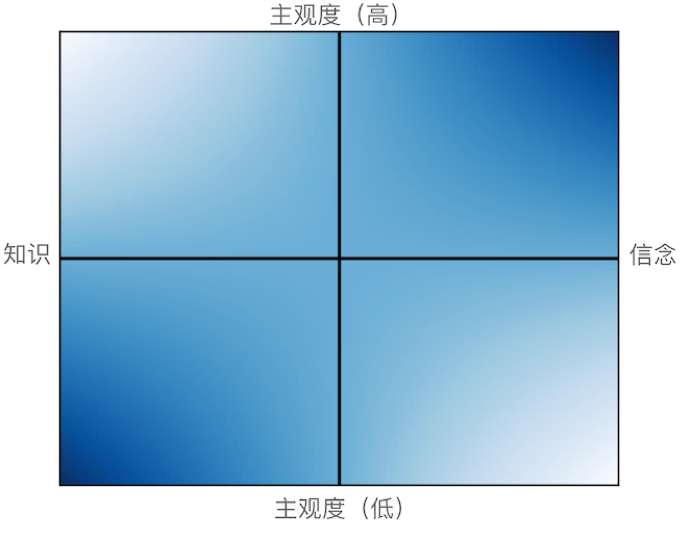

### 1. 前言

写这篇文是为了破除自己的一个迷思，这是一个自我认知过程，可能幼稚，但我还是得说出来。

首先给个定义，我这儿命理学指的是包括了算命术、风水术等尝试预测未来的技巧或思想。

命理学萦绕在我脑海里很多年，长期以来都想输出点什么，而它是我的第一篇文。

我这个心病是我家里传下来的，主要来源是我爷爷。老爷子本质上是一个追求真理的人，他智商高，懂易经、会术数，因为精通风水在那个年代享有盛名。他知道自己智商高，这给了他野心，但他命不好，这他也知道。多年一直念叨刘秀十二走南阳的故事，屋里还挂着一个世界地图。他著了书，还写了家训。可惜书没人看，家训可能就我记得，也记不大清。

从小听说过各种神奇的事情，比如爷爷曾帮人算良辰吉日，说某时某刻某穿红衣的人会从某个方向走来，那便是开启仪式的时辰，而那确实发生了，一个目击过的大伯口述道。我的出生日子也是计算的，为此不惜提前剖腹产赶那时辰，可惜当时医院来了急诊病人得救人命，给错过了，某个舅大大说我若真从那个时间出生，不知道现在会是什么天才，只能说人算不如天算。从小逢年便跟着家人回老家山上祭祖，爷爷指着山山水水，嘴里一套阴阳五行念念有词，福祸凶吉似乎尽在掌握。

这让我很长时间以来相信，这世间存在一套算法，是可以预测未来的。后来发现这也是人类潜意识底层的集体幻想，这种梦想在古典时代最典型的代表就是占卜和天文，尤其在哲学数学领域，基本上只要是个学者，都会难免会做点这个梦——其中不乏狂热者——只不过切入点不同，或者采取了迂回战术。根据测不准定理，物质世界本质上是不可测的，再强的算力也不可能，但心里还是会幻想，精确做不到，长期趋势呢？数学做不到，但若是杂糅东方的阴阳哲学呢？纯粹理性是有局限性的，那么理性与唯心的结合呢？人总是有一些奇奇怪怪的思维比如说第六感、或者梦，难以嵌入当前科学理性构建的版图中，有没有种思维模式不是基于归纳演绎法却依然可以抵达真理呢？

这让我回头去找找，难免又捡起了命理学，希望揭开它的神秘面纱。

### 2. 从源头说起

先从源头说起，源头自然是**易经**。

易经是古代巫师占卜用的，也**是所有命理学的理论起源**，据说有三本，《连山》、《归藏》和《周易》，不过传世的只有后者。古人相信世间有唯一真理为“道”，‘易’即是“道”的运行，《易经》则用一个符号系统用来指代这种道的运作，而要做到这一点必须足够抽象。横代表阳，断横代表阴，也便是两仪，太极生了两仪，两仪就生了四象，然后八卦再到64卦。而整本书正是对这64卦的逐个拆解。

这套符号系统怎么玩呢，拿第一卦乾卦举例。一个卦分为六爻（yáo），从下到上六根线，依次叫做初九、九二、九三、九四、九五，最后一个上九（九表示阳爻）。乾为天卦，卦辞（卦象的含义）为：**乾，元亨，利贞**。意思是：“乾卦，初始亨通，有利于坚守正道”。这是阳气最盛的一卦，古人给其赋予的内涵也是很正能量的。

我猜测这些符号也许在语言诞生之前就已经出现了，后来巫师们给了它简单的卦词利于占卜，而后人陆续赋予它新的解释，还是拿乾卦举例子，周朝的知识分子说：“大哉乾元，万物资始...（略）...首出庶物，万国咸宁”，认为万物因阳气而生，相信它能带来国泰民安，这里有国家意识的出现; 孔子说乾卦：“天行健，君子以自强不息”，而全是阴尧象征大地的坤卦则曰：“地势坤，君子以厚德载物”，他给了卦象个人道德层面的意义，可见孔子要用周易来建立做人的规范。不仅仅卦象被赋予了意义，而每一爻也有单独的注解，比如《射雕英雄传》中的著名武功“降龙十八掌”中有名的招数“潜龙勿用”、“亢龙有悔”便是乾卦初九和上九的爻词。爻词给了每个卦象时间感和空间感，似乎真的有条龙从初九飞到了上九，让人感受到乾卦好像蕴含着某种鲜活的生命力。而后人也不断的延展易经的文本，为其注入解读空间与想象空间。

还有一个不得不提的东西就是河图洛书，传说有个神龟背负河图出现在洛河，意味着上天认可天子，赋予其天命。神龟具体背的这幅图长啥样，有很多版本。但不管是什么版本，基本上都包涵一点数理关系，即横纵对角线的数相加为15。不仅如此，这图还可以旋转，其中的数字还可以换位，即使当时还没有文字，但这种朴素的数学之美让古人感到极大震撼。除此之外古人还为期赋予方位，各个方位还能和八卦对应上。如果说易经仅仅是卦象与意向之间的联想，融入河图洛书后就不同了，

**加入了方位，整个系统被赋予了空间属性；融入了术数，整个系统拥有了可计算性；再加上易经本身无限的可解读性，整个符号系统像获得了生命力一般，天地似乎被蕴含在其中。再到后来五行学说的融入，让金木水火土分别又对应不同的属性，人不但可以感性的去体悟“道”了，居然可以开始定性分析了，这带给人一种无与伦比的掌控感！** 这套符号系统不断膨胀，越来越复杂，比如天干地支、十二生肖......，类似的理论或概念沿着这个思路不断的被开发出来并用在了不同的领域，宗教、哲学、天文、音乐、算数、艺术、风水堪輿、八字命理、中医养生......

这个复杂的符号系统深深影响了中华文化的思维方式，很多传奇故事也只能在这种文化背景下才能出现，比如三国演义中诸葛亮的借东风和八卦阵，比如大名鼎鼎的**推背图**。

《推背图》是一本预言书，相传是唐代作者李淳风，推背图以64卦排列，一共六十象，每一象各由一个卦象、图像、谶语和“颂曰”律诗一首组成，赋予每一象极大的可解读空间（类似塔罗牌），六十年一个甲子，代表一个时代过去。这本书号称可以预测后世兴旺治乱，直接从贞观年间往后推演了一千年。事实上历朝历代人不断修改它，属于集体创作。历史上，这本书被打击过很多次，严谨私藏，严禁传播。打击的原因也很简单，总是有人借古讽今，用它做舆论宣传，并利用谶言来造反。但它的生命力极强，哪怕到了民国时期，依然在印刷，比如第39象“旭初升，人都哭”，预言“日本侵华”，比喻日本军国主义势力强大，中国人都在哭泣“。若告诉我这是唐朝写的，我是万万不信的。但吃这一套的人不少，直到现在都还有人拿着它预言中国国运。个人认为，**它并不能预言，本质上是命理学浸泡下的中国人那不可遏制的对于掌控命运的欲望和潜意识的集中涌现。**

若说《推背图》不能预言，但算命这件事总是真的吧？经历过算命的人有不少，不乏预言精准的案例，有名的大师也不少。但准不准毕竟不能靠身边人统计学，为了排除幸存者偏差，还是得有大数据支撑。

其实关于命理学的研究论文也有不少，大多集中在台湾岛上。我找到一篇《應用子平學於交通事故分析及預測之研究》的公开论文，是少有的真正拿命理学进行数据验证的研究。作者思路是，如果八字可以预测吉凶祸福，那在车祸数据中有没有对应的体现呢？于是拿到97008条车祸数据，再拿出根据经验总结的容易肇事的八字，比较这些八字的事故率，结论却是：“差异不大，难以有效预测事故发生。”

到了这里，应该能意识到不对劲了，虽然这套算命术十分复杂且严密，杂糅了哲学、天文各领域的内容，很是能唬住不少人，但却不能指导现实世界，那具体问题出在哪？

### 3. 问题出在哪？

**问题在于，它错用了演绎法**。

**演绎法是一种可靠的推理方法，可以被用来证明道理；人们从事实中归纳出公理，然后从公理出发，经过严密的逻辑推导走向结论**。从表面上看，从阴阳五行出发，进行逻辑推导似乎也能抵达某种结论，在八字命理中，八字按照历法演算，貌似也很严密。但实际上，**演绎法的公理是有前提的**，必须满足以下要求：

1. **真实性**：公理必须是事实，不能错
2. **全面性**：公理必须足够完备，不能有遗漏
3. **一致性**：公理之间不能有矛盾
4. **明确性**：公理必须清晰明确，不能过于抽象，表述也不能含糊

公理做为推导的前提，必须经过仔细分析，存在问题则需要进行修正。

回到一切的开头，《易经》。

一切的一切起源于一个朴素的哲学观念，**老子在《道德经》中总结道：“道生一、一生二、二生三、三生万物”**，这是一个洞察力及其深刻的思想，道是一切的起源，它产生了阴阳，阴阳的对立出现了运动，而运动生发出了万物（听起来很像宇宙大爆炸，还有生物树的演化）。**易经用卦象精简、抽象、符号化了这种思想**。而这种符号也蕴含着巨大的想象空间，能和世间万物对应上，这种对应的模式可称其为**象征律**。而这种思维惯性来源于占卜，占卜的一大特点就是给出结论并不需要确凿的证据，而是向外求神去寻找凭据。而占卜的起源则是对未知的恐惧，人们需要消除恐惧，于是便向神明去寻找答案。而事实上，求神明的过程也即是向心求证的过程，神在这过程中间只是一个中介。中国演变成了无神论国家，但占卜象征律的思维惯性被保留了下来，最典型的思想便是“**天人合一**”。比如说，每个人就是一个天地，人的运行也即是天的运行，天地有阴阳，人也有，天地有五行，人也有，甚至人的五脏六腑也对应五行的各个属性，这也便是中医的理论基础。

但这**以象征律为基础所浇铸的公理并不牢靠**！说金木水火土便是世间万物的组成，那为什么不能有第六个元素？说水克火，因为水能把火浇灭，但火同样能蒸发水呀，凭啥不是火克水？说八字蕴含了一个人的命运，那同一天同一时辰出生的人命运岂不是应该一模一样？这套象征律在铺设公理的阶段就已经漏洞百出，不完备、不一致也不明确，能做的就是不断的打补丁，导致整个理论系统臃肿庞杂，这种庞杂反而能让人垄断解释权，进而蒙蔽不知所云的人了。

况且，演绎过程也不能随随便便，必须要遵守逻辑规则，必须严谨，不可模糊，所有的结论必须由公理推出。然而已沉迷于象征律的大脑思维过于跳跃，满心想的都是直奔结论，或者想要跳出框架的桎梏去站上更高的层次，全然不顾自己的理论大厦完全建立在流沙之上，是彻彻底底的海市蜃楼。

### 4. 为什么信的人那么多？

下一个问题便是，命理学不靠谱，但为什么生命力这么强，信的人那么多，其中不乏聪明人？

其实生命力强的不只是命理学，相面、手相、星座、塔罗......这些神秘学生命力都很强。

它们大多都是基于象征律给出一个认知框架，然后使用不完备的演绎法推导结果。哪怕这些理论的公理不完备且漏洞百出，**但他们有一个最大优势，即公理的第一个要求——真实性——难以撼动！**做为一个公理，最重要的要求就是它得**不证自明**，而不证自明的来源是**共识**。两点之间线段最短，这是常识，所有人都相信它是真的，便能由它为基础建立几何学。换句话说，只要所有人都相信2+2=5，我们就会建立一个2+2=5的计算逻辑体系，唯一能消灭它的，只有在这条定理受到普遍质疑并被修改后才有可能。回到命理学，它为什么生命力这么顽强？因为天人合一的理念在人们心中是如此的深刻，对国人来说是它就是不证自明的公理，它是成立的，它必须成立，基于它所进行的推导自然也是对的！而且和算数不同，我若真的把2+2=5设为公理，拿着这条公理去买菜，很快就会被打脸而被迫修改它。但是”五行“、“八字”、“星座”很难证伪，相不相信它完全是自愿的，哪怕这个它给的结论模糊不清人们也会心甘情愿的全盘接受，并为它套上一个神秘的光环，因为它实际上是符合的是自己的心意。

这还不能解释为什么那么多聪明人也沉迷于命理学，我觉得有以下几个心理上的原因：

1. 宁可信其有，不可信其无。

2. 对传统文化深深的膜拜。
3. 对命运无常的恐惧，对掌握命运的强烈渴望。

第一种情况，大多数人都有对于命运的不可捉摸的**敬畏感**，往往为了获取安全感而进行膜拜活动。而国人在这方面尤甚，最典型的行为就是特别喜欢口头上讨个吉利。摔了东西一定会说碎碎平安，踩了屎会说狗屎运，讨厌别人乌鸦嘴，说了坏话赶紧得呸呸呸。他们属于会找人算命，请风水师傅那一类，他们自己不会深入多想，毕竟也就是图个安心。而且就算是有识之士，也会出于对未知敬畏的心态，把它作为解释世界的备用理论，并不会抛弃它。

第二种是时代赋予的集体心态，这是对于话语权长期被西方压制为了树立文化自信而产生的**逆反心态**。这个心态每个时代都有，表现不一样。近些年文化领域特别明显，比如眯眯眼的争论、博物馆热，满街穿汉服的小姐姐、集中于神话题材的动画、泛滥的中国风音乐。只能说有好有坏吧（汉服小姐姐是真好看，而大部分的国风音乐是真的难听），坊间上下充斥着“**传统的东西就是好的**”心态，这种心态会蒙蔽大家的判断，给错误的理念不断强化共识。

第三种情况比较复杂，属于**个人的世界观**，不过我有一个提问往往能测试出来一个人的态度：“请问，你相信**宿命**吗？”。少部分人会说“我命由我不由天”，有人会说：“三分天注定，七分靠打拼”。也有人说：“都是缘分，一切都是命中注定”。一般情况下，越相信命运的人，越容易走进命理学的世界，他们也许是为了看清命运，从而脱离命运的掌控，继而掌握别人的命运，这是一种无限膨胀的**控制欲**；也有可能是为了看破红尘或者洞悉真理，最后能进入羽化成仙或者涅槃，这是为了**超脱**。这批人往往及其聪明，思辨能力极强，但却让控制欲和追求超脱的欲望凌驾了他们的心智。这种人在官场和金融领域尤其多，官员比较好理解，他们的命运往往不在自己手上，极其需要一个让他们心安的锚点。而金融精英们，则是对于预测未来最为狂热的一批人了，而且手握一套由专业词汇组成的理论拿去忽悠韭菜，对他们来说根本就是手到擒来。

算命术历史惯性之巨大，思想之根深蒂固，究其根本，还是因为它抓住了人性的软肋。**它的起源是哲学思想，但给予它肉体和生命力的其实是人的欲望。**就算有一天大家不用八字算命了，类似的东西也会层出不穷。即使新一代的年轻人接受的都是唯物主义教育，也不会逃脱这种思维上的懒惰，无数的年轻人会在星座大V的评论区狂欢，塔罗牌会成为短视频里的超级热门，Chatgpt算命、VR看相、元宇宙风水......该来的都会来的。

### 5. 信的人多了，也便成了真理

让一个思想拥有旺盛生命力的，是**共识**，相信的人越多，影响力也就越大。然而促使人去相信某个思想的，是**人性**。

**这世上本没有鬼，也不存在僵尸，但对鬼和僵尸的恐惧这个人性是真实存在的**，这个恐惧是如此的深刻，以至于并不需要有人找出这世上存在鬼的证据，作家们就会自发的开始写鬼怪志异，电影人也会不停的拍恐怖片，游戏界也会不停的开发丧尸游戏。

这种恐惧的执念是如此的顽强，人们还发明了关于它的各种周边概念，哲学命题比如哲学僵尸（Philosophical zombie），甚至还有还有僵尸经济学（zombie economics）。

这世上本也不存在上帝，也不存在佛陀。但一场洪水、一场地震，一次火山喷发，顷刻间便会毁灭掉人们所拥有的一切，甚至抹杀掉一个文明；身在乱世中的人们，面对着兵荒马乱，眼铮铮看着家园被焚毁，财产被夺走，妻儿被奸淫，族人被奴役，而他们原本一直在勤勤恳恳的种地而已啊。这个时候怎么跟人解释，不好意思，你们运气不好？不，大家更愿意相信，上帝会让弥赛亚降临，带给全人类希望，让族人恢复往日的荣耀；或者大家更愿意相信，一切皆是因果，一切有为法，如梦幻泡影，如露亦如电......

再反思一下在不同地区不同人群所坚信的事情：针对某民族的大屠杀、牛尿能治新冠、病毒是人造的、飞过头顶的气球是间谍......
人们是没有辨析真相的能力吗？不是啊，只是那些说法的成立不需要充足的证据，只需要有足够多的人愿意去相信它就够了而已。

除了这些一眼能看出是舆论炒作的说法，还有很多被人视作真相的定理并没有得到足够多的质疑，比如：

- 人类只使用大脑10% ;（？？？）

- 二八法则：资源注定只会落入那少数的20%人群，而那20%的人中，分布也是如此；（凭什么？）

- 10000小时定律：要成为某个领域的专家，至少要有10000小时的专研；（少于行不行？怎么定义专家？）

- 需求层次理论：人类需要满足基本的生理和安全需求，然后才能追求更高级别的需求。（所有场景都适用吗？）

- 理性人假设：每一个从事经济活动的人所采取的经济行为都是力图以自己的最小经济代价去获得自己的最大经济利益（人真的是理性的吗，还是因为你更愿意相信人是自私的？）。

那么多杰出的天才所搭建的那么多伟大且“正确”的理论大厦，他们的基础真的就比命理学更结实吗？

还是说，理论思想永远都在那里，而且有很多，人们只是挑了更顺眼的那一个？

### 6. 什么才是真的？

如果说思想的真实性很大程度上建立在人们相信它的意愿上，而人的喜好本就是无常的，那到底什么才是真的？

换句话说，人应该怎样判断一个认知是正确的？

先理解一下什么叫“认知”，**首先认把知分为两类，一类叫做知识（knowledge），另一类叫做信念（belief）** 对于知识来说，它的主要任务是认识物质世界并找到改造物质世界的方法，因此需要追求普适性和精确性，它需要大量证据支撑，需要严格的逻辑论证；对于信念来说，它的任务是凝聚共识，凝聚共识的目标是为了团结可以改造物质世界的主体——人，因此证据并不是主要的，主要取决于相信程度的深浅和相信人数的多少。两者没有绝对的界限，是有中间地带的，知识与信念也是你中有我我中有你的关系。再坚定的信念也需要有证据的支撑，就算是宗教也需要向信徒展现神迹，同样的，再缜密的数学推导也需要灵感的引领，最主要的就是个人内心对于美与和谐的感受。当自己面对某种认知的时候，心里要盘问一下，这到底是个倾向于知识还是信念的东西，该拿什么样的标准去衡量它？为什么有时候，证据根本不重要，为什么有时候，必须得有实锤？

(可以试试问问自己，以上这些热点，哪些是知识？哪些是信念？)

那什么样的认知才是正确的呢？怎么理解正确？

要意识到，**这世上并没有绝对的真理**，就连创造并发扬了演绎法的《几何原本》，数千年后也会因为非欧几何的发明而被迫修改定理，不过这并不妨碍工程师们拿着欧氏几何建造房屋轮船；牛顿的力学体系虽然不能处理高速运行下的物体，但低速宏观也足够人们发射火箭上天了。当我们讨论**正确性**的时候，一定是**在某种框架内，这个框架会有若干约束条件，但在这个框架下，若一个思想能够满足这些约束条件，那它就是正确的，而这种正确性会导向某种成功**。成功有很多种场景，比如一个人用刚看到的促销广告买到了打折商品、实验室根据某理论完成了参数验证、一个民族因为某个主义实现了民族复兴......。

然而这还不够，如果说一个思想能够在某个框架下实现某种成功就算正确的话，那一个骗子靠诈骗获得了巨款算不算正确？通过炒地皮变得富可敌国算不算正确？革命者为人类解放死在游击战场上，他们算不算错误？富裕可是整个人类社会系统框架下最重要的成功评价标准了，而又有什么失败比死亡更深刻呢？所以正确性可以导向成功，但成功不代表正确。因此这个**框架中有一个约束条件及其重要，那就是正当性（Justification）**。

对于偏向于知识的认知而言，符合实验结果便是最大的正当性；而对于信念来说，则必须得符合道德。道德是一种约定俗成的价值判定，为道德背书的是所有人的生命体验（也许包括历史上的所有人），某种程度上来说道德也是信念的一种，只不过它属于大众。这里为正当性的评价模式画一幅图：

**X轴越靠左越接近知识，越靠右越接近信念**。**Y轴为主观度**，**主观度 = 相信人数 x 虔诚度**，主观度高意味着信徒多且虔诚，主观度越低，则人怎么想并不重要，重要的是实验结果或者证据。**颜色越深则代表正当性越强**。举几个宏观一点的例子，比如：全球变暖是真的吗？全球变暖这个问题可以放在左下角，政客们怎么说并不重要，重要的是看CO2的浓度。再比如，俄乌战争谁是正义的？战争正义性的话题适合放在右上角，不在于谁能摆出更多证据，支持哪一边的人越多、越坚定，哪一边就是更正义的。

若从个人的角度来说，比如小明冒出了一个想法，他说：“我找到了大统一理论的公式，这个公式特别精美，一定是真的！“，这时候不管有多少人质疑它，唯一能证明他正确与否的只有大自然，得做实验去。若他又冒出了另一个想法：”搞什么科研，杀人放火金腰带，洒家零元购去！“，那不好意思，全世界都反对小明，小明不具有正当性。当然，日常中大部分问题都在中间地带，需要在主观与客观中做取舍。

那正当性越高的认知就越正确吗？大部分下情况下是这样，但不绝对。

再举个🌰：

Rose对Jack说：“宝，我饿了，想吃东西（产生认知），去给我煮碗面吧。”，Jack说：“这不刚吃完午饭吗，你怎么可能饿了？（否定其认知）”。Rose于是生气了😠：“人家就是想吃东西了，你干嘛不情不愿的样子，是不是不爱我了！”。在这个场景下，Rose的认知来源于自己的主观感受，不需要证据也不需要别人支持，不存在所谓的正当性，此时Jack唯一正确的做法就是马上给Rose煮碗面条，并加个蛋。**正当性是我用来衡量正确性的重要标准**，具体情况还是要具体分析。

再回到前文提到的命理学的案例，为什么我要批判它？**因为它原本应该是一个信念领域的东西，却非要冒充自己是知识**，在既不严谨又缺论据的情况下却要凭借高主观度的优势自称为真理。当然啦，如果承认它是信念，其带来的心理影响也是不能忽略的，信念本就是一股很强大的力量。

### 7. 后记

写到这里似乎解决了很多问题，但还是有很多问题没有解决，甚至产生了更多的问题。

预测未来到底可不可行呢，如果可行，到哪种程度？命理学不行的话，用什么方法？

有没有种思维模式不是基于归纳演绎法却依然可以抵达真理呢？（尝试了解过禅宗，但是我看不懂，却大受震撼）

Rose明明刚吃完午饭，为什么就饿了呢？人的感知能力是可靠的吗？若不可靠那怎么办呢？

AI以后就要占领世界了，工作都没了，我想这些有的没的有什么用呢？

---

#### 参考资料：

1. 易经：https://yijing.5000yan.com/qiangua/1171.html
2. 河图洛书：https://yijing.5000yan.com/rumen/819.html
3. 推背图：https://zh.wikipedia.org/zh-hans/%E6%8E%A8%E8%83%8C%E5%9B%BE
4. 應用子平學於交通事故分析及預測之研究：https://tdr.lib.ntu.edu.tw/handle/123456789/9450
5. 恐怖谷理论：https://zh.wikipedia.org/zh/%E6%81%90%E6%80%96%E8%B0%B7%E7%90%86%E8%AE%BA
6. 认识论：https://plato.stanford.edu/entries/epistemology/
7. 绘图来自new Bing
8. ...

