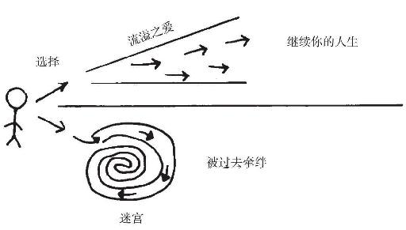

---
title:  施图茨的疗愈之道 （Stutz）
date: "2023-04-10 15:45:36"
description:  从一个电影纪录片到心理工具包
tags: ["心理学", "电影"]
---

  - [起源](#origin)
  - [从影片内容开始](#movie)
  - [一篇散文](#prose)
  - [一段友情，两个人生](#about_life)
  - [工具（The tools）](#tools)
  - [灵性系统](#spiritual)
  - [其他话题](#others)
    - [抑郁症是真的吗？](#Depression)
    - [关于思考视觉化](#about_thinking)
  - [结尾](#humor)

<h2 id="origin">起源</h2>

如果说有一个心理医生能牛逼到有人愿意为他单独出一个电影纪录片，那他肯定帮助了很多人，他的思想大概率是值得挖掘的。

这是我点开电影时的心态，然后看着看着就发现，完了，得做笔记...

再稍微查查资料发现，完了，记笔记不够，得翻书....

<h2 id="movie">从影片内容开始</h2>

第一幕，办公室里，导演与医生互相问候，就像多年的老朋友一般。果然导演乔纳·希尔是医生帮助了多年的病人，他邀请一起用**一天时间**拍摄本片，记录下一场交流过程，让医生的思维工具传播出去从而帮助更多的人。

黑白的画面，很简洁，能看到的，是一个坦诚的男人，和一个风趣幽默又年老虚弱的医生。Stutz医生侃侃而谈，时而讲讲笑话，时而爆个粗口，全然没有医生的架子。很快便能意识到他为什么那么特殊了，这个瘦弱的老头，有时会很强势的对病人说：“完全按照我TM说的去做，你就会好起来的！”。这不是一个只会神秘微笑和点头倾听的心理医生，他像知心朋友，充满智慧的那种，他会跟你开玩笑，也会给你当头棒喝，是真的有东西。

接下来能了解到Stutz的治疗风格，他追求治疗的有效性，要能直接到帮助到病人，给患者希望和动力，而且要求效果立竿见影。因此他创建了一系列的**工具（tools）**。工具是一系列的思考模版，Stutz经常把这些工具画在小卡片上进行视觉化的呈现，教病人如何使用，这个过程也能加深与病人之间的纽带。

比如，Stutz提出了一个**生命力（life force）**的概念，生命力是引导人前进的底层力量，Stutz用金字塔进行了呈现。

生命力的底层是物理身体，中层是人际关系，顶层是和自我的关系。再迷茫的人，都可以先从锻炼身体、注意饮食开始来提升自己的生命力；而人际关系则能够把脱离尘世的人重新拉入这个世界，重点在于主动出击，找人聊天，请人吃饭都可；对于自我，则可以通过写作去梳理自己（这是我正在做的事情），这些都是能马上去做，能立刻提升生命力的事。

另外一个重要的工具是**因素X(Part X)**，代表了一切逆境或负面的因素，可以是你害怕的、极力避免的、驱动你的东西。代表人生过程中的反派。

然后引出了Stutz的核心思想，**人只要活着，就必须忍受痛苦、不确定性和持续的努力（Pain, uncertainty, constant work）**。（不停的对抗PartX，让人想起西西弗斯）

讲完这三个概念，Stutz的思想框架已经搭好，确实很有启发性。

如果影片就这么继续下去，两人就这么继续交谈，接着介绍更多的工具，那这电影不失为一个很不错的心理学科普。不过接下来发生的一幕，让电影进入了另一个层次...

一个面向观众的视角，一阵思考过后，导演打破第四堵墙，开始向观众坦白。其实这部电影的制作远比想象中的复杂，他遇到了瓶颈，无法接受自己拍摄一部教人们如何克服脆弱的电影自己却躲在谎言的背后。电影其实已经磕磕碰碰拍了两年，并不像开头所说，是一天内的谈话；他们一直坐在绿幕前，并没有呆在办公室，导演本人也一直带着假发装作自己还是以前的样子；自己也很迷茫，病人采访医生真的是好主意吗，会不会这个项目一开始就注定失败？

从这一幕开始，导演对观众坦诚，两人也更加坦诚，相约一起加油完成这部作品。从此，某种面具被撕掉——哪怕从一开始观众并没有在意。画面也变成彩色，欢快的钢琴乐响起，某种局面似乎被打开，一种豁然开朗的感觉。

<h2 id="prose">一篇散文</h2>

这部电影并没有严谨的结构，表面上贯穿始终的是Stutz的思想，小工具一个一个的介绍。但实际上支撑着影片走向的，并不是某种步步为营的科普逻辑，而是乔纳和施图茨的友谊，是某种情绪，这种情绪让对话持续，让智慧从中对话中生长出来。这是一篇散文，有时候聊聊人生，讲讲家庭，穿插着科普，很随性，想到哪说到哪。

可能也这也是为什么这碗鸡汤不让人讨厌吧，市面上大多数的鸡汤和成功学甚至都很正能量，说的东西基本都对，但就是让人厌恶，其实就是输在了真诚这一点上。再优秀的人都有他们要面对的那些痛苦，他们的part X。鸡汤让人厌恶是因为它们往往不真诚，躲在某个完美的背后输出大道理，不真诚的话语哪怕是正确的其实也只是废话而已。

受电影的影响，所以**接下来我也很散很散的写点东西。**

<h2 id="about_life">一段友情，两个人生</h2>

一开始导演小心机的穿插了Stutz吃药的一幕，原来医生患了帕金森，怪不得他画卡片的时候手很抖，图像也歪歪斜斜，让人很心疼。也许导演拍这电影也有一种心疼在里面，不知道他什么时候会出事，也许是希望趁着好友思维还清晰身体还能动弹的时候记录下他的风采吧。

Stutz讲述了他治疗风格的起源，刚入职还是小白的时候，有个病人找他，开门见山：“告诉我，我如何才能停止胡思乱想。别再探究我为什么没有安全感了，那纯粹是在浪费我的时间和金钱，因为我早就知道这一点了”！”。这经历是很难忘的，Stutz把它写进了自己书（The Tools）中第一节，电影里也提到类似的内容，当时他是无能为力很自责的，然后他花了几十年完善自己的理论想要去有效的帮助人。

Stutz有一个早夭的弟弟，对他童年以至于整个人生影响很大，他时常梦见他，感觉自己似乎扛着两个生命。他父母也因为这个事情，失去了情感上作为父母的能力，家庭氛围总是很严肃，比如他自己放学回家只要晚了一点，父母都会抓狂。

Stutz的母亲十分讨厌男人，总是在所有人面前骂男人，原因则是她的父亲在她很小的时候抛弃了家庭。她父亲40年后再次联系母亲，她丝毫不理睬。而他自己的父亲比较唯唯诺诺，母亲骂天下男人没一个好东西的时候，他父亲只能在一旁：“啊，对对对”。而母亲对外也很强势，她以抗租为生，曾逼得纽约市长在谈判时要求她必须离场。Stutz直到十几岁的时候才不得不面对这个问题：啊？我也是个男人啊？

回想这一切，Stutz说到，原来自己很小的时候就已经开始履行心理治疗者的义务了，他小心谨慎，努力变得优秀，顺应父母的意愿成为医生，他缝合的是自己的家庭，自己父母心里的创伤，父母的影响让他成为了这样的人，刚开始做心理医生的时候，一切衔接自如，因为他一直以来做的都是这样的事情。

而导演Jonah也受到了母亲很大的影响，他小时候很胖，他的母亲时常针对这一点批评他，要让他减肥，让他变得更好。这让Jonah厌恶那个青年时期胖胖的愤世嫉俗的自己，那个形象让他感到羞耻，哪怕长大了之后他努力锻炼身体，变得健美，这也一直是一个不想触碰的伤痛，这个形象长在了自己心中，成为看待自己的坐标，他内心中的阴影。

他在Stutz的帮助下走出了这个困境，导演甚至把母亲邀请来参加对谈，有心理医生在一旁的加持下，两个人前所未有的坦诚，打开了自己的内心。其实母亲小时候也是家里最胖的那一个，一直遭到她父亲的批评，而她也接受了这种思想，同样的要求传递到了自己的儿子身上，给儿子施加了类似的压力。仇恨能一代代传下去，其实想法偏见也都能，能很明显的看到一些东西就是这么一代代影响下去。当然并不说肥胖不是问题应该忽略，而是不应该以批评贬低的方式去面对，要直视它背后的原因，是什么让一个人胖了？现实的无奈？自暴自弃？一味的批评并不能促使改变，反而可能会触发逆反，甚至留下心理阴影。

好羡慕这种真诚啊，我能和自己的母亲这样子聊天吗？希望这辈子有这种机会吧。

两人继续谈话直到到电影结尾，中间略过，感兴趣的自己去看。

最后导演对Stutz说，这个电影初衷是想把治疗中接触到的内容传播给所有人，不知道别人怎么看，更重要的是一起做了这件事。

Stutz也表示，自己74岁了，做了这件事很重要。

最后两人互道了爱意：

（导演）love Phil,  love life

（施图茨）I love U（尴尬笑）

哎呦，这种友谊真好。

<h2 id="tools">工具（The tools）</h2>

毕竟是科普片，重点还是这些思维工具。这些工具曾在2013年出过书详细介绍，书名就叫工具《The Tools》，书本还有对应的[网站](https://www.thetoolsbook.com/)，做的很精美。

2021年出了中文版的书，叫《自愈》，副标题：成年人崩溃自愈指南，满满的鸡汤感，豆瓣评分也很低。诶...国内这些出版商哟...老套路...整出来的这些东西...一言难尽...

这些工具我根据电影和书本挑一些重点写下来，这些工具像一则则伊索寓言，很简洁，但信息量很丰富，是某种智慧的浓缩胶囊，难受的时候可以拿出来嚼一嚼。

1. **概念1: 生命力（life force）**
   同上文，快速改变自己的突破口，寻找人生意义的底层动力。

2. **概念2: 因素X,PartX**
   一切的负面，它也是意义的来源，硬币的另一面。就像电影里的反派，没有它，就没有战胜邪恶这回事，也就没有英雄的高光，它永远不会被消灭，只能被抑制。

3. **工具1: 逆转渴望**

   

   闭上眼睛先构想一个情形，某种因为陷入舒适圈不愿意做的事情，比如不想出门去上课而宅在家里，比如说不想出去社交。需要把这些困难带来的痛苦看成乌云，感受这种痛苦然后穿越它，从而掌握它。你走向痛苦，痛苦则会退缩，你收获的将会是更多的自由。
   这个工具可以帮助自己走出舒适圈，把不想做的事情对象化，把痛苦转化为动力。

4. **概念3: 影子（The shadow）**
   内心的第二自我，比如电影里导演心里那个胖胖的青少年版的自己。影子是我们感受这个世界的中介，会影响自己看待世界的方式。闭上眼睛，想象自己面对一群让自己不自在的人和场景，注意这个情绪，它就是你的影子。

5. **工具2: 内在权威**
   这个工具能加强自我信心，屏蔽外界对自己的看法。

   - 接纳自己的影子，与自己的影子达成和解，意识到影子本身所蕴含的价值
   - 与自己的影子一起面向观众，发出声明，感受你们一起说话时达成的权威
     

6. **概念4:乌云**

   乌云的上方是太阳，是正面事物的普遍象征，但它被遮蔽住了。乌云代表的是负面思维
   

7. **工具3: 感恩之流**

   
   那些被视作理所当然其实可以感恩的事物，感受那些东西的价值。比如：“感谢我身体还算健康”，“感谢我吃喝不愁”，多提几个，感受自己被感恩的能量包裹，充满了温暖。释放这种能量，它能帮你穿越乌云。
   这个工具能帮助突破负面思维，比如懊悔、憎恨、愤世嫉俗等所有x因素。

8. **概念5: 珍珠串（String of pearl）**

   这是一种人生观，Stutz认为，人活着就必须忍受痛苦、不确定性和持续的努力这三件事。而且这种努力是一以贯之的，人必须不停的朝着目标进发，这是一个战斗的过程。每一个阶段就像一颗珍珠，人生就是把这个珍珠串起来的过程，而且这个过程当然不是完美的，珍珠也会沾上屎（原话 The turd 😂），不过不要纠结于这个，重点是继续串珍珠。

   

9. **工具4: 危机（jeopardy）**

   我们需要一个工具来产生意志力，来治疗拖延症，以及半途而废。

   

   “想象自己能看到未来，躺在病床上，生命将要结束，到时候明白了当下的时光有多重要。你看到那个老人冲你大叫，不要浪费自己的生命！”。忘了其他工具不要紧，记住这个工具吧，记住它也就记住了其他工具。

10. **概念6: 迷宫（The maze）**
    迷宫指的是某种情绪陷阱，对应电影中的例子，就是Stutz的母亲对抛弃自己父亲的恨，这种恨主导了她的一生。
    **迷宫往往和一个其他人有关**，某种刺激让你越陷越深，让你愤怒，让你委屈，可以是一个眼神，甚至是一个语气。
    得走出来，这种情绪会浪费大量的生命，但是很难，因为追求公平也是人的本性。

11. **工具5: 积极的爱**

    走出迷宫则需要克服对公平的期望（毕竟公平是奢侈品），能比公平更强大的东西只有爱了。
    “想象自己被爱的光芒包裹，感受自己与这份爱合二为一，它想要释放出去。想象那个让你愤怒的人，把你心中的爱送给他们，毫无保留。跟随这个爱，感受它对他人的渗透，完全接纳他。最后，放轻松，再次感受被爱包裹”

    
    （个人觉得，这个思想有点滥情，但是我也认可它的想法，毕竟斤斤计较太浪费生命了....）

<h2 id="spiritual">灵性系统</h2>

**灵性系统是Stutz思想体系的地基，是支撑整个工具系统运转的存在论框架**。上文提到的所有工具，其实都还是“术”，灵性系统才是施图茨的“道”。

图左边代表人生问题，包括了疾病、失业等，问题由掌管**进化的力量**（可以说是上帝，更高的意志，宇宙等等）送下来，然后人使用工具来解决问题，就像阶梯所示。向上的阶梯代表达到一个新的层次，一个人可以获得更高的动力，能做到前所未有的事，这个系统意味着，每个人都是自由人，是创造者。这个系统的秘密是，**问题和解决问题的动力都来源于一个东西——进化的力量**，他们其实都是一个系统的组成部分。唯一不属于这个系统的，是人的自由意志，进化或者躺平，都是个人选择，而宇宙不会干涉你的选择。

做一个比喻就是，假设这个宇宙是一场游戏，这个游戏设立了一个目标——进化，而人就是这个游戏里的玩家，游戏会不停的抛出问题，同时也提供解决问题的方法，游戏不会干涉玩家的选择，但是鼓励玩家发挥主观能动性。玩家在则会在解决问题的过程中升级变强。

让我想起了孟子的名言，曰：“天将降大任于是人也，必先苦其心志，劳其筋骨，饿其体肤，空乏其身，行拂乱其所为，所以动心忍性，曾益其所不能。”（真的太像了...）

其实这也就可以理解为什么施图茨常常让患者闭上眼睛，通过感受某种“爱”或者“感恩”来获得动力突破瓶颈。“爱”或者“感恩”都是进化力量的某种代号，他是真的相信灵性的存在，相信这些工具能让人们接触到这种力量，真的能帮助到大家。也许听起来可能有点过于狂热了，经历理性主义训练的人（包括笔者）本能上是排斥这种说法的，不过书里面施图茨讲述了这种信念的来源。

“他曾经厌倦了诊疗的工作，那种倦怠和痛苦逼得他去找内科医生（原来心理医生真的也会有心理问题），然后没有用，他选择向内寻找答案。那段时间，除了看诊就是睡觉，他感到内心有种东西在生长出来。证据出现在诊疗工作中，他意识到自己创建工具用来帮助患者时，某些信息也会出现，那些信息不是来自于别人，也不是来自于自己，似乎他只是某种力量的代言人，那些他本不知道的答案居然会从他的口中说出。而那些使用了他的工具的人，哪怕再怎么不配合的征询人，也能通过这些工具唤起更高的动力。从那之后，他相信，所有人都在一个灵性系统里，他感受到了某种宇宙的爱，这种宇宙才会教会我们需要学习的事物。”

其实很多领域的顶尖人物都有这种感受，比如说一个作家，往往感觉到不是自己在写文章，而是文章在写文章自己，似乎文字必须要以那种排列组合出现，故事情节必须要那么进展，彷佛有自己的意志一般；再比如说一个音乐家，当他作曲的时候，音符似乎必须要那么组合，那种组合才是悦耳的；对于画家，有时候似乎存在一个上帝握着你的手在画画；对于书法家....太多了，不举例子了，只是没想到，心理学家也有类似的体验，而且是这样的。

话说回来，施图茨之所以那么狂热信仰这套灵性系统，是因为他自己受到了拯救，同时也用了这些工具拯救了很多的人。从头到尾他也没有强制任何人去相信这套理论，他只是孜孜不倦的推广这些最高意志通过他的大脑所创建的工具，而灵性系统不失为一种很有意思的世界观。

这套哲学有很多有积极的方面，比如

1. 肯定人的自由，主张人要行动，去克服困难，体验生活。
2. 它拒绝了外界的权威，比如神、上帝；灵性在它这里更像是一种力量来源，一种工具，生命的决定权还是在自己的手里。
3. 主张解决问题是促进人进化的过程，它让人以乐观的心态去面对困难，提供了某种人生意义的同时也能很好的排斥享乐主义，消费主义。

但有些怀疑笔者也想提出来

1. 灵性的说法还是太唯心了，太过于接近宗教，虽然施图茨本人没有发教但这个思想很容易朝那个方向演化，人总是很难抵御信仰的诱惑，毕竟它给人的精神支撑还是太强大了。
2. 灵性被神秘化了，过于推崇灵性可能会让人放弃理解宇宙的奥秘只专注于内心的充实感。我也愿意承认存在更高意志或者进化力量（不管他叫什么名字），但我也愿意研究它，进一步理解它。
   有可能施图茨曾陷入了某种心流的体验，这种生理体验给了他灵感；也有可能是在帮助其他人的过程中让他体会到了自己生命的意义，从而实现了自我和病人的双重拯救，或许他该感谢的是自己而不是归功于灵性。
3. 困难和痛苦确实是成长的阶梯，但很多人就是走不出来，也许他们接触工具后能获得救赎，但大多数人并没有钱去看心理医生，况且 只专注内心与进化力量的链接去获取能量，忽略不公平的环境所造成的普遍性的痛苦，并不能治愈一个病态的社会。

总的来说施图茨的思想还是积极的，他鼓励人们成为创造者，这是他作为一个心理医生从业几十年对这个充斥虚无的世界开出的一剂药方，而那些工具也确实经过了大量临床检验，非常值得用起来。

<h2 id="others">其他话题</h2>

<h3 id="Depression">抑郁症是真的吗？</h3>

抑郁症当然是真的，但是关于它存在不少争议。

毕竟这种病没有肉眼可见的创伤，说得了就是得了，无法反驳，加上曾有过很多明星公关用这个病做借口来博同情，让不少人对抑郁症有一种怀疑。

再加上一些左派小将的鼓噪，将抑郁症污名为小布尔乔亚的文化，认为抑郁症不存在，真正存在的是资本主义制度对人的异化以及同这种制度沆瀣一气并火上浇油的医药产业，那么多的无产阶级打工人产生的心理问题本质上都是这种异化的体现。

不能说这些左派小将全是错的，他们确实指出了当代人精神问题的一部分来源是制度性的压迫，但不能否认抑郁症。比如经历了校园暴力从而跳楼的孩子，他们的压力来源就是周围孩子人性里很单纯的恶，跟资本主义没有任何关系。

国内心理咨询行业发展严重不足，大家还不能分辨心情不好和抑郁症的区别，大部分人出现心理问题很大程度上都是通过求神拜佛和中医解决的，大量心理学专业的毕业生拥挤在HR岗位或者成为婚恋网站的红娘。

诶...

其实施图茨的生命力金字塔理论挺好的，难受了就可以做这三件事：锻炼身体、开始社交、写东西。如果不想动就用逆转渴望工具，太拖沓了就用用危机工具。

<h3 id="about_thinking">关于思考视觉化</h3>

为什么施图茨的工具是有用的？忍不住想这个问题。

施图茨做了主要帮助咨询者做了两件事

1. 用小卡片把工具画下来
2. 闭上眼睛，描绘场景，然后感受爱与温暖

发现它他主要在做一件事，**帮助咨询者把思维视觉化**。

视觉化的思维有很多好处，比如

1. 它能把抽象的内容具体化
2. 激发人的创造力

咨询者往往是带着痛苦而来的，这种痛苦无形却又重如泰山，这个时候若能告诉咨询者，它叫因素X，它是你身上的一个影子/一个迷宫，这时候痛苦就具像化了，变成了一个可以处理的对象。

再比如说危机工具，人往往容易及时行乐而放弃长期需求，比如刷短视频停不下来。这时候想想那个生命尽头病床上的愤怒的自己，长期需求就变得很具体了。

<h2 id="humor">结尾</h2>

菲尔·施图茨并不是一个传统的心理治疗者，它抛弃了科学的理性精神，拥抱了灵性（很像晚期的容格）。他所有的工具都是在引导人们从那个灵性的领域汲取能量。他很狂热，对自己的发现很有自信心，因此他也很积极的让咨询者接受并使用他的工具，毕竟在他的价值观里，这些工具并单纯是他的创造，而是最高意志借他之手送给世人的爱。

电影评分不高，相关的书评分也不高，想想其实也正常，毕竟是鸡汤。

但我确实被电影的真诚打动，被施图茨身上的那种温暖和坚韧打动。

一切的路都是自己选的，之所以这么选，是因为认同它，愿意这样子去做。
