  - [Partial-order planning and hierarchical task networks 偏序计划和分层任务网络](#w4_Partial-order_planning_and_hierarchical_task_networks)
    - [Partial-order planning 偏序计划](#w4_Partial-order_planning)
      - [Partial-order 偏序关系](#w4_Partial-order)
      - [POP algorithm 偏序计划算法](#POP_algorithm)
      - [Duality 对偶性](#w4_duality)
      - [POP 小结](#w4_pop)
    - [hierarchical task networks 分层任务网络](#w4_HTN)
      - [HTN planning HTN 规划](#w4_HTN_planning)
      - [HTN refinements - HTN 细化](#w4_HTN_refinements)
      - [HTN planning example - HTN规划示例](#w4_HTN_Planning_example)
      - [HTN 小结](#w4_HTN)

<h2 id="w4_Partial-order_planning_and_hierarchical_task_networks">Partial-order planning and hierarchical task networks 偏序计划和分层任务网络</h2>

继续聊规划问题。一个好的规划有一个难点，即可序列化子目标的规划问题：存在子目标的顺序，它们应该按顺序实现而不会破坏任何先前实现的子目标。

如下图推箱子：

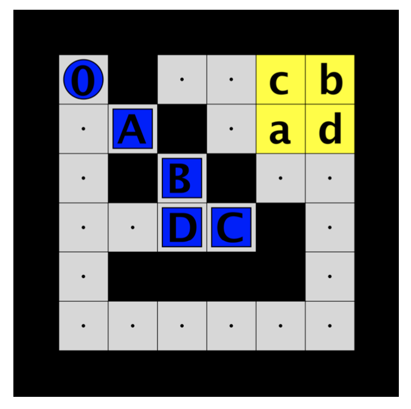

每个箱子都是一个小目标，但实现小目标的顺序对计算量的影响很大；但在之前聊过的抓手问题中，顺序并不重要；在机器流水线安装过程中，顺序则可能是唯一的。

**偏序计划（Partial-order planning，简称POP）**和**分层任务网络（Hierarchical Task Networks，简称HTN）**是人工智能（AI）领域的两种主要计划方法。它们都涉及在解决问题时找到合适的行动序列

**偏序计划**需要结合集合中元素之间顺序关系的数学概念**线性序列（Linear sequences）**和偏序关系（**partial orders**）进行理解（线性序列是一个具有全序关系的集合，其中的元素之间存在唯一的顺序关系。例如，我们可以将一组整数按照从小到大的顺序排列，这就是一个线性序列。偏序关系是一种更为一般化的顺序关系，它不要求集合中所有元素之间都具有明确的先后关系）。

另一个拆解问题的思路是**层级化分解**（**hierarchical decomposition**），把复杂问题拆违几个小问题，而每个小问题能拆解为更小的问题。比如吃饭问题，拆解为找到食物、吃掉食物两个小问题，找到食物可以拆解为选择哪家超市、怎么去超市、去超市买哪些食物的问题。

<h3 id="w4_Partial-order_planning">Partial-order planning 偏序计划</h3>

**Partial-order planning (POP) 偏序计划: **一种产生部分有序计划的计划技术，忽略独立行动的顺序。对于部分可分解的问题特别有效(比如规划一场party)

偏序计划是一种在搜索空间中寻找解决方案的方法，采取的依然是分而治之的思想，它以一种灵活的顺序构建行动序列，同时解决行动之间的约束问题。POP的关键特点是其能够对行动进行部分排序，这意味着，当确定了一个行动序列的一部分时，计划者可以同时处理其他的行动序列。通过这种方式，POP能够降低计划过程中的复杂性，同时提高搜索效率。

<h4 id="w4_Partial-order">Partial-order 偏序关系</h4>

接下来梳理偏序关系中用到的诸多概念

1. 在偏序计划中， 偏序关系用 < 表示， 用穿袜子的例子， LeftSock < LeftShoe，表示穿袜子在穿鞋子之前

2. 偏序的线性化（ **Linearisation** of a partial order）：在计算机科学中，我们通常使用拓扑排序算法（Topological Sort）来线性化一个偏序集合。

   e.g: 假设有一个偏序集合{a, b, c, d}，其中元素之间的偏序关系如下：

   a ≤ b, a ≤ c, b ≤ d, c ≤ d

   为了线性化这个偏序集合，我们可以使用拓扑排序算法，具体步骤如下：

   1. 找出所有没有前驱节点的节点，即入度为0的节点。在这个例子中，起始节点是a。
   2. 将起始节点a加入拓扑序列，并将a的后继节点b和c的入度减1。
   3. 继续找到所有入度为0的节点，并将它们加入拓扑序列。在这个例子中，下一个节点是d。
   4. 最后一个节点是b或c都可以，这里我们选择b，因为它比c更靠前。

   因此，这个偏序集合的线性化结果是a → d → b → c，其中“→”表示顺序关系。这个结果满足原偏序关系中的所有顺序关系，因此它是这个偏序集合的一种线性化。

3. **Solution 解决方案**： 如果一个偏序关系≺的任何一种线性化都构成了一个计划（从起始状态到目标状态的动作序列），那么这个偏序关系被称为一个计划问题的解决方案。使用偏序关系作为计划问题的解决方案可以使得计划问题更加灵活、可扩展、高效和可解释

   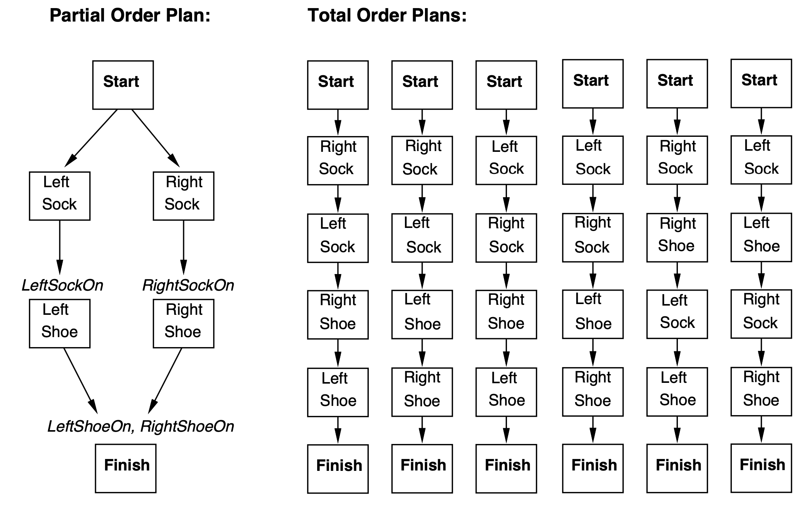

   4. **Ordering constraints 顺序约束**： 
      1. A ≺ B ，其中 A 和 B 是动作。解释：动作 A 必须先于动作 B。
      2. A ≺ B：A,B 都是动作，c是A的效果，也是B的前提条件。读作：“action A **achieves** (pre)condition c for performing action B” or simply “A **achieves** c for B.”
   5. **部分有序计划（Partially Ordered Plans）**：
      - 一个有向图，node代表action
      - Edge 代表动作之间的顺序约束ordering constraints
        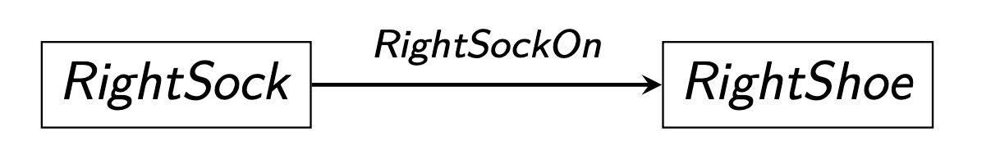

   6. **Open preconditions 开放先决条件**：
      上接4.2， c就是B的先觉条件。如果c在计划中没有任何操作实现它，那么这个前置条件就是**开放(open)**的，也就是说，计划中不包含任何形如A≤B 的顺序约束

   7. **conflicts 冲突**：

      对于一个顺序约束（ordering constraints）A≤B，如果存在一个动作D，会毁掉条件C，那执行A和B的过程中不能执行D，可称其为冲突

   8. **POP algorithm (partial-order planning algorithm)** 偏序计划算法:

      从空的部分有序计划开始

      - 选一个开放先决条件，然选一个能完成它的动作，迭代增加actions(nodes)和顺序约束ordering constraints（edges）
      - 解决所有因此而发生的冲突

   如果一个部分有序计划（Partially Ordered Plans），没有开放先决条件，也没有冲突，那它就是一个规划问题的Solution 解决方案。（因为部分有序计划的任何线性化顺序≺都将构成一个有效的计划）

<h4 id="POP_algorithm">POP algorithm 偏序计划算法</h4>

展开讲偏序计划算法

1. 初始化：空计划
2. 开始：一个动作，规划问题的开始状态描述为该动作的效果
3. 结束：一个动作，规划问题的目标状态为该动作的前提条件
4. 步骤： 选一个开放条件c对应动作B，然后选一个能完成c的动作A
   1. 添加顺序约束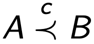
   2. 解决所有冲突
5. 回溯：如果一个前提条件无法被解决或者某些冲突无法被解决

抓手问题的POP实例：

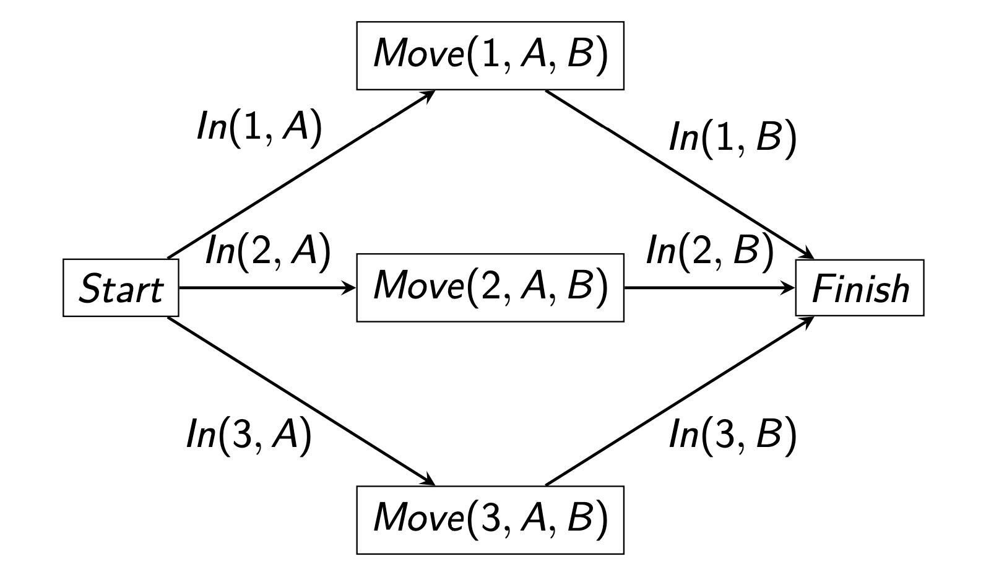

<h4 id="w4_duality">Duality 对偶性</h4>

部分偏序计划和空间状态是对偶的（他们都是空间有向图），一边的节点是另一边的线。

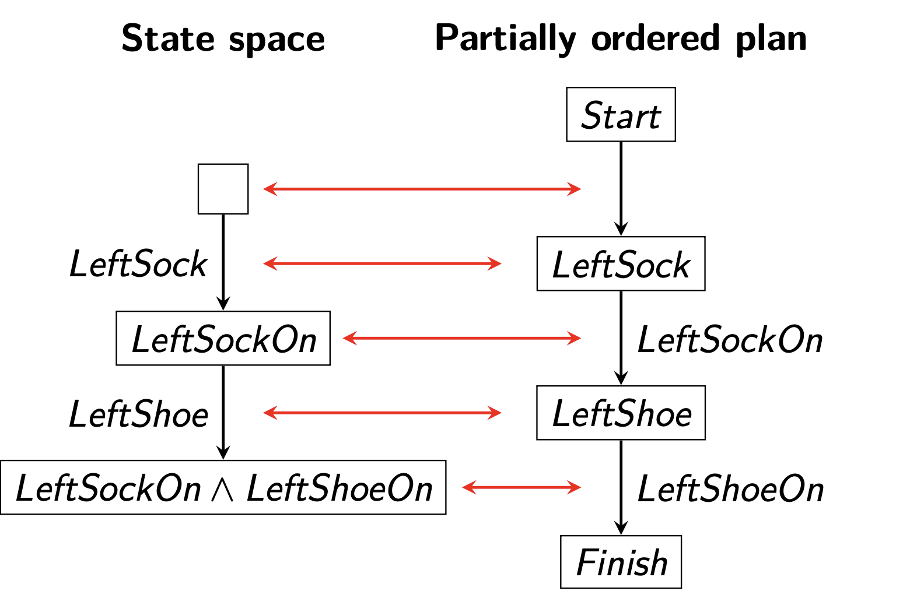

<h4 id="w4_pop">POP 小结</h4>

- pop和回归规划（regression planning）与additive/max 启发式相似，都是从目标到初始状态的思路
- pop的图，和状态空间图成对偶
- POP的线性化组成一个规划问题的方案
- 好处
  - 利于分解问题，不用考虑单独动作的顺序
  - 动态规划的中适合调整规划
  - 很自然的处理规划和调度问题
  - 人比较难能理解
  - 应用：火星探测，Maersk航运
- 坏处：目前无法处理大型的问题，比较难找到好的heuristics

<h3 id="w4_HTN">hierarchical task networks 分层任务网络</h3>

分层任务网络规划的好处是能把复杂的组合问题从原子层级开始处理

一如既往的，展开之前先梳理概念

<h4 id="w4_HTN_planning">HTN planning HTN 规划</h4>

1. **层次任务网络规划（HTN规划）：**一种探索层次规划思想的规划方法。HTN规划的核心组成部分是动作分解
2. **Action decompositions (or refinements) 动作分解（或细化）**：将高级动作（ **high-level action** HLA）分解为一系列低级动作。
3. **HTN planning algorithm**HTN规划算法：HLA被**递归**地细化，直到只剩下原始动作（不可细化的动作）。
4. HLA的实现**Implementation**：是对递归细化成原始动作的结果。通常不是唯一的。

<h4 id="w4_HTN_refinements">HTN refinements - HTN 细化</h4>

HTN 细化模式（**refinement schemas**）表示。细化模式由以下元素组成：

- **HLA name**: 细化模式为其定义分解的 HLA 的名称。例如。 GetFood、Buy2Things(x, y) 或 Navigate (x, y)

- **Precondition**: 细化应用条件。有时候前提条件没有明确说明，因为它可以从模式的步骤中计算出来。

- **Steps**： 一串动作，可以是基础动作，也可以是高级动作，写法：[Buy(x, Shop), Buy(y, Shop)] or [Go(x, z, r), Navigate(z, y)].

  例子：
  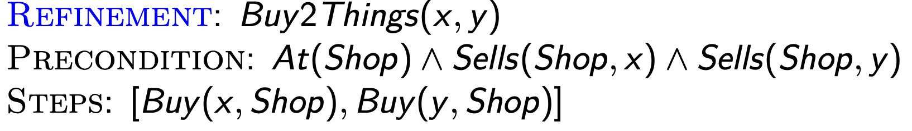

- **multiple refinement 多重细化**：同一个高级动作可以有很多的细化模式

- **High-level plan 高级规划**：动作组成，一个高级规划应该至少要完成一个小目标才对

- **Downward refinement property 向下细化属性：**对于一个HLA动作模式来说，如果其具有向下细化属性，那么通过对其进行细化，可以得到原始动作集合，这些原始动作集合可以实现该HLA动作模式。

- **Representing high-level actions 高级动作表示法**： 
  使用 PDDL/STRIPS 动作模式来表示，Navigate(x, y)可以这么写：

  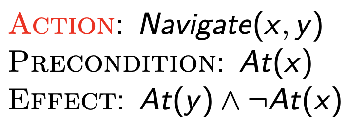

<h4 id="w4_HTN_Planning_example">HTN planning example - HTN规划示例</h4>

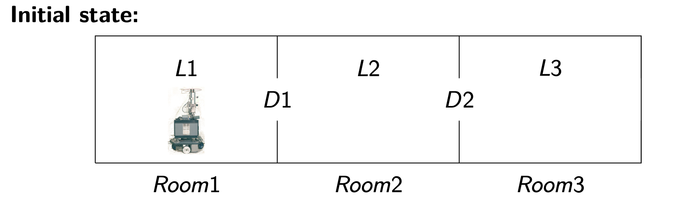

假设有一个机器人Shakey位于房间1, 目标是到达L3，初始状态如上，要执行HLA Navigate(L1, L3)的操作，即从L1引导机器人到L3

细化模式如下：
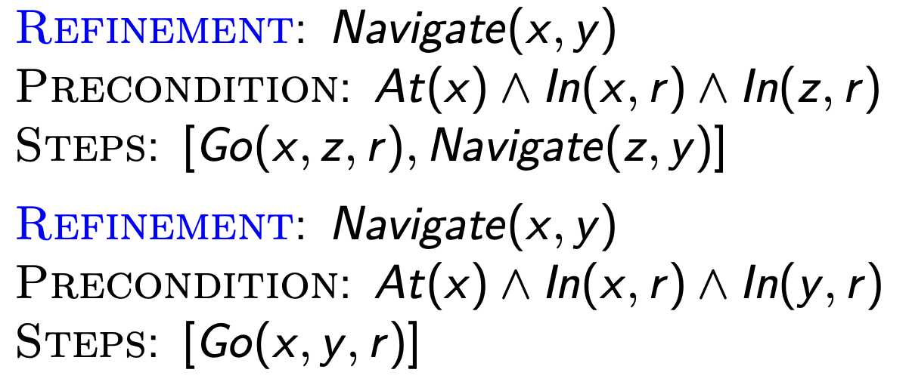

HLA Navigate(L1, L3)的实现分为一下几步：

1. 先位于L1， Navigate(L1, L3)细化为[Go(L1, D1, Room1), Navigate(D1, L3)]
2. 然后到达L2, [Go(L1, D1, Room1), Go(D1, D2, Room2), Navigate(D2, L3).
3. 最后到L3 [Go(L1, D1, Room1), Go(D1, D2, Room2), Go(D2, L3, Room3)].

因此细化模式能完成**目标 At(L3)**

再复杂化这个例子，要把箱子从L2推到L3,可以如下拆分实现

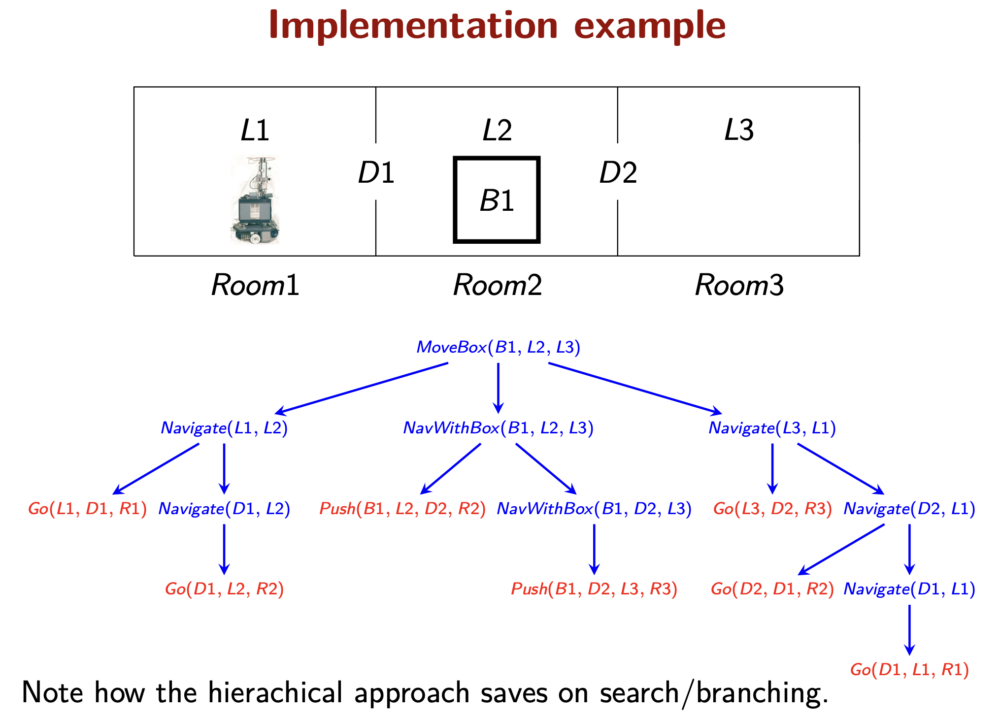

<h4 id="w4_HTN">HTN 小结</h4>

HTN的最大优势：可以以沿轴从纯命令式（无搜索）到纯声明式（仅搜索）任意调整

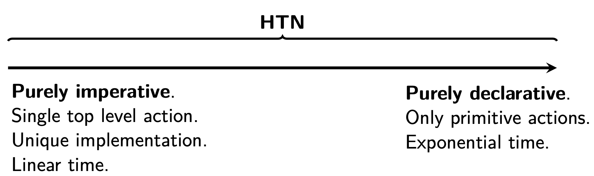

换句话说，拆分子任务可以拆出不同风格

- 拆的粗一点，几步就好。
- 拆的细一点，甚至可以变成传统的规划问题。

这种拆分思路是解决复杂问题的大杀器， **HTN是所有规划问题应用领域最广的方法**，被用在了 用于生产线调度，航天器规划和调度，设备配置，制造过程规划，疏散规划，桥梁计算机，机器人技术。被日立、普华永道和捷豹汽车等公司使用。

