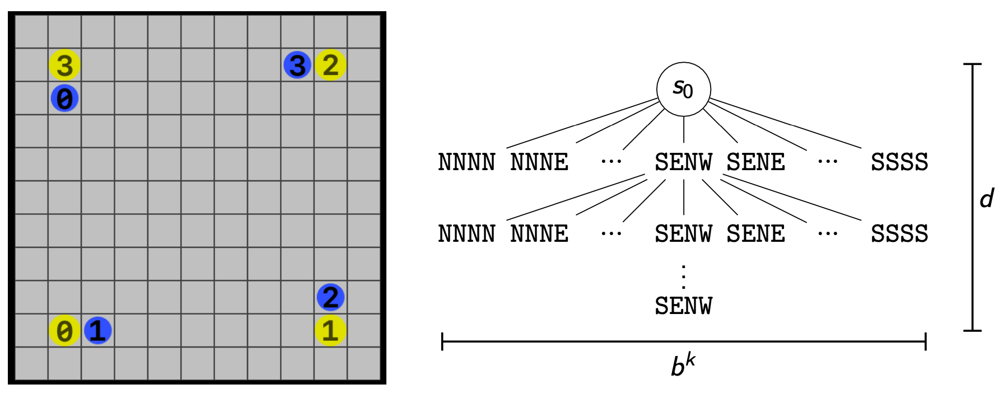
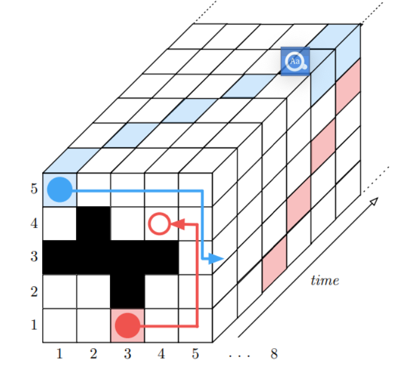
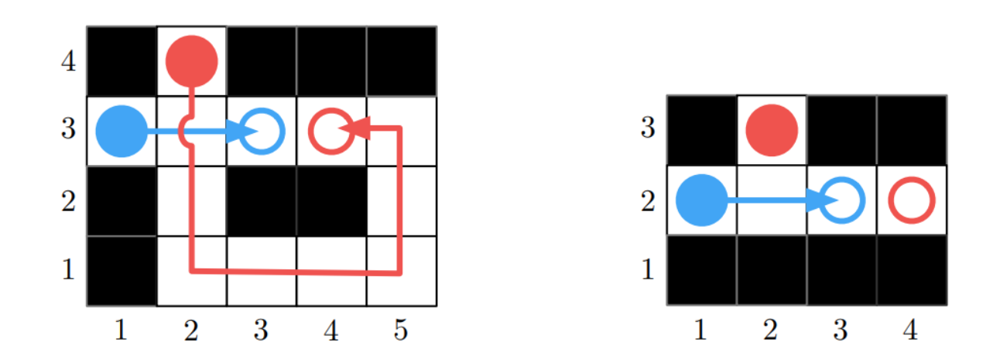
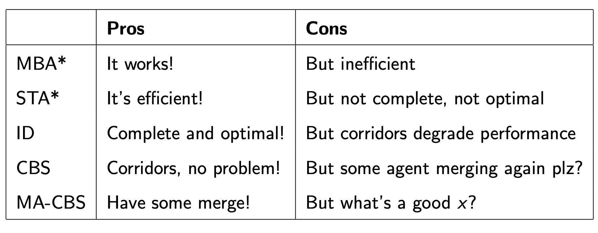
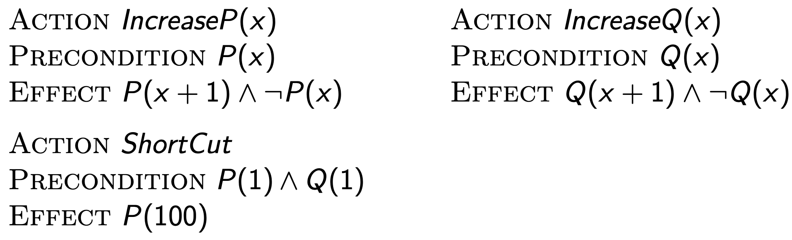
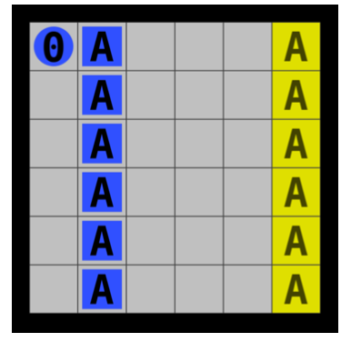

  - [Conflict based search 基于冲突的搜索](#w6_Conflict_based_search)
    - [multibody A* 多体A算法](#w6_multibody-A*)
    - [Space-time A* 空间-时间A*算法](#w6_Space-time-A*)
    - [Independence detection (ID) 独立检测](#w6_Independence_detection)
    - [Conflict based search (CBS) 基于冲突的搜索](#w6_Conflict-based-search)
    - [Meta-agent CBS 元智能体冲突搜索](#w6_Meta-agent-CBS)
    - [总结](#w6_summary)
  - [Planning based on Iterated Width (IW) 基于迭代宽度的规划](#w10_Planning-based-on-Iterated-Width)
    - [Potential issue with relying only on heuristics 依赖启发式的潜在问题](#w10_heuristics-issue)
    - [Planning over size-bounded states 有大小限制的状态](#w10_size-bounded)
    - [Width of a problem 问题宽度](#w10_Width)
    - [Non-optimality of Iterated Width 迭代宽度的非最优性](#w10_Non-optimality)
    - [Effective width有效宽度](#w10_Effective-width)
      - [序列化迭代宽度 Serialized Iterated Width](#w10_Serialized-Iterated-Width)
    - [Efficiency of Iterated Width algorithms 迭代宽度算法的效率](#w10_Efficiency-of-Iterated-Width)
  - [Machine learning + Iterated Width 机器学习+迭代宽度](#w10_Machine-learning+automated-planning)


<h2 id="w6_Conflict_based_search">Conflict based search 基于冲突的搜索</h2>


**基于冲突的搜索（Conflict-based Search CBS）**, 是一个用来解决**多智能体路径规划问题（Multi-Agent Pathfinding Problem）**的算法，它的目标是在一个给定的环境中为多个智能体找到无碰撞的路径，其核心思想是通过检测并解决智能体之间的冲突来达到理想解。算法从智能体之间的约束冲突开始，通过不断迭代来寻找冲突的最佳解决方案。

解决多智能体路径规划问题算法有很多，接下来展开

<h3 id="w6_multibody-A*">multibody A* 多体A算法</h2>

1. 多体A * 算法（MBA * ）是基于经典的A * 搜索算法，通过扩展A*算法而来

2. 启发式：$h(s) = \sum_{i=1}^{k}dist(v_{i,s},g_{i})$

- $v_{i,s}$是agent所在状态s的位置点
- Dist 计算的是不同V之间的最短距离，可以提前计算（使用Floyd-Warshall算法，时间复杂度 O($V^{3}$))

> Floyd-Warshall算法是一种用于解决带权有向图中多源最短路径问题的动态规划算法。它能够找出任意两个节点之间的最短路径，即使图中存在负权边。Floyd-Warshall算法的时间复杂度为O(n^3)，其中n是节点数。
>
> 算法的基本思路是利用动态规划的思想，通过已知节点之间的最短路径推导出其他节点之间的最短路径。具体来说，算法通过一个n * n的二维矩阵D，其中D[i][j]表示从节点i到节点j的最短路径长度。初始时，D[i][j]的值为i到j的边的权值（如果i和j之间有边），或者是正无穷大（如果i和j之间没有边）。然后，对于每一个节点k，算法将D[i][j]的值更新为min(D[i][j], D[i][k] + D[k][j])，即通过节点k来更新i到j的最短路径长度。最终，矩阵D中存储的就是任意两个节点之间的最短路径长度。


3. **MBA*是完备的**，即能够找到问题的解（如果有解的话）
4. **MBA* 算法是理想的(opmital)**，如果启发函数是可行的，则能够找到最短的解
5. 如果有k个agent，**分支因子**（Branching factor）就是$b^{k}$
6. 如果存在一组长度为d的（最短）动作序列，可以使得所有智能体都到达它们各自的目标，则我们称解的**深度(solution depth)为d**。
7. **最坏情况Worst case:**  最坏情况下，我们需要检查所有深度为d的搜索树分支，即需要扩展$b^{kd}$个状态， 所以时间/空间复杂度的上限也就是$b^{kd}$



上图，网格域，分支因子b=5：Move(N), Move(E), Move(S), Move(W), Noop；k=4 个agent；解的深度为d。如果没有启发式，空间状态db^k = 7 × 5^4 ≈ 4300 states(!)

但每个agent自己规划自己那么只需要 db^k = 7 × 5 × 4 = 140 states，能避免指数爆炸

在最好情况下（启发式完美引导搜索）：

- 减少分支因子
- k个问题能在时间/空间复杂度O(db)搞定
- 能不能用CDPS？合作分布式的架构，即relax -> solve -> unrelax

<h3 id="w6_Space-time-A*">Space-time A* 空间-时间A*算法</h2>

Space-time A* (STA*): 在A *的基础上考虑了时间限制



定义：一个constraint约束条件 (a,v,t) 表示在时间 t 时，智能体 a 不允许处于位置 v ∈ V

```python
def SpaceTimeAStar(problem , agents): 
  solution = dict()
  constraints = []
  k = len(agents)
  for i in range(k):
    plan = AStar(problem[agents[i]], constraints) 
    constraints += [(agents[j], v, t)
                    for j in range(i+1, k)
                    for t, v in enumerate(plan)] solution[agent] = plan
    return solution
```

假设有一个子程序 AStar(p,c)，它使用一个可行的启发式函数，可以解决单智能体问题实例，那么它限制c其实就是前一个智能体的解。

换句话说，前面的agent的解就是后面的agent的限制

问题：

- STA * 考虑了约束，但是并不理想（optimal），也不完备（complete）

  

- 理想情况下

  - 智能体能独立规划
  - 遇到冲突能多体（multiody）规划


<h3 id="w6_Independence_detection">Independence detection (ID) 独立检测</h2>

**冲突定义**：(ai,aj,v,t) 是智能体 ai 和 aj 的冲突，它们都计划在时间 t 时处于位置 v ∈ V

```python
def IndependenceDetection(problem , agents): 
  solution = dict()
  groups = [[agent] for agent in agents] 
  for group in groups:
    solution[group] = AStar(problem[group], []) 
    while not IsValid(solution):
      # Merge confliting groups
      (group1 ,group2 ,v,t) = FindFirstConflict(solution) del solution[group1]
      del solution[group2]
      merged = [group1 , group2]
      groups.append(merged)
      # Plan for the merged group
      solution[merged] = AStar(problem[merged], []) 
   return solution
```

重点是FindFirstConflict函数，(group1,group2,v,t) = FindFirstConflict(solution) 指的是两组智能体G1，G2，他们在时间t，地点v，产生冲突

这个算法理想（optimal），也完备（complete）

最坏的情况下，group包括所有的智能体

<h3 id="w6_Conflict-based-search">Conflict based search (CBS) 基于冲突的搜索</h2>

思路基于STA*，考虑限制，但是不做阻拦，而是重新规划，这也很像独立检测，但是不分组

大概思路：

1. 为每个智能体独立地规划理想路径。

2. 检测所有智能体之间的冲突。

3. 如果发现冲突，选择一个智能体并为其创建新的约束。

4. 使用新的约束为该智能体重新规划路径。

5. 重复步骤2-4，直到找到无冲突的路径或超出预定时间/迭代次数限制。

其中：

- 使用高层约束树（high-level constraint tree）来跟踪每个智能体的约束条件

  > 高层约束树，节点代表约束条件，例如智能体不能同时占用同一位置等。每个节点包含子节点，这些子节点代表更具体的约束条件。
  >
  > 例如，一个节点可以表示智能体不能进入一个特定的区域，而它的子节点可以表示智能体不能在特定的时间进入该区域。

- 每个智能体使用低级别的 A *搜索算法， 并考虑到其他智能体的路径和约束条件。


#### 冲突分类

冲突分为三种1. vertex conflict 顶点冲突，2. edge conflict 边缘冲突，3.Follow conflict 跟随冲突


#### 实例


蓝色需要走8步，红色走7步，cost = 7+8 = 15，能发现红蓝agent在t=4的时候位置D5冲突

> Cost = FlowTime  /  MakeSpan 
>
> 即：要么用总共消费时间计算，要么用总体时间跨度来算

然后，蓝色红色agent分别进行推演，计算cost


```python
def ConflictBasedSearch(problem , agents , cost): 
  root.constraints = []
  for a in agents:
    root.solution[a] = AStar(problem[a]) 
  root.cost = cost(root.solution)
  frontier = PriorityQueue(root, lambda n: n.cost) 
  while not frontier.empty():
    node = frontier.get() # get lowest cost 
    if IsValid(node.solution):
    	return node.solution
		(a1, a2, v, t) = FindFirstConflict(node.solution) 
    	for a in [a1, a2]:
        m = n.copy() 
        m.constraints.append((a, v, t)) 
        m.solution[a] = AStar(problem[a],m.constraints) 
        m.cost = cost(m.solution)
        if m.cost < infinity: # solution is found 
          frontier.put(m)
```

CBS是理想的也是完备的，因为还是探索了所有的组合去找了最短的解决方案。

不过主要是智能体高耦合（很多冲突）的情况下才比MBA*, ID的表现好

<h3 id="w6_Meta-agent-CBS">Meta-agent CBS 元智能体冲突搜索</h2>

这个是CBS的一个优化，大概意思是，如果如果智能体ai aj之间有超过x个冲突，那么把他们合并为一个meta-agent.(结合了Independence detection (ID) 独立检测的思想)

参数x是可以调整的

- 对于 MA-CBS($\infin$) = CBS
- MA-CBS($\infin$) = ID

```python
def ConflictBasedSearch(problem, agents, cost, x): 
  conflicts = dict()
  root.constraints = []
  for a in agents:
    root.solution[a] = AStar(problem[a]) 
  root.cost = cost(root.solution)
  frontier = PriorityQueue(root, lambda n: n.cost) 
    while not frontier.empty():
      node = frontier.get() # get lowest cost 
      if IsValid(node.solution):
        return node.solution
      (a1, a2, v, t) = FindFirstConflict(node.solution) 
      if conflicts[(a1,a2)] > x:
        m = merge(a1, a2, constraints) 
        m.solution[a] = AStar(problem[(a1,a2)] m.constraints) 
        m.cost = cost(m.solution)
        if m.cost < infinity: # solution is found frontier.put(m)
       else:
        conflicts[(a1,a2)] += 1 # then do as before
```

<h3 id="w6_summary">总结</h2>



- See (Silver, 2005) for STA*

- See (Standley, 2012) for ID

- CBS was introduced in (Sharon et al., 2015) and compares it to other state-of-the-art algorithms

  • Benchmark against other algorithms

  • Focus on completeness and optimality

##### reference

> Guni Sharon, Roni Stern, Ariel Felner, and Nathan R. Sturtevant. Conflict-based search for optimal multi-agent pathfinding. Artificial Intelligence, 219:40–66, 2015. ISSN 0004-3702. doi: https://doi.org/10.1016/j.artint.2014.11.006. URL https://www. sciencedirect.com/science/article/pii/S0004370214001386.

> David Silver. Cooperative pathfinding. In Proceedings of the First AAAI Conference on Artificial Intelligence and Interactive Digital Entertainment, page 117–122, 2005.

> Trevor Scott Standley. Independence detection for multi-agent pathfinding problems. In Workshops at the Twenty-Sixth AAAI Conference on Artificial Intelligence, 2012.


<h2 id="w10_Planning-based-on-Iterated-Width">Planning based on Iterated Width (IW) 基于迭代宽度的规划 </h2>

基于迭代宽度的规划是一种启发式搜索算法，主要用于解决状态空间规划问题。

迭代宽度规划的主要思想是通过限制问题的宽度来简化搜索过程，大致理解如下：

迭代宽度规划算法的核心思想是将问题分解为一系列的子问题，并逐步增加搜索宽度。在每一步，算法会考虑当前搜索宽度下的所有可能的状态变化，并试图找到一个解决方案。如果在当前宽度下找不到解决方案，算法会增加宽度，并重复这个过程。

接下来聊IW思路来源（还是解决规划的复杂性）：

<h3 id="w10_heuristics-issue">Potential issue with relying only on heuristics 依赖启发式的潜在问题</h3>

在STRIPS/PDDL规划中，因为状态由ground atoms集合组成，这种集合可能的数量是$2^{x}$，状态空间是指数级上升的。

举个例子，块问题（block world problem）：


假设有n个不同的块，语法有On(x,y), Block(x) and Clear(x)。clear(x)表示某个方块x上面没有其他方块，考虑到桌子则有n+1个原子；On原子有$(n+1)^{2}$个，所以总共有(n + 1) + (n + 1)(n + 1) = (n + 1)(n + 2)。可以发现状态空间是指数上升的O(n^2)

经典的处理方式是，使用启发式来引导搜索，然而这是有问题的

**启发式的问题**：

- 好的启发式太难找了，常常从 PDDL 描述中自动诱导的启发式不是很有效
- 即使使用良好的启发式方法，也可能会陷入启发式高原（**heuristic plateaus**），例如在使用曼哈顿距离启发式的贪婪最佳优先搜索时出现的这个关卡：
  
- 如果我们只关心部分原子来简单地减少状态空间会怎样？在上面的例子中，如果我们只担心代理 0 的位置，状态空间会小得多

<h3 id="w10_size-bounded">Planning over size-bounded states 有大小限制的状态</h3>

给定基本命题（ground atoms）集合**At**, 定义$T^{i}$为At的大小≤i的子集。所以它的大小是指数i级别的而不是|At|，所以$T^{i}$的元素是是受到i得大小限制的

举例子：在多智能体路径规划（Multi-Agent Pathfinding MAPF ）问题中，每个$T^{1}$只需要提供其中一个智能体的坐标

**定义**：

令一个状态s ⊆ At，s **包含contains** 一个子状态 t ∈ $T^{i}$ if t ⊆ s.

令规划问题Π，让Π(t)表示规划问题目标为t，然后我们需要解决规划问题Π通过在$T^{i}$上建造一个图。

令$G^{i}$为这个图，归纳方法为：

1. 令t为问题的起源root（iff t ⊆ $s_{0}$）
2. 当前仅当 Π(t)的所有最优规划都可以通过添加单个动作来扩展为Π(t′)的最优计划时，从t到t′有一条边edge

**结论**：

如果从起源到一个顶点能够满足目标，则我们有该长度的一个最优解

**举例子**：

考虑以上由$T^{i}$定义的问题$G^{i}$

假设有一个规划问题Π = (A,s0,g) 初始状态 s0 = {p1}, 目标 g = p4  动作集 A为{a1,a2,a3,a4,}


这个问题，状态空间为: 4^A，解决方案{a2, a4}

<h3 id="w10_Width">Width of a problem 问题宽度</h3>

每个规划问题都有一个宽度w，我们可以通过计算图$G^{w}$并搜索一个最优状态来达到目标

这听起来有些棘手，因为我们总是需要跟踪最优性并对所有最优计划进行量化，但有一种更简单的方法。

我们可以在无限制状态空间中进行搜索，但要跟踪它们包含哪些$T^{i}$状态。

我们只需要确保如果状态s ⊆ At的s添加到搜索树中，它至少包含一个新的T状态。为了保证最优性约束，我们只需要进行广度优先搜索。 

**定义**：

IW(i)算法类似于广度优先搜索，但仅在子状态s包含至少一个新的$T^{i}$状态时才将其添加到前沿frontier。 （与图搜索中的循环检查loop check进行比较。） 

**迭代宽度**（**Iterated Width**或简称IW）算法是按顺序运行 IW (0), IW (1), IW (2), . . .，直到发现目标状态。它是完备的，并在宽度问题的时间指数级中运行。

**例子(by Frederik Drachmann)**：


还是块问题：这次扩展重点在于，将子状态添加到边界的，得是以前没出现过的原子

如图，I. ->S1， S1可以扩展为S2,S4,S4,但S2出现过了，所以不能放入边界，再扩展S3,发现S6出现过了，所以也忽略S6，最后找到S7,目标实现。

回到这个MAPF问题


每次迭代，确认是否进入了一个新地点，如果没有，就不添加子状态。问题也有，为了获取最佳路线，搜索树不能被裁减。Maximal # of states generated:\#loc · #agt = 51 · 5 = 255

<h3 id="w10_Non-optimality">Non-optimality of Iterated Width 迭代宽度的非最优性</h3>

假设一个规划问题，初始状态S0={P(0),Q(0)}, 目标是P(100)

有三个动作模式：



很明显，最佳方案是IncreaseP(1),IncreaseQ(1),ShortCut 和 IncreaseQ(1),IncreaseP(1),ShortCut。然而，在跌打宽度的逻辑下会跑100次IncreaseP。

为什么呢？

因为在IW(1)，我们就已经在深度1的树下见过了P(1)和Q(1)，所以就不会把状态 {P(1),Q(1)}放入树的第二层。

**综上：迭代宽度并非最优解**

<h3 id="w10_Effective-width">Effective width有效宽度</h3>

迭代宽度IW(i)迭代增加i的值，第一个返回答案的i的值称为问题的**有效宽度effective width**

> 在国际规划竞赛（IPC）的规划问题中，有153个Sokoban级别。其中大约1/3的级别有效宽度为1，另外1/3的级别有效宽度为2，剩下的级别有效宽度大于2。

搜索宽度的增加有助于在复杂的问题中找到解决方案，但同时也会增加搜索空间的大小，从而增加计算成本。

请注意，**如果我们直接在宽度为w的规划问题Π上运行IW(w)，那么我们保证能够找到最优解。**

为什么呢？

对于宽度w，存在一个路径t0……tk在图$G^{w}$从根节点到节点tk，能够最优路径导向目标g。

通过构建，则存在一个动作序列a1……ak, 这样对于每一个l≤k，序列a1……ak对于问题 Π(tl)是最优的。

如果把这个动作序列应用到初始状态S0,就搞定了

**人话翻译一下：在有效宽度内，必有最优解**

<h4 id="w10_Serialized-Iterated-Width">序列化迭代宽度 Serialized Iterated Width</h3>

**注意⚠️：**

一个有n个子目标的规划问题（conjunctive goals）大概率其有效宽度≥n。我们有可能可以解决一组<n的子目标用少于解决所有子目标的步数，因此当i<n的时候IW(i)会阻碍我们去解决目标

一种可能的弥补办法来解决这种联合目标的问题就是考虑**序列化迭代宽度 Serialized Iterated Width** (or simply **SIW**)。

先跑迭代宽度直到实现了一个子目标，然后我们返回这个迭代宽度的新状态作为初始状态，直到之前的子目标和一个新的子目标被搞定。继续下去直到所有子目标都搞定

**SIW在一个问题上的有效宽度是在搜索过程中调用IW(i)的最大i值。**



考虑用SIW处理这个推箱子问题：

IW(1)会找到一个最佳路径去把最上面的箱子推到目标，在这个最优路径上没有任何状态被中断/减除，也没有子目标能够被更快解决，在结果状态中，一个最佳路径去把第二个箱子推到目标也只要IW(1)且不会被阻碍。持续下去就能搞定所有的箱子。

所以我们跑了IW(1)n次，n=箱子数量，如果我们把状态用原子On(x,y,z)来表示一个物体z在坐标x,y，那么我们有6·6·2=72个单独的atoms 。注意这里没有用到启发式，只需要BFS搜索序列化的处理大小为1的子状态

**另一个序列化迭代宽度的例子；**

如果我们可以push和pull，但以下这个问题并不能IW (1)迭代一次搞定


agent0位于（3，4），必须移动到（3，3）去取箱子，然后向上移动到 (2, 3) 或向下移动到 (4, 3)，然后它却不能回到（3，3），因为因为没有完成任何子目标，导致0回不到（3，3），自己把自己卡住了。除非还使其他一些新原子为真。如果我们在s0状态中没有看到一个箱子在单元格（3,4）中，但是在一步操作后可以将其放置到该位置，那么这是可能的。

<h3 id="w10_Efficiency-of-Iterated-Width">Efficiency of Iterated Width algorithms 迭代宽度算法的效率</h3>

**序列化迭代宽度（Serialized Iterated Width）是一种非常强大的算法**。在国际规划竞赛的问题上，它解决了比使用hFF启发式的贪心最佳优先搜索更多的问题，并且解决速度更快。贪心最佳优先搜索是我们在本课程中看到的最有效的领域无关规划框架之一。

迭代宽度也可以与贪心最佳优先搜索相结合，以获得最佳的效果。这种组合被称为**最佳优先宽度搜索（Best-First Width Search，Lipovetzky和Geffner，2017）**。在贪心最佳优先搜索中，IW有助于摆脱启发式平台。在最近的国际规划竞赛中，表现最好的两个规划器分别是Fast Downward Stone Soup（本课程中提到的）和最佳优先宽度搜索。


我对SIW进行了一些修改，使其更加高效：

以前的子目标永远不会被撤消，除非满足以下条件之一：

1）当前子目标搜索的初始状态s0的hmax（s0）=∞（意味着目标无法实现），或者

2）我们无法在宽度＃goals+1处实现额外的子目标。

<h2 id="w10_Machine-learning+automated-planning">Machine learning + Iterated Width 机器学习+迭代宽度</h2>

近年来，将机器学习与自动化规划相结合的系统显著增加，例如使用机器学习来学习行动模式，使用机器学习来学习启发式等。


• 使用变分自编码器（variational autoencoder）将Atari视频游戏的屏幕像素状态压缩为一组（4500）布尔特征，从本质上将像素转换为（相对）紧凑的符号表示。

• 然后，使用迭代宽度（Iterated Width）的展开版本（IW meets Monte-Carlo Tree Search）在这些表示上进行规划。


直接说结论啊：RA VAE-IW（1）在大多数游戏中获得了基于宽度的方法中最高的分数，并且其表现优于或可与专业人类玩家媲美。

具体的可以看论文去

#### Reference 

> Planning from Pixels in Atari with Learned Symbolic Representations https://backend.orbit.dtu.dk/ws/portalfiles/portal/264038835/16627_Article_Text_20121_1_2_20210518.pdf
