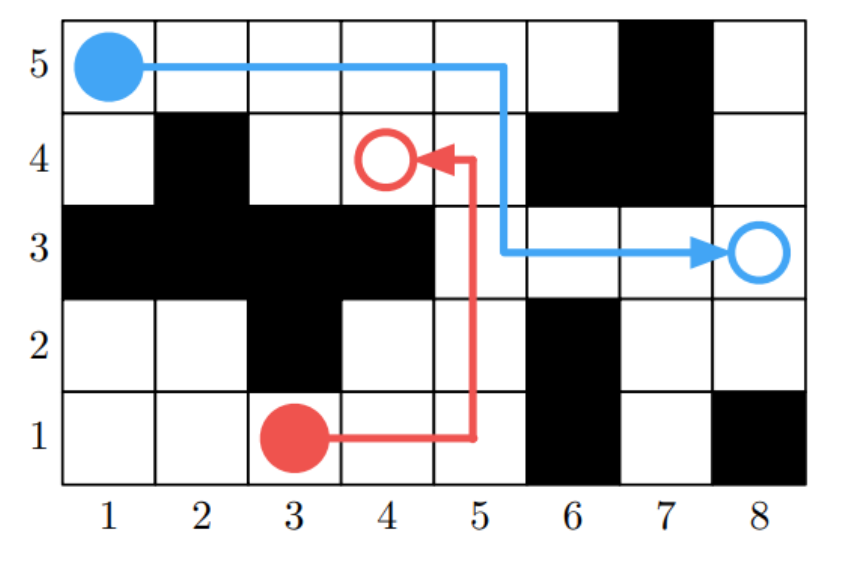
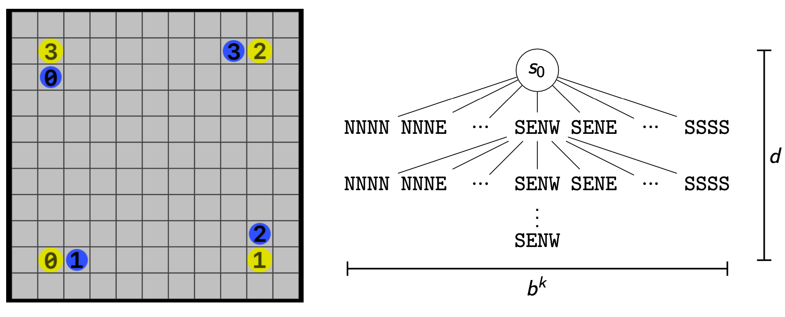
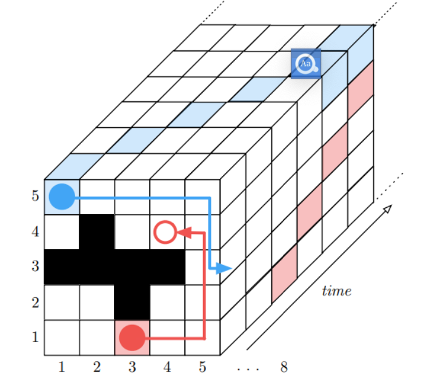
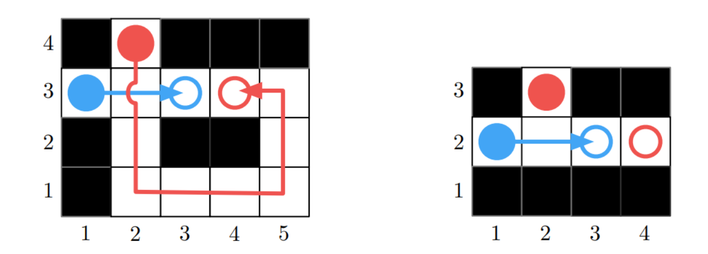
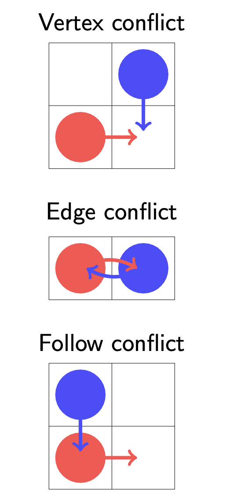
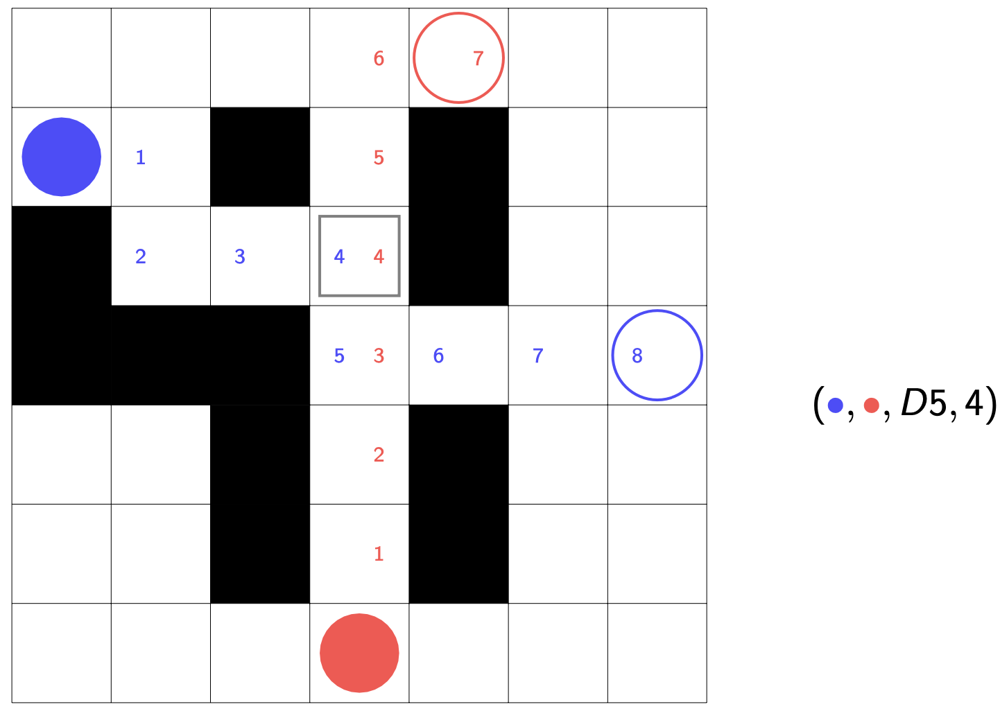
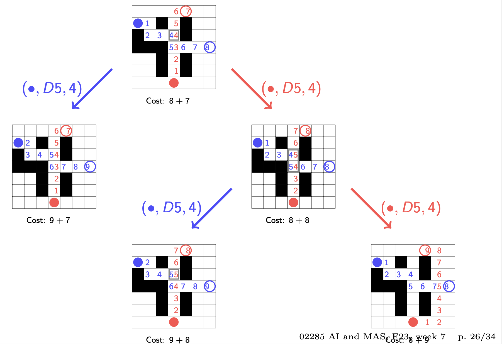
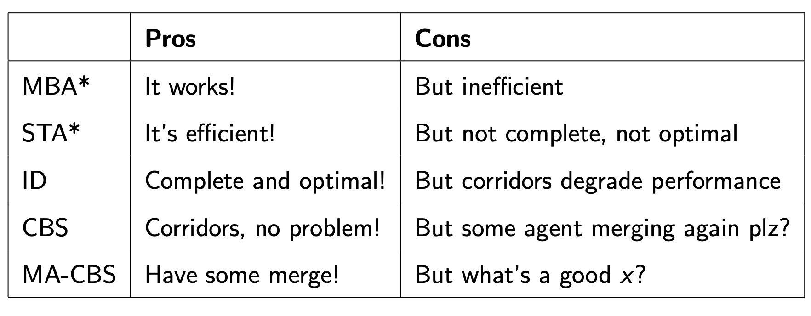

  - [Conflict based search 基于冲突的搜索](#w6_Conflict_based_search)
    - [multibody A* 多体A算法](#w6_multibody-A*)
    - [Space-time A* 空间-时间A*算法](#w6_Space-time-A*)
    - [Independence detection (ID) 独立检测](#w6_Independence_detection)
    - [Conflict based search (CBS) 基于冲突的搜索](#w6_Conflict-based-search)
    - [Meta-agent CBS 元智能体冲突搜索](#w6_Meta-agent-CBS)
    - [总结](#w6_summary)

<h2 id="w6_Conflict_based_search">Conflict based search 基于冲突的搜索</h2>


**基于冲突的搜索（Conflict-based Search CBS）**, 是一个用来解决**多智能体路径规划问题（Multi-Agent Pathfinding Problem）**的算法，它的目标是在一个给定的环境中为多个智能体找到无碰撞的路径，其核心思想是通过检测并解决智能体之间的冲突来达到理想解。算法从智能体之间的约束冲突开始，通过不断迭代来寻找冲突的最佳解决方案。

解决多智能体路径规划问题算法有很多，接下来展开

<h3 id="w6_multibody-A*">multibody A* 多体A算法</h2>

1. 多体A * 算法（MBA * ）是基于经典的A * 搜索算法，通过扩展A*算法而来
2. 启发式： $h(s) = \sum_{i=1}^{k}dist(v_{i,s},g_{i})$
- $v_{i,s}$是agent所在状态s的位置点
- Dist 计算的是不同V之间的最短距离，可以提前计算（使用Floyd-Warshall算法，时间复杂度 O($V^{3}$))
> Floyd-Warshall算法是一种用于解决带权有向图中多源最短路径问题的动态规划算法。它能够找出任意两个节点之间的最短路径，即使图中存在负权边。Floyd-Warshall算法的时间复杂度为O(n^3)，其中n是节点数。
>
> 算法的基本思路是利用动态规划的思想，通过已知节点之间的最短路径推导出其他节点之间的最短路径。具体来说，算法通过一个n * n的二维矩阵D，其中D[i][j]表示从节点i到节点j的最短路径长度。初始时，D[i][j]的值为i到j的边的权值（如果i和j之间有边），或者是正无穷大（如果i和j之间没有边）。然后，对于每一个节点k，算法将D[i][j]的值更新为min(D[i][j], D[i][k] + D[k][j])，即通过节点k来更新i到j的最短路径长度。最终，矩阵D中存储的就是任意两个节点之间的最短路径长度。


3. **MBA*是完备的**，即能够找到问题的解（如果有解的话）
4. **MBA* 算法是理想的(opmital)**，如果启发函数是可行的，则能够找到最短的解
5. 如果有k个agent，**分支因子**（Branching factor）就是$b^{k}$
6. 如果存在一组长度为d的（最短）动作序列，可以使得所有智能体都到达它们各自的目标，则我们称解的**深度(solution depth)为d**。
7. **最坏情况Worst case:**  最坏情况下，我们需要检查所有深度为d的搜索树分支，即需要扩展$b^{kd}$个状态， 所以时间/空间复杂度的上限也就是$b^{kd}$



上图，网格域，分支因子b=5：Move(N), Move(E), Move(S), Move(W), Noop；k=4 个agent；解的深度为d。如果没有启发式，空间状态db^k = 7 × 5^4 ≈ 4300 states(!)

但每个agent自己规划自己那么只需要 db^k = 7 × 5 × 4 = 140 states，能避免指数爆炸

在最好情况下（启发式完美引导搜索）：
- 减少分支因子
- k个问题能在时间/空间复杂度O(db)搞定
- 能不能用CDPS？合作分布式的架构，即relax -> solve -> unrelax

<h3 id="w6_Space-time-A*">Space-time A* 空间-时间A*算法</h2>
Space-time A* (STA*): 在A *的基础上考虑了时间限制



定义：一个constraint约束条件 (a,v,t) 表示在时间 t 时，智能体 a 不允许处于位置 v ∈ V

```python
def SpaceTimeAStar(problem , agents): 
  solution = dict()
  constraints = []
  k = len(agents)
  for i in range(k):
    plan = AStar(problem[agents[i]], constraints) 
    constraints += [(agents[j], v, t)
                    for j in range(i+1, k)
                    for t, v in enumerate(plan)] solution[agent] = plan
    return solution
```

假设有一个子程序 AStar(p,c)，它使用一个可行的启发式函数，可以解决单智能体问题实例，那么它限制c其实就是前一个智能体的解。

换句话说，前面的agent的解就是后面的agent的限制
问题：

- STA * 考虑了约束，但是并不理想（optimal），也不完备（complete）
  

- 理想情况下
  - 智能体能独立规划
  - 遇到冲突能多体（multiody）规划

<h3 id="w6_Independence_detection">Independence detection (ID) 独立检测</h2>

**冲突定义**：(ai,aj,v,t) 是智能体 ai 和 aj 的冲突，它们都计划在时间 t 时处于位置 v ∈ V

```python
def IndependenceDetection(problem , agents): 
  solution = dict()
  groups = [[agent] for agent in agents] 
  for group in groups:
    solution[group] = AStar(problem[group], []) 
    while not IsValid(solution):
      # Merge confliting groups
      (group1 ,group2 ,v,t) = FindFirstConflict(solution) del solution[group1]
      del solution[group2]
      merged = [group1 , group2]
      groups.append(merged)
      # Plan for the merged group
      solution[merged] = AStar(problem[merged], []) 
   return solution
```

重点是FindFirstConflict函数，(group1,group2,v,t) = FindFirstConflict(solution) 指的是两组智能体G1，G2，他们在时间t，地点v，产生冲突

这个算法理想（optimal），也完备（complete）

最坏的情况下，group包括所有的智能体

<h3 id="w6_Conflict-based-search">Conflict based search (CBS) 基于冲突的搜索</h2>

思路基于STA*，考虑限制，但是不做阻拦，而是重新规划，这也很像独立检测，但是不分组

大概思路：

1. 为每个智能体独立地规划理想路径。

2. 检测所有智能体之间的冲突。

3. 如果发现冲突，选择一个智能体并为其创建新的约束。

4. 使用新的约束为该智能体重新规划路径。

5. 重复步骤2-4，直到找到无冲突的路径或超出预定时间/迭代次数限制。

其中：

- 使用高层约束树（high-level constraint tree）来跟踪每个智能体的约束条件

  > 高层约束树，节点代表约束条件，例如智能体不能同时占用同一位置等。每个节点包含子节点，这些子节点代表更具体的约束条件。
  >
  > 例如，一个节点可以表示智能体不能进入一个特定的区域，而它的子节点可以表示智能体不能在特定的时间进入该区域。

- 每个智能体使用低级别的 A *搜索算法， 并考虑到其他智能体的路径和约束条件。


#### 冲突分类

冲突分为三种1. vertex conflict 顶点冲突，2. edge conflict 边缘冲突，3.Follow conflict 跟随冲突



#### 实例



蓝色需要走8步，红色走7步，cost = 7+8 = 15，能发现红蓝agent在t=4的时候位置D5冲突

> Cost = FlowTime  /  MakeSpan 
>
> 即：要么用总共消费时间计算，要么用总体时间跨度来算

然后，蓝色红色agent分别进行推演，计算cost



```python
def ConflictBasedSearch(problem , agents , cost): 
  root.constraints = []
  for a in agents:
    root.solution[a] = AStar(problem[a]) 
  root.cost = cost(root.solution)
  frontier = PriorityQueue(root, lambda n: n.cost) 
  while not frontier.empty():
    node = frontier.get() # get lowest cost 
    if IsValid(node.solution):
    	return node.solution
		(a1, a2, v, t) = FindFirstConflict(node.solution) 
    	for a in [a1, a2]:
        m = n.copy() 
        m.constraints.append((a, v, t)) 
        m.solution[a] = AStar(problem[a],m.constraints) 
        m.cost = cost(m.solution)
        if m.cost < infinity: # solution is found 
          frontier.put(m)
```

CBS是理想的也是完备的，因为还是探索了所有的组合去找了最短的解决方案。

不过主要是智能体高耦合（很多冲突）的情况下才比MBA*, ID的表现好

<h3 id="w6_Meta-agent-CBS">Meta-agent CBS 元智能体冲突搜索</h2>

这个是CBS的一个优化，大概意思是，如果如果智能体ai aj之间有超过x个冲突，那么把他们合并为一个meta-agent.(结合了Independence detection (ID) 独立检测的思想)

参数x是可以调整的

- 对于 MA-CBS($\infin$) = CBS
- MA-CBS($\infin$) = ID

```python
def ConflictBasedSearch(problem, agents, cost, x): 
  conflicts = dict()
  root.constraints = []
  for a in agents:
    root.solution[a] = AStar(problem[a]) 
  root.cost = cost(root.solution)
  frontier = PriorityQueue(root, lambda n: n.cost) 
    while not frontier.empty():
      node = frontier.get() # get lowest cost 
      if IsValid(node.solution):
        return node.solution
      (a1, a2, v, t) = FindFirstConflict(node.solution) 
      if conflicts[(a1,a2)] > x:
        m = merge(a1, a2, constraints) 
        m.solution[a] = AStar(problem[(a1,a2)] m.constraints) 
        m.cost = cost(m.solution)
        if m.cost < infinity: # solution is found frontier.put(m)
       else:
        conflicts[(a1,a2)] += 1 # then do as before
```

<h3 id="w6_summary">总结</h2>



- See (Silver, 2005) for STA*

- See (Standley, 2012) for ID

- CBS was introduced in (Sharon et al., 2015) and compares it to other state-of-the-art algorithms

  • Benchmark against other algorithms

  • Focus on completeness and optimality

##### reference

> Guni Sharon, Roni Stern, Ariel Felner, and Nathan R. Sturtevant. Conflict-based search for optimal multi-agent pathfinding. Artificial Intelligence, 219:40–66, 2015. ISSN 0004-3702. doi: https://doi.org/10.1016/j.artint.2014.11.006. URL https://www. sciencedirect.com/science/article/pii/S0004370214001386.

> David Silver. Cooperative pathfinding. In Proceedings of the First AAAI Conference on Artificial Intelligence and Interactive Digital Entertainment, page 117–122, 2005.

> Trevor Scott Standley. Independence detection for multi-agent pathfinding problems. In Workshops at the Twenty-Sixth AAAI Conference on Artificial Intelligence, 2012.
