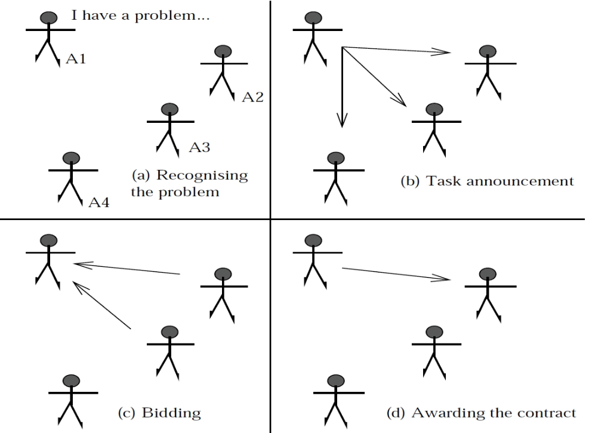
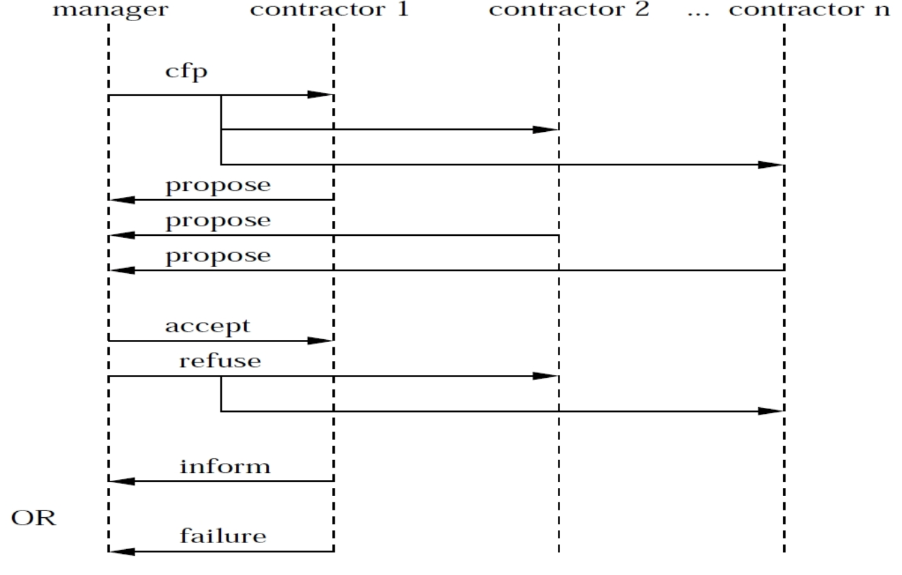
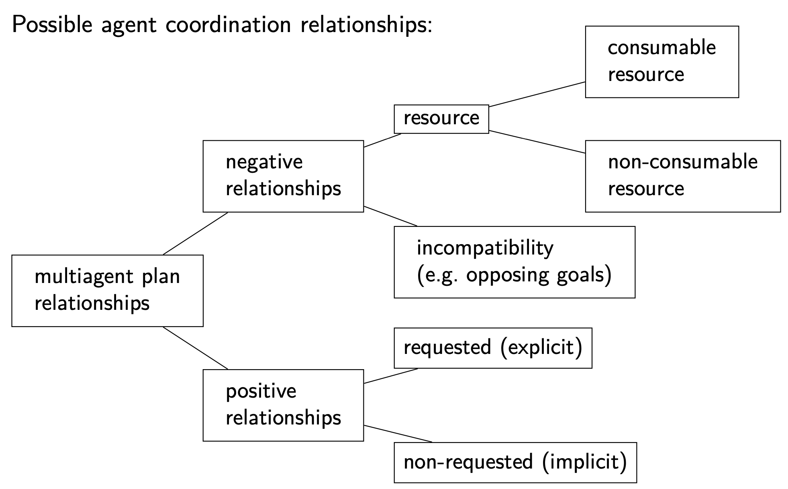

  - [Multiagent communication and agent architectures 多智能体通信与架构](#w7_Multiagent-communication-and-agent-architectures)
    - [Task sharing in multiagent planning 多智能体规划-任务共享](#w7_Task_sharing)
    - [Agent communication languages 智能体通信语言](#w7_Agent-communication-languages)
      - [The FIPA Agent Communication Language FIPA智能体通信语言](#w7_FIPA)
    - [The Contract Net protocol (CNET protocol) 合同网协议](#w7_CNET)
      - [The Contract Net via FIPA-ACL messages 合同网通过FIPA-ACL](#w7_FIPA-contract-net)
      - [result sharing 成果共享](#w7_result-sharing)
    - [Agent architectures 智能体架构](#w7_Agent-architectures)
      - [Deliberation and means-end reasoning](#w7_reasoning)
      - [intentions 意图](#w7_intentions)
      - [The BDI architecture: version 1 BDI 架构：版本 1](#w7_BDI_v1)
      - [BDI formal notation BDI正式表示法](#w7_BDI_notation)
      - [The BDI architecture: version 2 BDI 架构：版本 2](#w7_BDI_v2)
      - [The BDI architecture: version 3 BDI 架构：版本 3](#w7_BDI_v3)
      - [The BDI architecture: version 4 BDI 架构：版本 4](#w7_BDI_v4)
      - [The BDI architecture: version 5 BDI 架构：版本 5](#w7_BDI_v5)
      - [The BDI architecture: version 6 BDI 架构：版本 6](#w7_BDI_v6)
      - [The BDI architecture: version 7 BDI 架构：版本 7](#w7_BDI_v7)
    - [关于 BDI 的总结和最后说明](#w7_BDI_Summary)


<h2 id="w7_Multiagent-communication-and-agent-architectures">Multiagent communication and agent architectures 多智能体通信与架构 </h2>
大纲：

• **Multiagent communication**: Speech acts and the FIPA Agent Communication Language.
• **Multiagent cooperation**: The Contract Net protocol. 
• **Agent architectures**: The BDI architecture.

<h3 id="w7_Task_sharing">Task sharing in multiagent planning 多智能体规划-任务共享</h3>

日常里**task sharing 任务分配** 的常用方式:
- **Negotiation** 协商
- **bidding** 投标
- **voting** 投票
- **Conventions** and **social laws** 惯例

在多智能体通讯领域，借用了**言语行为理论（speech act theory）**的概念，大致意思是，言语不仅具有表达意义的功能，还能执行某种行为的理论

> 它起源于奥地利哲学家维特根斯坦（Ludwig Wittgenstein）和英国哲学家奥斯丁（John Langshaw Austin）的思想,

根据理论，一个言语行为由两种组成
- 表示行为的动词（Performative Verb）：如请求（request）、通知（inform）、承诺（commit to）、保证（promise）、感谢（thank）、询问（inquire）、宣布（declare）等
- 命题内容（Propositional Content）：如“门是锁着的”（the door is locked），“你们现在是夫妻”（you are man and wife）等。

许多具有相同命题内容的言语行为可以通过改变相应的行为动词来形成。
如“门是锁着的”（the door is locked）=> Performative: **request** 请求. “Please lock the door”.

<h3 id="w7_Agent-communication-languages">Agent communication languages 智能体通信语言</h3>

**智能体通信语言（ACL）**是专门为代理通信开发的语言，它们通常依赖于**言语行为理论**。

代理通信语言定义了一类代理可以相互发送的消息，其中一种**FIPA**代理通信语言（FIPA-ACL）。

<h4 id="w7_FIPA">The FIPA Agent Communication Language FIPA智能体通信语言</h4>

FIPA有一个**头（header）**是表示行为词（Performative）

举例子：

• 询问和声明：
1. query-if. “箱子B是否在位置L？”
2. inform. “箱子B在位置L。” 

• 请求：
1. request. “请将箱子B移动到位置L。”
2. agree. “好的，我会做的。”
3. refuse. “我不会做。”
4. failure. “我没有做到。” 

• 提议：
1. cfp. 征求提案。 “请在T时间内向我发送有关将箱子B移动到位置L的提案。”
2. propose. “我可以在...完成。”
3. accept-proposal. “好的，我接受你的提案。”
4. reject-proposal. “不，那不够好。” 

FIPA-ACL还包含除上述9种之外的11种表述。

除了header，还有**sender**发送者，**receiver**接受者，**content**信息内容，格式如下：

```pseudocode
(inform
  :sender Agent1
  :receiver Agent2
  :content (location Box1 Location1))
(query-if
  :sender Agent1
  :receiver Agent2
  :content (> (weight Box1) (weight Box2))
```

FIPA-ACL消息可以在主体中包含更多参数，例如语言（**language**）和本体论（**ontology**）


<h3 id="w7_CNET">The Contract Net protocol (CNET protocol) 合同网协议</h3>

**Contract Net (CNET) protocol**是一种协作协议，用于分布式问题求解，作用是任务分配（**task allocation**），它基于公司里承包的概念，核心要素
- **announcement** 招标
- **bidding** 投标
-  **awarding** 中标

包括以下几个步骤
1. **问题认知 (Problem recognition):** 代理A意识到自己有一个需要帮助的问题。
2. **任务公告 (Task announcement):** 代理A广播任务公告，其中包括竞标的截止日期。
3. **竞标任务 (Bidding for the task):** 代理可以决定是否竞标该任务。竞标必须包括竞标者与所宣布任务的执行相关的能力
4. **授予任务 (Awarding the task)** : 代理A根据竞标信息选择最合适的竞标，并通过授予消息将其通知给竞标者。
5. **加快任务 (Expediting task):** 成功承包商加快任务进程。



<h4 id="w7_FIPA-contract-net">The Contract Net via FIPA-ACL messages 合同网通过FIPA-ACL</h4>

FIPA-ACL消息可以使用以下表述来在多智能体系统中实现合同网协议： 
• cfp (call for proposals 征求提案)。用于公告任务。 
• propose (提议)，refuse (拒绝)。用于竞标。
• accept-proposal (接受提议)，reject-proposal (拒绝提议)。用于授予任务。 
• inform (通知)，failure (失败)。用于指示完成或失败。



<h4 id="w7_result-sharing">result sharing 成果共享</h4>

1. 这种**结果分享（result sharing）**，适合使用 **黑板架构**（**blackboard architecture**），通过共享的数据结构（黑板）来共享结果。所有代理都可以从黑板中读取和写入。代理将部分解决方案写入黑板。

   比喻：一组专家团队协同解决问题，使用黑板作为工作场所。他们轮流向黑板添加贡献，直到问题解决。

2. 结果共享中最重要的问题之一是**协调**（coordination），即管理代理活动之间的相互依赖关系。

   协调关系可以是**负面的**（negative）或**积极的**（positive）。

   - **负面关系 Negative relationship**的例子：两个智能体计划将两个不同的箱子同时移动到同一个位置（即计划同时使用相同的资源）。
   - **积极关系 Positive relationship**的例子：一个代理计划清除一个路径上的箱子，从而允许另一个代理通过（即一个代理帮助另一个代理）。

3. 协调关系的类型学，如图

   

<h3 id="w7_Agent-architectures">Agent architectures 智能体架构</h3>

在复杂的动态多智能体环境中，智能体必须不仅仅是规划者，我们必须考虑更复杂的智能体架构。

在这些架构中，智能体由许多独立的计算模块（**computational modules**）构建而成，其中规划引擎（planning engine）只是其中的一个模块。 

> 根据Patti Maes（1991）的**智能体架构**定义：用于构建智能体的特定方法论。它指定了如何将智能体分解为一组组件模块，并且这些模块应该如何交互。智能体架构包含支持此方法论的技术和算法。 

其中一个智能体架构是BDI架构。

<h4 id="w7_reasoning">Deliberation and means-end reasoning</h4>

在单纯的规划问题里，一个智能体被给定了一个目标去完成。规划者因此适合找到how to do，而不是找到what to do，区别在于

- **Deliberation 深思熟虑**：找要达到的目标。Deliberation产出的是**目的（intentions）**，智能体决定要做的事情。比如买香蕉
- **means-end reasoning 目标手段推理**：决定如何实现目标。means-end reasoning产出的是计划（plan），如何完成intentions，比如计划买香蕉

因此，一个智能体需要同时拥有Deliberation模块和Means-end reasoning模块

<h4 id="w7_intentions">intentions 意图</h4>

1. **intentions**某种程度上就是目标，用$\phi$表示
- 智能体应该投入资源来实现 φ。
-  智能体不应该采取与 φ 冲突的意图（例如，在回来的路上吃香蕉）
- **Persistence**持续性：如果智能体第一次尝试实现 φ 失败了，它应该再试一次（可能采用不同的计划）。
- 智能体应该相信 φ 是可以实现的，并且在“正常情况”下，它最终会实现 φ。

2. **The intentional stance **意向立场:  意向立场是一种描述智能体信仰、意图、欲望、希望等方面的方式

3. **Intentions vs. desires**

   请注意，意图比欲望更强大！
   欲望是我们在“理想世界”中想要实现的一切（如年轻、富有、有名、美丽、幸福等），其中一些可能是无法实现或互相排斥的。相比之下，意图是我们已经选择承诺的欲望（例如完成学业，希望这是成为富人道路上的一步）。

<h4 id="w7_BDI_v1">The BDI architecture: version 1 BDI 架构：版本 1</h4>

终于开始聊BDI架构啦
BDI架构是一种基于三个态度——信仰**b**elief、欲望**d**esire和意图**i**ntention的智能体架构。
采用BDI架构设计的智能体将不断地处于一个智能体控制循环（ **agent control loop**）中，其中智能体交替进行深思熟虑（deliberation）和目标手段推理（means-end reasoning）。
第一版的智能体控制循环是这样
```pseudocode
1. while true do
2.   perceive the world;
3.   update beliefs about the world;
4.   deliberate about what intention to achieve next;
5.   use means-ends reasoning to compute
         a plan for the intention;
6.   execute the plan
7. end while
```

第 5 步和第 6 步对应于我们已经涵盖的自动化计划。

<h4 id="w7_BDI_notation">BDI formal notation BDI正式表示法</h4>

- B：**当前信念**。 B ∈ Bel：**所有可能信念**的集合。

- D：**当前欲望**。 D ∈ Des：**所有可能欲望**的集合。

- I：**当前意图**。 I ∈ Int：**所有可能意图**的集合。

- ρ：一个**感知**。 ρ ∈ Per：**所有可能感知**的集合。

- π：**计划**。 π ∈ Plan：**所有可能计划**的集合。计划是一系列行动的序列。

- hd(π)：计划 π 的**第一个行动**。

- tail(π)：计划 π 的**剩余行动序列**。

- execute(π)：执行计划 π 的过程。

- **Belief revision function 信念修订函数 **： 

  brf : P(Bel) × Per → P(Bel) 

  brf(B, ρ) 表示基于当前信念B和感知ρ的更新后的信念。 

- **Deliberation function**深思熟虑函数： 

  deliberate : P(Bel) → P(Int) deliberate(B) 

  表示基于当前信念B所选择的意图集合。 

- 规划函数**Planning function**：

   plan : P(Bel) × P(Int) → Plan plan(B,I) 

  表示基于当前信念B和当前意图I所选择的计划。

<h4 id="w7_BDI_v2">The BDI architecture: version 2 BDI 架构：版本 2</h4>

使用上面介绍的符号，我们现在可以用更正式的方式表达代理控制循环：

```pseudocode
1. B := B0 /* initial beliefs */ 
2. while true do
3. 	get next percept ρ;
4. 	B:=brf(B,ρ);
5. 	I := deliberate (B );
6. 	π:=plan(B,I);
7. 	execute(π)
8. end while
```

<h4 id="w7_BDI_v3">The BDI architecture: version 3 BDI 架构：版本 3</h4>

深思熟虑**deliberation**步骤（上述算法中的步骤5）通常分为两个部分：

1. 生成欲望**desires**，即智能体可能想要实现的一切。
2. 通过在竞争的欲望之间做出选择并承诺其中一些来生成意图**intentions**。 

第一部分称为选项生成 **option generation**： 

options : P(Bel) × P(Int) → P(Des) 

第二部分称为过滤**filtering**：

 filter : P(Bel) × P(Des) × P(Int) → P(Int)

将深思熟虑步骤分为选项生成和过滤两个步骤后，我们得到以下智能体循环：

 ```pseudocode
 Agent Control Loop Version 3
 1. B := B0 /* initial beliefs */
 2. I := I0 /* initial intentions */ 
 3. while true do
 4. 		get next percept ρ;
 5. 		B := brf (B, ρ);
 6. 		D := options(B, I);
 7. 		I := filter(B, D, I);
 8. 		π := plan(B,I);
 9. 		execute(π)
 10. end while
 ```

<h4 id="w7_BDI_v4">The BDI architecture: version 4 BDI 架构：版本 4</h4>

**Blind commitment vs. plan monitoring **盲目承诺与计划监控 :

当前智能体控制循环的**弱点**是，智能体对其目标（意图）和手段（计划）都**盲目**承诺。 

换句话说，智能体进行离线深思熟虑和离线规划 **offline deliberation** and **offline planning**。 

如果领域是部分可观测**partially observable**、动态**dynamic**（例如存在其他智能体）或非确定性的**nondeterministic**，则这是不足够的。 

实现在线（重新）**online (re)planning **规划的第一步是引入**计划监控 plan monitoring**:：

如果当前计划不再符合智能体的意图和信念，则重新规划。 

我们使用符号**sound(π,I,B)**表示**计划π**在给定**信念B**的情况下实现**意图I**的有效性。 

智能体控制循环的第4个版本集成了这种类型的计划监控

```pseudocode
1. B:=B0;I:=I0;
2. while true do
3. 		get next percept ρ;
4.    B := brf (B, ρ); D := options(B, I); I := filter(B, D, I);
5.    π:=plan(B,I);
6.    while ¬empty (π) do
7.      execute(hd(π));
8.      π := tail(π);
9.      get next percept ρ;
10.     B := brf (B, ρ);
11.			if not sound(π,I,B)  /* <-- check this place */ 
12.				π := plan(B,I)     /* <-- check this place */ 
13.			end-if  
14.		end while  
15. end while
```

<h4 id="w7_BDI_v5">The BDI architecture: version 5 BDI 架构：版本 5</h4>

除了上面的计划监控**plan monitoring**，我们还可以引入目标监控 **goal monitoring**。

基本目标监控，如果出现以下情况，则取消当前计划：
- 意图（目标）已经实现，我们用succeeded(I, B)表示。 
- 意图（目标）无法实现，我们用impossible(I, B)表示。

 智能体控制循环的第5个版本集成了这种类型的目标监控

```pseudocode
1. B:=B0;I:=I0;
2. while true do
3. 		get next percept ρ;
4.    B := brf (B, ρ); D := options(B, I); I := filter(B, D, I);
5.    π:=plan(B,I);
6.    while ¬empty(π) ∧ ¬succeeded(I, B) ∧ ¬impossible(I, B) do  
7.      execute(hd(π));
8.      π := tail(π);
9.      get next percept ρ;
10.     B := brf (B, ρ);
11.			if not sound(π,I,B)
12.				π := plan(B,I)
13.			end-if  
14.		end while  
15. end while
```

<h4 id="w7_BDI_v6">The BDI architecture: version 6 BDI 架构：版本 6</h4>

我们的BDI智能体每次进行外部控制循环时，只会重新考虑其意图一次，

即： 
- 当它完全执行一个计划来实现其当前的意图时；或者 
- 当它相信它已经实现了其当前的意图；或者 
-  当它相信其当前的意图已不再可能实现。 

换句话说，我们现在具有在线（重新）规划 **online (re)planning**，但仍没有在线深思熟虑 **deliberation**。

这种方法的适用性不够广泛：

假设我的愿望**desire**是在伦敦吃晚餐。我可能会形成寻找一家漂亮又便宜的餐厅的意图**intention**。然后我制定了一个搜索这样一家餐厅的计划**plan**。在经过几个小时的无果搜索后，我可能会想要重新考虑我的意图

智能体控制循环的第6个版本集成了在线深思熟虑的概念...

```pseudocode
1. B:=B0;I:=I0;
2. while true do
3. 		get next percept ρ;
4.    B := brf (B, ρ); D := options(B, I); I := filter(B, D, I);
5.    π:=plan(B,I);
6.    while ¬empty(π) ∧ ¬succeeded(I, B) ∧ ¬impossible(I, B) do 
7.      execute(hd(π));
8.      π := tail(π);
9.      get next percept ρ;
10.     B := brf (B, ρ);D := options(B, I);I := filter(B, D, I); /* <-- check this place */ 
11.			if not sound(π,I,B)
12.				π := plan(B,I)
13.			end-if  
14.		end while  
15. end while
```

<h4 id="w7_BDI_v7">The BDI architecture: version 7 BDI 架构：版本 7</h4>

没想到吧，还没完，还有意向复议问题 **The problem of intention reconsideration**

另一个问题是：重新考虑意图会带来计算上的成本！

问题是： 
-  意图重新考虑太少：智能体可能会在意图不再相关时继续追求它的意图。 
- 意图重新考虑太多：智能体可能会花费太多时间重新考虑，而永远无法实现任何意图。 

可能的解决方案是：引入一个显式的元层控制组件reconsider(I,B)，它决定是否重新考虑意图。 为了有意义，计算reconsider(I,B)必须相对于重新考虑意图来说相当便宜。 

智能体控制循环的第7个版本集成了这一点

```pseudocode
1. B:=B0;I:=I0;
2. while true do
3. 		get next percept ρ;
4.    B := brf (B, ρ); D := options(B, I); I := filter(B, D, I);
5.    π:=plan(B,I);
6.    while ¬empty(π) ∧ ¬succeeded(I, B) ∧ ¬impossible(I, B) do 
7.      execute(hd(π));
8.      π := tail(π);
9.      get next percept ρ;
10.     B := brf (B, ρ); 
11.			if reconsider(I,B) then
12.       D := options(B,I); I := filter(BDI)
13.     end-if;
14.     if not sound(π,I,B)
15.				π := plan(B,I)
16.			end-if  
17.		end while  
18. end while
```

<h3 id="w7_BDI_Summary">关于 BDI 的总结和最后说明</h3>

- 在动态（多智能体）环境中 **dynamic (multiagent) environments**，纯粹的（离线）规划是不够的。规划器必须嵌入到更复杂的智能体架构**agent architecture**中，例如BDI架构。 
- BDI架构以信念、欲望和意图为中心(**belief**, **desire**, and **intention**) 
- BDI架构可以被呈现为一个智能体控制循环**agent control loop**，根据应用程序的不同可以设计更或少复杂的版本（版本1-7）。 
- BDI架构不是一个固定的算法，而是一个可以帮助设计智能体的概念模型 **conceptual model**。 
- BDI模型的起源是哲学家**迈克尔·布拉特曼 Michael Bratman**（1987年）的一种人类实践推理理论**human practical reasoning**。

BDI架构的实现示例：
- 悉尼某机场的空中交通管理系统。 
- 在DTU，由多个Lego NXT机器人组成的多代理系统，在共享环境中解决运输任务。 
-  本课程的编程项目中的一些DTU团队（例如 Jason）

### Reference

> Chapter 7 and 8 of Michael Wooldridge’s An Introduction to MultiAgent Systems, 2ed, Wiley 2009.

> Chapter 2 of Michael Wooldridge’s Reasoning about rational agents


