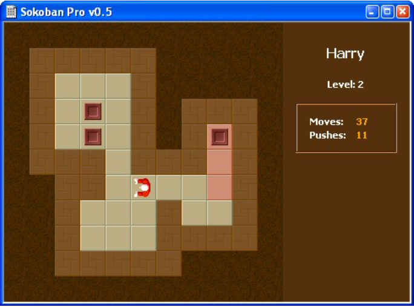
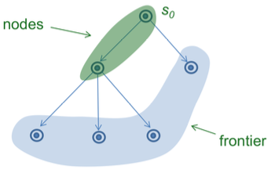
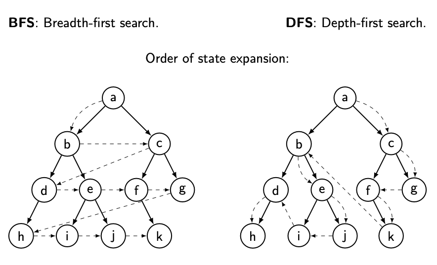
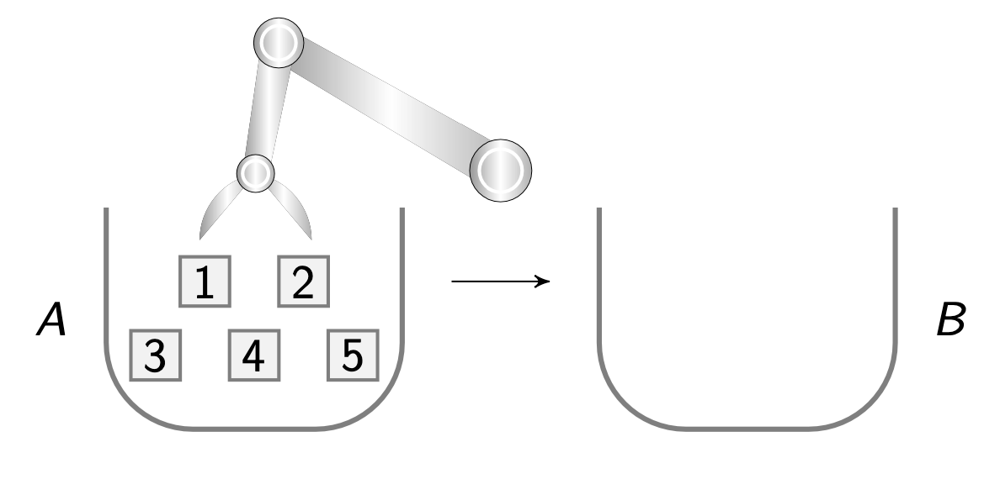
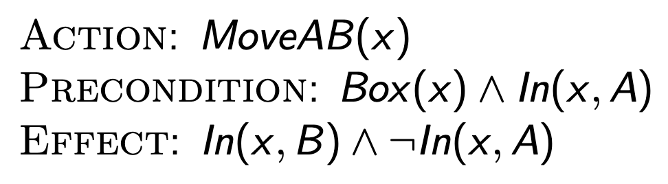
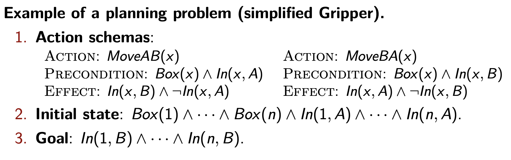
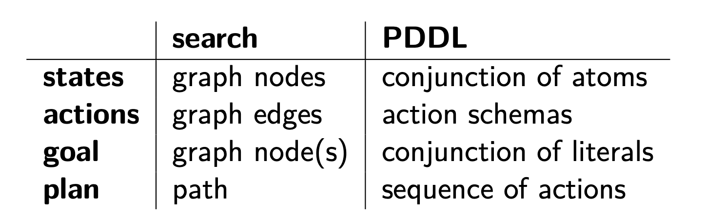
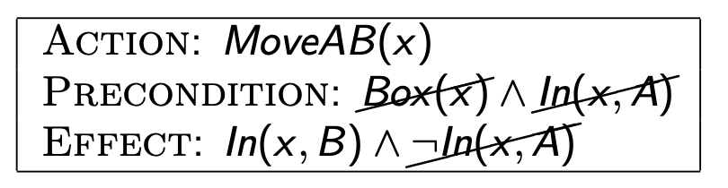
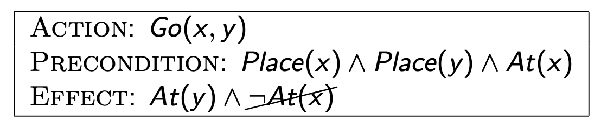
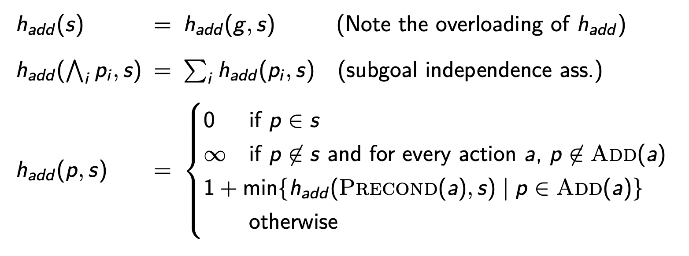

  - [写在开头](#w1_intro)
  - [AI search basics - 人工智能搜索基础](#w1_AI_search_basics)
    - [Search problem 搜索问题](#w1_Search_problem)
    - [The Graph-Search algorithm 图搜索算法](#w1_Graph-Search_algorithm)
    - [Best-first search strategies with Graph-Search 图搜索 - 最佳优先策略](#w1_Best-first_search)
    - [Relaxed problems and admissible heuristics 元问题和启发式设计](#w1_Relax_problems)
  - [Classical automated planning - 经典自动规划](#w2_Classical_automated_planning)
    - [Gripper problem 抓手问题](#w2_Gripper_problem)
      - [Heuristics for Gripper 抓手问题的启发式方法](#w2_Heuristics_for_Gripper)
      - [Weaknesses of problem-solving by searching 搜索解决问题的弱点](#w2_Weaknesses_search)
    - [PDDL Planning Domain Definition Language 规划领域定义语言](#w2_PDDL)
      - [About (function-free) first-order logic 关于无功能一阶逻辑](#w2_logic)
    - [PDDL 详解](#w2_PDDL_structure)
      - [search vs PDDL](#w2_search_vs_PDDL)
      - [PDDL小结](#w2_summary)
  - [Domain-independendent heuristics 领域无关启发式](#w3_Domain-independendent_heuristics)
    - [Domain-independendent heuristics design](#w3_DIH_design)


<h2 id="w1_intro">写在开头</h2>

这是一门课程的个人梳理笔记，最开始选这门课的时候完全冲着AI两个字就去了，实际上人工智能（AI）研究领域十分广泛，热门的有机器学习（Machine Learning）、深度学习（Deep Learning）、计算机视觉（Computer Vision）、语音识别（Speech Recognition）以及产生了ChatGPT的自然语言处理（Natural Language Processing，NLP）。

选课的时候完全忽略了副标题**Multi-agent system（多智能体系统，简称MAS）**，准确的说课程内容主要是有关MAS的**automated planning（自动规划）**。与也是学习之后才意识到，MAS在人工智能领域更偏向研究智能体之间互相协调的问题，目标是让一个个智能体合作起来解决更大更复杂的问题，当然也研究与人类的协作。在科学家追求实现通用人工智能——即超过人类智力的AI——的过程中，它并不是最前排的那个领域。

目前大语言模型（LLM）爆火，实现通用人工智能曙光初现，但不管未来出现多聪明的AI，最后还是要在人类社会中去协作和竞争，好好了解一下这个领域还是很有价值的。

当前MAS应用领域也很广泛，涉及到自动驾驶、多机器人工厂、自动交易、商业游戏、自动辅导等。

这么说还是比较抽象，给几个MAS应用的例子：

1. 网购平台使用的一个个仓储物流机器人。
   
2. 一起踢足球的机器人运动员
3. 自动从互联网提取信息并处理的多智能体程序

**写在前面：**MAS是一整个学科领域，内容庞杂，课程内容也主要是自动规划相关；笔者水平也有限，本博客只是学习笔记，对得起自己就好。


<h2 id="w1_AI_search_basics">AI search basics - 人工智能搜索基础</h2>

当前并不涉及具体多智能体的范围，先从搜索的基础问题入手

<h3 id="w1_Search_problem">Search problem 搜索问题</h3>

搜索问题指的是，先定义好一个系统的初始状态（initial state）目标状态(goal state)，然后找寻一系列的动作（actions）能让系统从初识状态变成目标状态。

举个例子就是推箱子：



搜索问题的**正式定义**包括如下内容：

1. 参数$S_{0}$: 初始状态
2. 函数 Actions(s) : 返回状态s可执行的所有动作
3. 函数 Results(s, a): 返回状态s执行一套动作a后的新状态s‘
4. 函数 Goal-Test(s): 测试是否达到目标状态，返回True / Flase
5. 函数 Step-Cost(s,a): 状态s执行动作a的成本，一般来说状态变一次就算成本+1
6. 参数 g :代表目标状态，Goal-Test(g) = True

这时候，搜索问题的**解决方案**就是：

要找到一系列的动作，让系统从$S_{0}$到g，cost最小的就是**最佳方案**，用推箱子的例子，就是要找到最少的把箱子推到指定地点步骤

<h3 id="w1_Graph-Search_algorithm">The Graph-Search algorithm 图搜索算法</h3>

搜索问题最形象也最抽象的思考方法便是图论式的视觉化。



每个状态和潜在的状态都是一个点，从$S_{0}$初始状态开始搜索，看能生长出多少结点，上图绿色部分是初识节点，蓝色前沿部分（frontier）是搜索出来可能走向的状态。

在没有其他已知信息的情况下， 要找到所有可能的状态，有两个基础搜索策略：

1. **Breadth-first search (BFS)**  广度优先搜索:
   - 给定初识状态
   - 前沿部分（frontier）的数据用队列（queue， FIFO）保存
   - 选择新状态：frontier中出列一个状态s
   - 添加新的可能状态：frontier入列s的所有可能状态

2. **Depth-first search (DFS)**: 深度优先搜索:
   过程同上，区别在于前沿部分（frontier）的数据用栈（stack， LIFO）保存

不同frontier的数据保存方式影响的是搜索所有状态的时候，选择的路径不同



广度优先（BFS）是a, b, c, d, e, f, ,g, h, i, j, k的顺序，优先搜索高层级的状态。

深度优先 (DFS) 是a, c, g, f, k, b, e, j, i, d, h优先遍历某一个分支，然后探索临近的状态。

做个比喻就是，想象有两对人马要探索一个溶洞，一个洞窟互相连接，而某个洞内藏着宝藏，1小队BFD, 2小队DFS。

1队的策略就是优先探索离入口最近的那些洞穴，然后再深入。

2队则是先一条道走到黑，没路可走时换条道，然后继续一条道走到黑。

BFD队的好处是如果宝藏所在洞窟并不深的话效率高；太深入的话则反之。

DFS 本质上是在随机游走（跟踪重复状态），直到它抵达终点，

<h3 id="w1_Best-first_search">Best-first search strategies with Graph-Search 图搜索 - 最佳优先策略</h3>

DFS、BFD都是确保能遍历所有可能性的方法，但坏处是太全面，耗时太长。

假如有个3小队，他们知道宝藏大概藏在南边的某个洞窟，那对他们来说最好策略就是搜索的时候，优先走入朝南的洞窟，这就是最佳优先。

规范化表达最佳优先策略（Best-first search strategies）：

- Frontier 是一个**priority queue（优先队列）**，状态s的优先值由**函数f(s)**计算
- 优先选择f(s)最小的状态出列
- 添加子状态

**f(s)**由两部分组成

- g(s) :  从初识状态$S_{0}$到状态S所消耗的action数量
- h(s) : 状态S的启发值（**heuristic value**），代表从状态S到目标g的预估成本

h(s)也被称为启发函数（**heuristic function**）

最佳优先策略有很多，区别在于f(s)的选择

- 贪心最佳优先搜索（**Greedy best-first search**）：f(s) = h(s)
- A* (A star)： f(s) = g(s) + h(s)
- WA*（weighted A star）: f(s) = g(s) + W · h(s)  ； w代表权重

<h3 id="w1_Relax_problems">Relaxed problems and admissible heuristics 元问题和启发式设计</h3>

可以发现启发函数并不确定，在推箱子的场景下，可以h(s) = 是箱子与终点的距离， 或者h(s) = 箱子能达到的最远距离与终点距离的差。一个好的h函数需要实际情况实际分析，并且不断调试。

设计启发函数是门艺术，不过还是有迹可循的，即从最简单的最元初问题开始思考。

**元问题（relaxed problem）**：抛弃当前问题大量限制的简化版

**合理的启发式设计（admissible heuristics）**：

- 算出来的值不能大于最佳方案（比如推箱子至少需要10步，用$h^{*}(s)$ =10表示，必须h(s)≤$h^{*}(s)$）
- 给定问题P和其简化版P'，h(s) = $h^{*}_{p'}(s)$。即启发函数值等于元问题的最佳方案的成本值。


<h2 id="w2_Classical_automated_planning">Classical automated planning - 经典自动规划</h2>

自动规划是人工智能另外一个子领域，也能解决搜索问题。

区别在于，自动规划通过一套逻辑结构处理状态和动作，因此自动规划器可以解决任何搜索问题，只要问题是使用这些逻辑结构指定的

目前应用在环境适应型的机器人设计、游戏AI设计等领域

<h3 id="w2_Gripper_problem">Gripper problem 抓手问题</h3>



**抓手问题**：把n个箱子用一个抓手从A挪到B

- 初始状态：所有箱子都在A
- 目标：都在B
- 动作：MoveAB(x)
- 状态空间（state space): 用大Θ符号表示，这里Θ($2^{5}$)

<h4 id="w2_Heuristics_for_Gripper">Heuristics for Gripper 抓手问题的启发式方法</h4>

如果用BFS 或者DFS计算状态数量， 随着箱子数量的增加，状态空间将指数级上升，需要考虑有效的启发式方法。

比如：

1. h 函数的值代表A中箱子的数量，

2. 使用贪心最佳优先搜索策略（greedy best-first search），f(s) = h(s)

3. 这个时候Results(s, a)函数计算复杂度为Θ($n^{2}$), n是箱子数量

<h4 id="w2_Weaknesses_search">Weaknesses of problem-solving by searching 搜索解决问题的弱点</h4>

如果要解决规划问题单纯使用搜索策略的话，有很多不足，比如

- 系统状态被抽象为一个个节点，无法包含内部结构
- 没有启发式的策略过于盲目，往往必须使用启发式
- 这种原子化的图式搜索适用范围有限

结果就是每个新领域（从推箱子到抓手问题）都需要一个新的问题规范（行动、结果、目标测试等）和一个新的用于特定于问题的启发式方法，太麻烦。

比如用搜索策略解决了抓手的问题，再换一个去超市买东西的问题呢？再去定义一下初始状态、目标状态、具体动作，然后再设计一个启发式？

我们需要一个新的表达方式，需要一个逻辑来结构化的表达状态，也就是PDDL

<h3 id="w2_PDDL">PDDL Planning Domain Definition Language 规划领域定义语言</h3>

当要求抽象性与普适性的时候，尤其在语言领域，基本上都得回到逻辑学。

PDDL由斯坦福为机器人 Shakey 开发的STRIPS语言衍生而来，使用的是无函数一阶逻辑 (Function-free first-order logic)

有了PDDL，就可以定义一些通用的启发式方法。

不过在这之前先补一点逻辑学知识

<h4 id="w2_logic">About (function-free) first-order logic 关于无功能一阶逻辑</h4>

梳理无功能一阶逻辑在逻辑学里的位置，如下

```
1. 逻辑学 (Logic)
   研究推理和论证的学科。
   
   1.1 形式逻辑 (Formal logic，又称 Symbolic logic)
       使用形式化语言研究推理和论证的形式结构。

       1.1.1 命题逻辑 (Propositional logic)
           关注命题之间的逻辑关系，通过连接词组合命题。

       1.1.2 一阶逻辑 (First-order logic)
           命题逻辑的扩展，引入个体、谓词和量词，描述复杂关系和属性。

           1.1.2.1 无函数一阶逻辑 (Function-free first-order logic)
               一阶逻辑的特殊形式，不包含函数符号，仅使用个体、谓词和量词。

```

会用到的一些基本概念：

- n元谓词(n-nary predicate):  表示n元关系的符号, 接受 n 个参数。
  - 示例：In 是一个 2 元谓词。	
  - 惯例：我们对谓词使用大写单词，例如 In、Move、Buy、Kill。
- 变量 **Variables**
- 常量 **Constants**
- **Terms** ： 变量常量合称
- **Atom** ：应用于 n 项的 n 元谓词。示例：ln(x,y), In(x,1),  In(1,2)
- **literal** : 一个Atom或者它的否定，示例：In(x,y), ¬In(x,y).
- **Ground atom/literal**: All arguments are constants.

在抓手问题里面，就可以用以上的逻辑来表达

初始状态 ：S0 =In(1,A)∧In(2,B)∧In(3,A)∧In(4,A)∧In(5,A)


<h3 id="w2_PDDL_structure"> PDDL 详解</h3>

1. **Action schemas** 动作模式
   PDDL用一个模版去描述一个动作，格式如下
   
   由动作名、前提条件、结果三部分组成

2. **Goal 目标**， 

   由literals的连接组成，比如ln(1, B) ∧ In(2, B) ∧ In(3, B)

3. **Planning domain 规划域**
   常用集合$A$表示，A代表一批动作模式的集

4. **planning problem 规划问题**
   使用以上的概念， 就可以将规划问题描述为一个三元组 tripe($A, S_{0}, g$)
   A是规划域， $S_{0}$是初始状态， g是目标。
   

5. **Gound actions 基础动作** ：
   特指一个Action schemas动作模式中所有变量都是常量的动作模式

6. **Applicability 适用性**：
   **Applicability**用来形容一个动作在状态s下是否可行，逻辑符号‘|=’
   s |= Precondition(a)
   这个语句表示基础动作a符合状态s的前提条件，是适用的

7. **Result** 执行动作后的结果：

   对状态s执行一个适用的动作a, 会让s要么增加literals或者删除literals（或同时发生）。

   **增加的literals用ADD(a)表示，减少的用DEL(a) 表示**

   Result(s, a) = (s - DEl(a)) U ADD(a)

8. **Solution 结果**：

   给定一个问题 (A,s0,g)， 一个由一系列动作组成的规划能够让状态从初始到目标，这个规划就是结果答案。
   这个结果可以通过搜索（BFS、DFS、A*...）给出

<h4 id="w2_search_vs_PDDL">search vs PDDL</h4>

search和PDDL的对比



可以发现PDDL用atoms的组合代替了节点去表达state和goal，图搜索的边也用一套动作模式表示，规划则用一系列的动作表示，所有这一切都是为了更能突出状态和动作的内部结构。

<h3 id="w2_summary"> PDDL小结</h3>

- 不管用什么语言表示场域，要解决问题，一个准确的启发式还是避免不了的
- 常用的启发式有goal count - 目标达成数量
- 在域独立启发式（domain-independent heuristics）的语境下，relax problem的思路更好用了，比如从简化一些动作模式的precondition入手
- PDDL也只是设计规划问题的一种范式，而且使用PDDL队领域的描述也不是唯一的，要用好这套语言设计一个合理的范式还是很难的


<h2 id="w3_Domain-independendent_heuristics">Domain-independendent heuristics 领域无关启发式</h2>

利用自动问题松弛（relax problem）技术来生成领域无关的启发式算法，不仅仅是一个思路，而是一个通用的解法，这些算法可以广泛应用于解决各种规划问题。

举个🌰， 最常用的，goal count 目标计数：

- $h_{gc}(s) = 不满足目标的literals数量$

在松弛问题的场景下，$h_{gc}= h*（理想启发式的值）$

<h3 id="w3_DIH_design">Domain-independendent heuristics design</h3>

接下来探讨领域无关场景下启发式的设计思路

1. **Ignore preconditions and non-goal literals heuristic**

设计启发式需要从松弛问题入手，这个场景松弛的比较彻底，先直接把所有的前提条件和目标不需要的literals全部忽略，用$h_{ip}$表示：


2. **Delete-relaxation heuristic**

通过去掉动作effect的所有否定的literals, 用$h^{+}$表示：

用的不多，因为计算$h^{+}$属于NP-hard问题

3. **Additive heuristic 加法启发式**
   用$h_{add}$表示，分两步

   1. 去掉动作effect的所有否定的literals， 同$h^{+}$
   2. 假设**子目标独立subgoal independence**:
      假设一个目标由很多子目标组成g1∧g2 ∧···∧gn，则$\sum$i h∗(gi , s)  =  h∗($\and$i gi , s)，即完成单个目标的启发值和与完成所有目标的启发值是一样的
      举个例子：
      假设有个总目标g=去超市买吃的，g = g1(买水果) $\land$ g2(买蔬菜) $\land$ g3(买肉)，悲观的估计要买三下，但是有某个动作比如说买番茄能同时完成g1、g2，等式变为3 > 2，实际上买两下就能完成所有目标。

   毕竟有悲观的估计，所以可能$h_{add}>h*$，并不是一个合适的启发式，不过它易上手，而且可以用一个递归的方式来定义：

   

   其实就是把完成每个子目标的启发值加起来，不过每个子目标有多个处理方案且启发值不同，所以取最小的那个。即便如此，$h_{add}>h*$，因为它忽略了子目标之间的关系，强迫子问题必须一个一个解决，追求局部最优解的同时忽略了全局最优解

4. **Max heuristic 最大启发式**

   与加法启发式唯一不同点，$h_{max} = max_{i}h_{max}(p_{i}, s)$

   即取子目标中启发值最大的那个子目标。

   相当于用做一件事情最难的某个局部问题的难度来衡量整件事的难度，和加法对比的话

   - 加法启发式：实用性差，参考价值大
   - 最大启发式：实用性凑合，但没啥参考价值

5. **小结一下**
   - 加法/最大启发式用atom描述了搜索问题中的状态
   - 如果用平常的图的概念来思考，就只能是一个点连接一个点，点代表状态，edge视为关系。用atom的概念之后，除了给状态内部结构，而且动作a所涉及到的前提条件和将生成的新状态，都可以用一组atoms来表示，能突破二维点相连接的思维桎梏（不然用很多很多的线条连接状态还打上标签解释关系，太乱了）。
   - 问题的大小与基本原子和动作的数量成正比（在具体问题中，基本原子是指问题的基本元素，而动作则是改变问题状态的操作），计算启发式的复杂度呈多项式级别（polynomial），这意味着随着问题规模的增长，所需的计算资源和时间会增加得相对较慢。比直接计算整个状态空间在原子和动作增长下指数增长好很多。