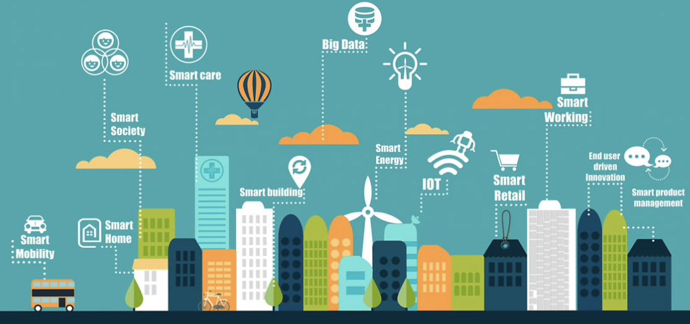
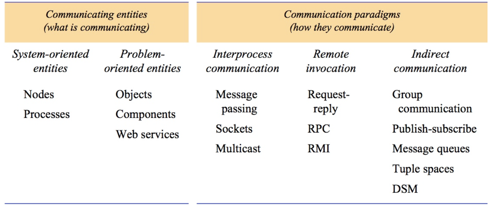
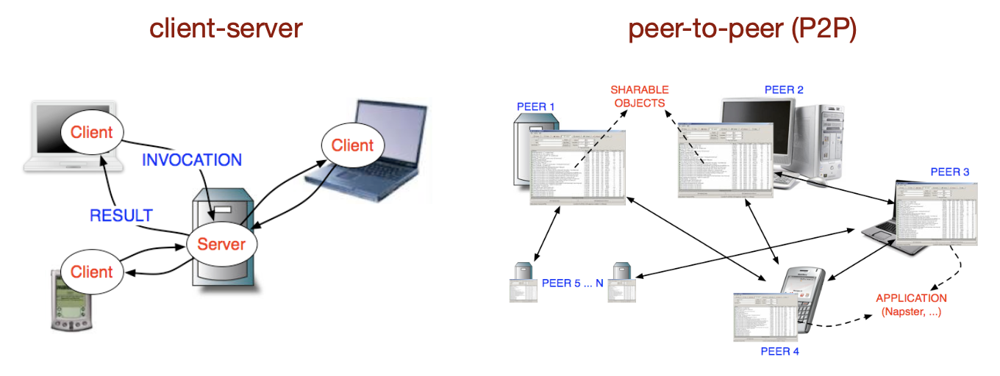
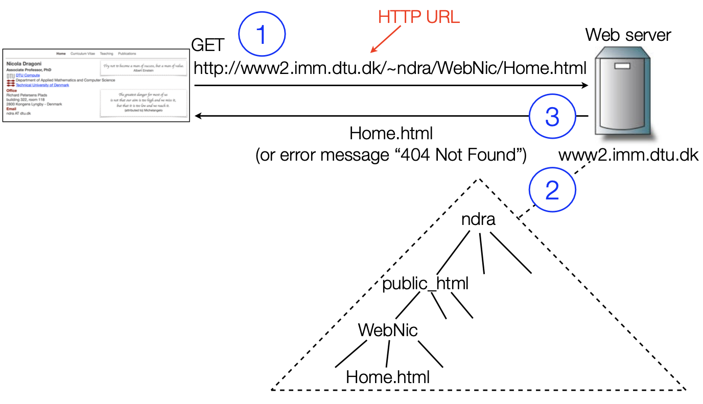
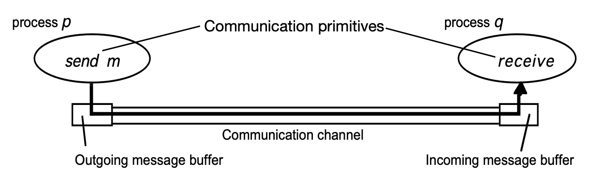

  - [写在开头](#w1_intro)
    - [建立一下概念](#w1_baisc)
    - [Pervasive Computing 普适计算](#w1_Pervasive—computing)
  - [Models and Design 分布式系统 - 模式与设计](#w1_Models-and-Design)
    - [Architectural Models 架构模型](#w1_Fundamental-Models)
      - [Communicating Entities 通信实体](#w1_Communicating-Entities)
      - [Communication Paradigms 通信范例](#w1_Communication-Paradigms)
    - [Roles and Responsibilities of entities 实体的角色与任务](#w1_r&r)
      - [客户端-服务端 架构](#w1_server-client)
      - [Peer-to-Peer P2P](#w1_p2p)
      - [Placement 如何部署？](#w1_placement)
      - [Placement Strategies 部署策略](#w1_placement-Strategies)
    - [Interaction Model 交互模型](#w1_Interaction-Model)
      - [进程与沟通信道](#w1_communication_channels)
      - [交互模型的变体](#w1_variants-of-interaction)
    - [分布式模型的设计挑战](#w1_design-challenges)
    - [思考题](#questions)

<h2 id="w1_intro">写在开头</h2>

**分布式系统（Distributed Systems）**，这个词经常听到也见到，感觉哪都能用，当有这种感觉的时候，证明这个词所包含的意义已经很广泛，真要写起来的话，这个题目其实还是太大了。

对于分布式系统，一个可能的**定义**：**是指硬件和/或软件组件位于网络设备（Networked devices）上，在仅通过传递消息进行通信和协调其操作的系统。**（这个网络设备的距离可以从一个房间到一片大陆...）

> 当你闻所未闻的一台计算机崩溃导致你无法完成任何工作，这时你就知道自己在使用分布式系统了  - Leslie Lamport

之所以要学分布式系统，是因为它不只是一个技术，也是一种心法。

当前世界，技术以指数级增长，新技术信息量每2年就会翻倍，我们能做的就是着眼于这些基础知识，以便能够应对技术进步。

<h3 id="w1_baisc">建立一下概念</h3>

1. 注意点：

   - **Distributed ≠ Decentralised** 分布式不代表去中心化！
   -  **Decentralised** ⇒ **Distributed** 去中心化能导向分布式
   - **Distributed** ⇏ **Decentralised** 分布式不一定是去中心化的

   客户端 - 服务端架构就是典型的中心化的分布式系统

   比特币是去中心化分布式系统

   需要许可证的区块链是中心化的分布式系统了

2. 为什么系统需要分布式的？

   **分布式系统的搭建来源于这个世界对资源共享的欲望** 

   在计算机世界，这个资源可以指很多东西，硬件、算力、文件、数据库...

3. 举个🌰 - 互联网：

   它是一个由许多不同类型计算机网络组成的庞大互联集合，一个非常庞大的分布式系统

   运行在连接到它上面的计算机上的程序通过传递消息进行交互，使用一种通用的通信方式（互联网协议），它使用户无论身在何处都能使用开放式服务（WWW、电子邮件、文件传输、多媒体服务等）。
   

   而大家常常聊起来的物联网（IOT - internet of things），则是在互联网的基础上更进一步扩展了分布式的定义，在物联网中互相连接的是各种融入生活中的嵌入式计算设备。

<h3 id="w1_Pervasive—computing">Pervasive Computing 普适计算</h3>

普适计算是一种新型的计算模式，旨在将计算和通信技术融入到我们日常生活的方方面面，实现计算环境的无处不在和无感知性，和物联网很像。

> 最深刻的技术就是那些不会被人察觉的技术，它们已经融入了日常生活的衣食住行，直到变得和生活本身一样不可分割 
>
> ——普适计算之父 Mark Weiser ，Xerox PARC（帕克斯研究中心）

Mark Weiser最早提到普适计算（Ubiquitous Computing），并设立了很多原则

- 计算机的目的是帮助你做其他事情 
- 最好的计算机是一位安静、不可见的仆人 
- 你能够凭直觉完成的任务越多，你就越聪明 
-  科技应该创造宁静

房间里能看到计算机一般来说，有手机、手环、笔记本、游戏机这些电子设备。但还有一些被动存储了信息的东西被我们忽略了，比如银行卡里的芯片、各种产品上的标签，随便拿起一个杯子，上面大概率可能写着IKEA。

回顾一下人利用能量的的过程，最开始是农业革命，人们能够捕捉太阳能，利用牲畜的生物能。后来工业革命，能够利用蒸汽机扩展人力的极限。再往后，能量被去中心化了，人们拉起电网把电力输送到了全国各地。再往后，能量被隐藏得更深了，放进了可穿戴的设备，放进了小小的电池。

信息的利用也有类似的过程，最开始纯粹依靠人的脑力，然后发明了纸张，发明了算盘。有了电脑，终于能扩张脑力的潜能。再完后，算力也被去中心化了，比尔盖茨把台式机卖到了每个家庭，再完后笔记本兴起，手机兴起，各种设备吧，相机、mp3、手环，哪怕电冰箱...。最开始ENIAC是一个巨大的需要很多人维护的中心化设备，往后一个人就拥有多个设备。

而普适计算则继续畅想，计算适用于智能家居、个人健康、环境监测、智能城市，任何东西都是智能的。就算是生物，也可以生物纳米物联网，而且一切都与云端链接。为此还有概念**雾计算（Fog computing）** , 作为云端与物联网中间层的一个分布式的计算控制组件。

>  题外话：
>
> 普适计算就是这些年大家心心念念的工业4.0，这个话题在华为被打压以及5G普及的那些年很是爆火。后来2021年元宇宙兴起，把VR、区块链等等话题推向新高。现在是2023年，GPT带领着AI技术井喷。
>
> 这些梦很相似，又有不同，热点就这么一直涌现，每次热点出现的时候总会泛起一个彩虹泡，你也不知道哪个能实现，大家都期待世界快速改变，世界也确实在快速改变，永恒的只有割韭菜，有些东西看不清，有些东西必然发生....

<h2 id="w1_Models-and-Design">Models and Design 分布式系统 - 模式与设计</h2>

1. Architectural Models

2. Interaction Model

3. Design Challenges

4. Case Study: Design of a Client-Server System

<h3 id="w1_Fundamental-Models">Architectural Models 架构模型</h3>

1. 架构模型 vs 基础模型

   - 架构模型：关注其组件的部署及其之间的关系（具体）
   - 基础模型：关注更抽象的描述，描述所有架构模型共同具有的属性（抽象）

2. 系统架构（Architectural of a system）

   系统架构指的是结构，包括单独指定的组件及其相互关系，考虑四个关键问题

   - 通信实体 **Communicating entities**：在分布式系统中，哪些实体在进行通信？

   - 通信范例 **Communication paradigms**：这些实体如何进行通信，或者更具体地说，使用了哪种通信范例？

   - 角色和职责 **Roles and responsibilities**：这些实体在整体架构中具有什么（潜在的变化）角色和职责？

   - 布局 **Placement**：这些实体如何映射到物理分布式基础设施上（即它们的位置是什么）？

<h4 id="w1_Communicating-Entities">Communicating Entities 通信实体</h4>

在分布式系统中，进行通信的实体是什么？

**从系统的角度来看**：

1. 通信实体就是**进程 processes**。 

2. 分布式系统是由进程processes和适当的进程间通信范例(interprocess communication paradigms)组合而成

⚠️：

- 在某些环境中，比如传感器网络，底层操作系统可能不支持进程抽象，因此在这样的系统中进行通信的实体是节点。
- 在大多数分布式环境中，进程会被线程（轻量级进程）补充，因此严格来说，线程才是通信的端点。

**从程序的角度来看**

1. 除了进程和线程等通信实体之外，还有一些面向问题的抽象概念被提出，比如**分布式对象distributed objects**、**多智能体系统multi-agent systems**、Web服务等。

2. 分布式对象：

- 是为了促进和鼓励在分布式系统中使用**面向对象的方法**而引入的。
- 计算由许多相互作用的对象组成，这些对象是给定问题域的自然分解单元。
- **通过接口访问对象**，并通过相关的接口定义语言提供对象上定义的**方法**的规范。

<h4 id="w1_Communication-Paradigms">Communication Paradigms 通信范例</h4>

进程实体如何在分布式系统中进行通信？（使用什么通信范式？）

有三种

- **进程间通信 ‣ interprocess communication**

  **分布式系统中进程间通信的低级支持**，包括消息传递原语、套接字编程、多播通信

  low level support for communication between processes in the distributed system, including message-passing primitives, socket programming, multicast communication

- **远程调用 ‣ remote invocation**

  最常见的沟通范式，基于通信实体之间**双向交换**和**远程调用**的操作

- **间接沟通 ‣ indirect communication**

  通过第三方进行沟通，允许发送者与接收者之间很大程度上的去耦合，尤其是：

  - 空间上去耦合
  - 时间上去耦合

  主要技术包括：group communication群组通信, publish subscribe systems 发布-订阅系统, message queues 消息队列, tuple spaces 元组空间, distributed shared memory (DSM) 分布式共享内存

  

在分布式系统中，进程间通信是指为进程之间的通信提供低级别的支持，包括消息传递原语、套接字编程和多播通信等技术。消息传递原语是指一组原始的通信操作，如发送和接收消息等，这些操作可以用于构建更高级别的通信机制。套接字编程是指使用套接字接口进行通信，通过网络套接字实现进程之间的数据传输和通信。多播通信是指向一组接收方发送单个数据包的通信方式，这种通信方式可用于提高通信效率和减少网络带宽占用。这些技术为分布式系统中的进程提供了通信支持，以实现高效和可靠的协作工作。

<h3 id="w1_r&r">Roles and Responsibilities of entities 实体的角色与任务</h3>

实体在整体架构中具有哪些可能的角色和职责？

先给出两种常见的架构风格**client- server & P2P**

<h4 id="w1_server-client">客户端-服务端 架构</h4>

**进程被分为两组**

- Server: 进程实现一个特定的角色
- Client: 进程请求服务通过发送一个请求并等待回复

**交互：**

1. request 请求：当一个请求从客户端发送，我们称之为客户端调用服务器上的操作

2. replies回复：服务器接收请求并执行操作后，会发送一个包含结果的回复消息返回给客户端。
3. Remote invocation 远程调用:  从客户端发送请求到接收服务器响应的整个过程，我们称之为远程调用。

**举例子**： web网络资源分享系统

万维网是一个不断发展的开放系统，用于通过 Internet 发布和访问资源和服务

通过Web浏览器（客户端），用户可以：

- 检索和查看多种类型的文档；
- 收听音频流；
- 观看视频流；
- 与无限数量的服务进行交互。

web的主要技术有以下几个

1. **超文本标记语言（HyperText Markup Language HTML）**是一种用于指定网页内容和布局的语言，它是Web浏览器展示网页时所需的基本语言。
2. **统一资源定位符（Uniform Resource Locators URL）**是用于识别存储在Web上的文档和其他资源的标识符。
3. 客户端-服务器系统架构，使用标准规则进行交互**（超文本传输协议 HyperText Transfer Protocol-HTTP）**，通过这种协议，浏览器和其他客户端从Web服务器获取文档和其他资源。

一个典型的网页加载过程

**客户端与服务端的角色**：

- 一个进程既可以是客户端也可以是服务端（一个服务器可能也会成为另一份服务器的客户端）
- 客户端与服务端通常指的是一次请求的语境
- 但总体来说他们不是一个东西
  - 客户端是主动发起active，服务端是被动相应reactive
  - 服务端持续运行

• 例子1：Web服务器通常是本地文件服务器的客户端，后者管理着存储网页的文件。 

• 例子2：Web服务器和大多数互联网服务都是DNS服务的客户端（它将互联网域名转换为网络地址）。

<h4 id="w1_p2p">Peer-to-Peer P2P</h4>

**正式定义：**所有进程在执行某个任务或活动时，都扮演相似的角色且作为对等的进程合作交互，没有区分客户端和服务器进程或它们运行在哪台计算机。

**换句话说**：所有结点都运行相同的程序并相互提供相同的接口集

> P2P架构的目标是利用大量参与计算机的资源（包括数据和硬件）来完成特定的任务或活动。

实际上，所有对等方都运行相同的程序，并向彼此提供相同的接口集。

<h4 id="w1_placement">Placement 如何部署？</h4>

这些主体是如何映射到物理分布设置中的？

1. 物理区隔开的设施通常由大量设备链接的网络组成

2. 这种部署很关键的决定了一些属性，比如性能、可靠度、安全性
3. 部署需要考虑很多方面（机器、可靠度、通讯），有一些策略是能使用的

<h4 id="w1_placement-Strategies">Placement Strategies 部署策略</h4>

以下介绍三种策略

1. **Mapping of services to multiple servers 服务部署到多个不同的服务器上**

   - 服务可以作为多个服务器进程在不同的主机上实现，根据需要相互交互以向客户进程提供服务。 

   - 服务器可以：

   1. 将服务所基于的对象集合分区，并在它们之间分布（例如Web服务器）；
   2. 在多个主机上维护它们的复制副本（例如SUN网络信息服务（NIS））

2. **Proxy server and caches 使用代理和缓存**

   缓存是一种存储最近使用的数据对象的方式，它比对象本身更靠近一个客户端或一组特定的客户端。 

   • 示例1：Web浏览器在客户端本地文件系统中维护了最近访问的页面和其他Web资源的缓存。 

   • 示例2：Web代理服务器的目的：

   1. 使它后面的机器匿名（主要是出于安全考虑）
   2. 通过缓存来加速对资源的访问。

3. **Mobile code 移动码**

   客户端程序请求内容需要程序码

   客户端与程序交互需要这个码

   在本地运行下载的代码的一个优点是它可以提供良好的交互响应，因为它不会受到与网络通信相关的延迟或带宽可变性的影响

<h3 id="w1_Interaction-Model">Interaction Model 交互模型</h3>

交互中常常有很多问题

• 每个进程的执行速率通常无法预测。 

• 通常无法预测消息传输的时间。

• 每个进程都有其自己的状态，包括其程序中的变量等可访问和更新的数据集。

 • 属于每个进程的状态完全是私有的（即，其他进程无法访问或更新该状态）。

<h4 id="w1_communication_channels">进程与沟通信道</h4>

一个进程p通过将消息m插入其发送消息缓冲区来执行发送操作 

 通信通道将m传输到进程q的接收消息缓冲区 

进程q通过从其接收消息缓冲区获取m并将其传递来执行接收操作 

 发送/接收消息缓冲区通常由操作系统提供。

影响交互过程的因素有很多，比如通讯的性能，或者时差，接下来举一些重要的因素

1. **Latency**延迟

   定义：从一个进程开始发送消息到另一个进程开始接收它之间的延迟。 

   延迟包括：

   - 一串比特中第一个通过网络到达目的地所需的时间
   - 访问网络的延迟，在网络负载较重时会显著增加
   -  发送和接收进程的操作系统通信服务所需的时间，根据操作系统的当前负载而变化。

2. **Bandwidth带宽**
   - 计算机网络的带宽是在给定时间内可以通过它传输的总信息量。
   - 通常以比特/秒或其倍数（千比特/秒，兆比特/秒等）表示。
   - 当大量的通信通道使用同一网络时，它们必须共享可用的带宽。

3. **Computer Clocks and Timing Events 计算机时钟和计时事件**

   **这个世界不存在单一的全球正确时间概念**！

   分布式系统中的每台计算机都有自己的内部时钟，本地进程可以使用它来获取当前时间的值。  因此，运行在不同计算机上的两个进程可以将时间戳与它们的事件相关联。 **然而，即使两个进程同时读取它们的时钟，它们的本地时钟可能会提供不同的时间值**。 这是因为计算机时钟会漂移，更重要的是，它们的漂移速率（）彼此不同。 

   - **时钟漂移率 Clock drift rate**：计算机时钟偏离完美参考时钟的速率。

<h4 id="w1_variants-of-interaction">交互模型的变体</h4>

可以发现，在分布式系统中，很难对进程执行所需的时间、消息传递或时钟漂移设置时间限制。 

因此，两种极端的立场提供了一对简单的模型： 

- 同步(Synchronous)分布式系统：对时间做出强烈的假设 

- 异步(Asynchronous)分布式系统：不对时间做任何假设

1. **同步(Synchronous)分布式系统**

   一个同步分布式系统，必须定义一些限制（bound）： 

   - 执行进程每个步骤所需的时间有已知的下限和上限 
   - 通过信道传输的每个消息在已知的有界时间内接收 
   - 每个进程都有一个本地时钟，其与真实时间的漂移速率有已知的界限。

2. **异步(Asynchronous)分布式系统**

   异步一个分布式系统，则没有以下限制： 

   - 进程执行速度 process execution speeds：每个步骤可能需要任意长的时间。 
   - 消息传输延迟 message transmission delays：消息可能在任意长的时间后接收。 
   - 时钟漂移率：时钟的漂移速率是任意的。 

   其实这正是互联网的模型，在其中服务器或网络负载上没有内在限制，因此例如使用ftp传输文件或接收电子邮件消息需要花费多长时间是不确定的。

   **会发现任何对异步分布式系统有效的解决方案在同步分布式系统中也是有效的，因为同步系统中的任何解决方案都必须考虑时钟同步和时间限制，而异步系统则不需要**

<h3 id="w1_design-challenges">分布式模型的设计挑战</h3>

先列举一下要考虑到的挑战

- **异构性 Heterogeneity**

  异构性指的是分布式系统中使用不同的硬件、软件和网络技术的情况。这些差异可能会导致通信协议、数据格式、编程接口等方面的不兼容性，它出现在

  - 网络
  - 电脑硬件
  - 操作系统
  - 编程语言
  - 由不同开发人员完成

  异构性可以通过以下方式来解决：

  -  协议（如Internet协议） 
  -  中间件（提供编程抽象的软件层）

  e g 最典型的领域就是物联网，IOT本身就是一个复杂的，组成多样的，分布式的系统

- **transparency 透明度** 

  **透明度：**在分布式系统中，隐藏用户和应用程序员对组件分离的认知，以便系统被视为一个整体，而不是独立组件的集合 

  **目的：**使分布的某些方面对应用程序员不可见，以便他们只需关注其特定应用程序的设计

  当UNIX用户键入"make"命令重新编译目录中大量文件时，他不需要知道所有编译正在不同的机器上并行进行，并且正在使用各种文件服务器来完成。 • 就从终端发出的命令和在终端上显示的结果而言，可以使分布式系统看起来就像单处理器系统一样。

  e.g  ANSA参考手册和国际标准化组织的开放分布式处理参考模型(RM-ODP)确定了8种透明度形式

  > 访问透明度： 使本地和远程资源可以使用相同的操作进行访问
  >
  > 位置透明度： 使资源可以在不知道其物理或网络位置的情况下进行访问（例如，哪个建筑或IP地址）
  >
  > 并发透明度： 允许多个进程同时使用共享资源，而彼此之间不会产生干扰
  >
  > 复制透明度： 允许使用多个资源实例以增加可靠性和性能，而用户或应用程序员不需要知道副本的存在
  >
  > 故障透明度： 允许隐藏故障，使用户和应用程序能够在硬件或软件组件发生故障时完成任务
  >
  > 移动透明度： 允许资源和客户端在系统中移动，而不影响用户或程序的操作
  >
  > 性能透明度： 允许在负载变化时重新配置系统以改善性能
  >
  > 扩展透明度： 允许系统和应用程序在不改变系统结构或应用程序算法的情况下扩展规模

- **开放性 Openness**

  开放性是决定系统是否可以以各种方式进行扩展和重新实现的特性。 

  在分布式系统中，这主要取决于可以添加新的资源共享服务以及可以通过各种客户端程序使用的程度。 

  开放的分布式系统可以通过以下方式进行扩展： 

  - 通过将计算机添加到网络中来扩展硬件层面 
  - 通过引入新服务和重新实现旧服务来扩展软件层面

  比较典型的就是对外开放的api

- **并发性 concurrency**

  在分布式系统中，服务和应用程序都提供可以由不同客户端共享的资源 ，因此，可能会有多个客户端尝试同时访问共享资源 ，每个资源（如服务器、应用程序中的Web资源对象等）必须设计成在并发环境下安全使用。

- **安全性 security**

  - 保密性：抵御未授权用户的揭露
  - 纯洁度：保护系统收到篡改或污染
  - 可用性：防止干扰获取资源的方法

  e.g DDOS攻击

- **可扩展性 scalability**

  如果系统可以在资源和用户数量显著增加时仍保持有效，则该系统具有可扩展性。 

  互联网提供了分布式系统的一个例子，其中计算机和服务的数量已经大幅增加

  比如ipv4 -> ipv6

- **故障处理 Failure Handling**

   计算机系统有时会出现故障 ， 当硬件或软件出现故障时，程序可能会产生不正确的结果，或在完成预期计算之前停止运行 

   分布式系统中的故障是部分性的：

  - 任何进程、计算机或网络都可能独立于其他部分发生故障 

  - 一些组件可能出现故障，而其他组件继续正常运行 

  因此，在分布式系统中处理故障尤其困难。

  1. **故障类型：遗漏故障**

  | 故障类别 | 影响 | 描述                                                       |
  | -------- | ---- | ---------------------------------------------------------- |
  | 崩溃     | 进程 | 进程过早停止并保持停止状态                                 |
  | 遗漏     | 通道 | 插入到出站消息缓冲区中的消息从未到达另一端的入站消息缓冲区 |
  | 发送遗漏 | 进程 | 进程完成发送，但消息未放入其出站消息缓冲区                 |
  | 接受遗漏 | 进程 | 消息被放置在进程的入站消息缓冲区中，但该进程未接收到它     |

  2. **故障类型：任意故障**

     术语“*arbitrary* ”或“拜占庭故障 （*Byzantine* failure）“用于描述最严重的故障语义，其中可能发生任何类型的错误 

     进程的任意故障：进程会任意省略预期的处理步骤或执行意外的处理步骤 

     通信通道的任意故障：消息内容可能会被损坏，也可能会传递不存在的消息，或者真实的消息可能会被传递多次。

  3. **故障类型：时间故障**

     时序故障适用于同步分布式系统，在此类系统中，对进程执行时间、消息传递时间和时钟漂移率设置了时间限制。

     | 故障类别    | 影响 | 描述                                     |
     | ----------- | ---- | ---------------------------------------- |
     | 时钟 Clock  | 进程 | 进程的本地时钟超出了其与实时漂移率的界限 |
     | Performance | 进程 | 进程超出了两个步骤之间间隔的界限。       |
     | Performance | 通道 | 消息的传输时间比规定的时间更长。         |

     在异步分布式系统中，超载的服务器可能会响应过慢，但我们不能说它有时序故障，因为没有提供任何保证。

<h2 id="questions">思考题</h2>

1. **(1)  What is an architectural model of a distributed system? 分布式系统的架构模型是什么？**

   An architectural model of a distributed system refers to an abstract representation that describes the components of the system and their relationships. 

   The basic building blocks of an architectural model typically include communicating entities, communication paradigms, roles and responsibilities, and placement, which help answer key questions such as which entities are communicating, how they communicate, what roles and responsibilities they have in the system, and where they are placed in the physical infrastructure. 

2. **(2)  What is a fundamental model of a distributed system? 分布式系统的基本模型是什么？**

   A fundamental model of a distributed system is an abstract representation that describes the basic properties and characteristics that are common to all architectural models of distributed systems. 

3. **(3)  What is the difference between an architectural model and a fundamental model of a distributed system? 分布式系统的架构模型和基本模型有什么区别？**

   architectural models and fundamental models of distributed systems are models that describe different aspects of a distributed system from different perspectives. Architectural models focus more on the relationship and interaction between components, while fundamental models focus more on the basic concepts and mechanisms in a distributed system.

4. **(4)  What is a process in a distributed system? 分布式系统中的进程是什么？**

   In a distributed system, a process refers to an instance of a program running on a separate computer node.

5. **(5)  What is a communication paradigm? 什么是通信范式？**

   A communication paradigm refers to a set of rules, protocols, and mechanisms that define how information is exchanged between entities in a computer system or network. It specifies the ways in which data is transmitted, received, and processed by these entities.

6. **(6)  Can you name some examples of different communication paradigms? 能否举几个不同的通信范式的例子？**

   **‣ interprocess communication :** message-passing primitives, socket programming, multicast communication

   **‣ remote invocation:** client-server request,  web service

   **‣ indirect communication :** group communication, publish subscribe systems, message queues, tuple spaces, distributed shared memory (DSM)

7. **(7)  What is a client server system? 什么是客户端-服务器系统？ **

   A client-server system is a computing architecture in which a client application requests services or resources from a server application.

8. **(8)  What is a P2P system? 什么是P2P系统？**

   - All the processes involved in a task or activity play similar roles, interacting *cooperatively* as peers without any distinction between client and server processes or the computers that they run on
   - In practical terms, all peers run the same program and offer the same set of interfaces to each other

9. **(9)  What is the main difference between client server systems and P2P systems, in terms of architectural style? 从架构风格的角度来看，客户端-服务器系统和P2P系统的主要区别是什么？**

   The main difference between client-server systems and P2P systems, in terms of architectural style, is the degree of centralization and distribution of control.

10. **(10)  What is the difference between synchronous and asynchronous distributed systems? 同步和异步分布式系统有什么区别？**

    Synchronous and asynchronous distributed systems differ in their approach to time and communication. In a synchronous system, there are strict timing assumptions and processes operate in lockstep, while in an asynchronous system, processes operate independently without coordination or synchronization.

    In a synchronous system, processes execute in a coordinated manner, timed with respect to a global clock or common notion of time. Communication between processes is conducted using messages that arrive within a bounded time interval, and the order of messages is preserved.

    In contrast, an asynchronous system does not have a global clock or common notion of time. Processes communicate with each other using messages that may take an arbitrary amount of time to arrive. Processes operate independently and may proceed at different speeds without coordination or synchronization.

11. **(11)  Can you describe some design challenges for distributed systems? 能否描述一些分布式系统的设计挑战？**

    1. Communication issues: Distributed systems require communication between different computers, and communication delay and reliability can be affected by many factors such as network bandwidth, packet loss, etc.
    2. Data consistency: When multiple processes access shared data simultaneously, it is necessary to ensure data consistency. For example, in a distributed database, multiple users can access the same data at the same time, and it must be ensured that the data they read and write is consistent.
    3. Security issues: Data and services in distributed systems may face security threats such as unauthorized access, data leaks, etc. Security measures must be taken to protect data and services in distributed systems.
    4. Fault handling: Computers and networks in distributed systems may fail, and fault detection and recovery mechanisms must be implemented to ensure system reliability and availability.
    5. Performance issues: Distributed systems may face performance issues due to the involvement of multiple computers and networks. The system must be optimized and scaled to improve performance.
    6. Diversity and heterogeneity: In a distributed system, computers and networks may have different operating systems, programming languages, and hardware configurations. The system must be designed to be adaptable to different environments.
    7. Transparency: Distributed systems must achieve various types of transparency, so that users and application programmers perceive the system as a whole rather than a collection of independent components.

12. **(12)  What is failure model in distributed systems? 分布式系统中的故障模型是什么？**

    Failure model in distributed systems refers to a set of assumptions made about the behavior of the system components when failures occur. It defines the types of failures that may occur in a distributed system and their effects on the system's behavior. A failure model helps designers and developers to identify and handle different types of failures, and to develop fault-tolerant and reliable distributed systems. There are different types of failure models, such as crash failures, omission failures, timing failures, and arbitrary failures, each with different characteristics and challenges.

13. **(13)  Can you name some examples of taxonomy of failures? 能否列举一些故障分类的例子？**

    1. Crash failure: A process or component suddenly halts and remains inactive without any warning.
    2. Omission failure: A message is lost or not delivered to its intended recipient.
    3. Timing failure: A process or message takes too long to complete, possibly due to network delays or congestion.
    4. Byzantine failure: A process or component exhibits arbitrary or malicious behavior, such as intentionally sending incorrect data or disrupting the system.
    5. Performance failure: A process or component is unable to meet expected performance metrics, such as response time or throughput.
    6. Transient failure: A process or component experiences a temporary failure but eventually recovers on its own.
    7. Hardware failure: A physical component, such as a server or network switch, malfunctions or becomes inoperable.
    8. Network failure: A network link or router fails, preventing communication between components.
    9. Software failure: A bug or defect in the software code causes incorrect behavior or crashes.
    10. Environmental failure: External factors such as power outages or natural disasters disrupt the operation of the system.

14. **(14)  What is transparency? (similar question for all the other design challenges)  什么是透明度？（同样的问题也适用于其他设计挑战）**
