  - [写在开头](#w1_intro)
    - [Hashing 哈希](#Hashing)
    - [Dictionaries problem 字典问题](#Dictionaries)
    - [Chained Hashing 链式哈希](#Chained-Hashing)
    - [Universal Hashing 通用哈希](#Universal-Hashing)
      - [举例子](#ex-number-systems)
    - [Static Dictionaries and Perfect Hashing 静态字典与完美哈希](#Static-Dictionaries-and-Perfect-Hashing)
    - [动态完美哈希（Dynamic Perfect Hashing）](#Dynamic-Perfect-Hashing)
  - [Predecessor Problem 前驱问题](#Predecessor-problem)
    - [解决方法1 ：van Emde Boas](#van-Emde-Boas)
    - [Predecessor 解决方法2: Tries](#Tries)

<h2 id="w1_intro">写在开头</h2>

算法系列的自学笔记。

算法是用来解决问题的，也就是说，是先有客观实在的某种问题，再后来发展的算法。算法是抽象的，这种抽象性让它能匹配特定领域的问题，但其依然是存在于人脑中的符号系统。这套符号系统是处理复杂问题的思路，是一种思维的延伸。因为计算机的缘故，如今算法脱离了数学家哲学家思维游戏的范畴，生来就是为了优化空间与时间的复杂度，让计算机能更快更省的解决问题。

<h3 id="Hashing">Hashing 哈希</h3>

"Hash" 这个词原本是英语中的一个动词，意思是将食物切成小块或将物品搅拌混合。用在计算机科学中，"hash" 被引用为一个专有名词，表示一种用于将数据转换成函数。

它的典型问题就是字典

<h3 id="Dictionaries">Dictionaries problem 字典问题</h3>

联想中文字典，就是把一个字用拼音、部首或笔画定位到特定的字，这种编码本身就是一种函数。

对应到计算机科学中，字典是一种非常有用的数据结构。

它允许我们使用键值对存储和检索数据，其中每个键对应一个唯一的值。在字典中，键必须是唯一的，因为每个键都与一个值相关联。字典可以用于存储各种类型的数据，例如字符串、数字、对象等。

对于一个字典问题，要求有以下操作

- 查 lookup
- 增 insert
- 删 delete

字典域U会很大，而字典中的键数量S ≪ U(远远小于)

要求便是，实现紧密的(compact)数据结构和快速的操作，同时需要考虑到可能出现的哈希冲突，以确保字典的性能和正确性。

<h3 id="Chained-Hashing"> Chained Hashing 链式哈希</h3>

从链式哈希入手

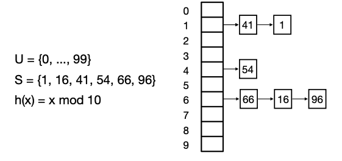

链式哈希：链式哈希是一种哈希表的实现方法，它使用链表来解决哈希冲突。

当两个不同的键被映射到相同的哈希桶时，它们被放入同一个链表中。这个链表被称为哈希槽或哈希桶。当我们需要查找特定键时，我们需要遍历该链表并比较每个键，直到找到匹配的键或链表的结尾。

We can store h in O(n) space. 

We can evaluate h in O(1) time

**如果哈希表中有许多冲突，那么链表可能会非常长，需要更多的空间来存储**。另外，链式哈希需要为每个哈希槽分配内存，因此它需要O(n)的总空间。时间上需要Time. O(1 + length of linked list for h(x))，取决于链表冲突的长度。

所以要想办法处理冲突，使用不同的哈希函数，然而选什么函数是有讲究的

比如，h(x) = x mod 10 这并不是一个很疯狂、混乱或随机的函数，很多数据会形成一个链表。最坏的情况下，甚至得到一个单链表。要解决这个问题，需要引入随机性。假定输入是随机的，那选择哈希函数也是随机的。如果函数h确实是“疯狂的”，“混沌的”和“随机的”，则使用h将使我们将S的元素随机分布在N个桶中。由于S的大小最多为N，我们应该期望桶通常很小。

定量计算一下：

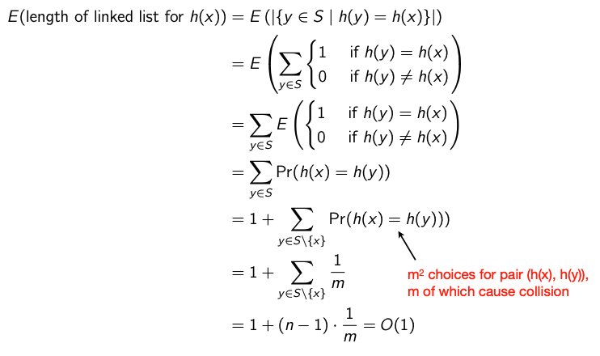

h(x) 是函数本身，E代表链表的长度,S是键值域。假设y $\in$ S，h(y) = h(x)。E的大小等于h(y) = h(x)数量的和。

换句话说，E等于h(y) = h(x)的概率和。假设有$m^{2}$个配对，m个冲突，那么链表长度E = 1+（n-1)· 1/m

总结一下，链式哈希

- 时间 O(1)
- 空间 O(n)

表现结果取决于哈希函数的选择，这个结果于输入集无关。

不过，上述的随机性是有问题的，由于哈希函数是从一个大的数据集合U到一个小的数据集合f1，…，Ng的映射，因此可能存在某些键的哈希值冲突，这可能导致桶的大小不均匀。选择随机函数的前提条件是不切实际的，因为在实践中，无法生成大到足以代表所有函数的函数集合，因此我们必须依赖于启发式的哈希函数，并根据它们的性能进行分析和改进

<h3 id="Universal-Hashing">Universal Hashing 通用哈希</h3>

通用哈希：**通用哈希是一种解决哈希冲突的方法**，通用哈希函数族的优点在于，它可以在任意输入数据的情况下提供良好的性能保证，而不需要事先了解输入数据的分布或结构。

在哈希表的上下文中，"universal"一词指的是一种哈希函数族，即从一定范围内随机选取一个哈希函数，使得每个键都被映射到哈希表上的槽中的概率相等

给定一个性质 (U) For all x != y; Pr[h(x) = h(y)]  !=N

N代表哈希表的槽数

即任意两个不同的键被映射到同一槽的概率不超过1/N。这是通用哈希的一个重要性质，确保了哈希表中的元素分布均匀，避免了冲突，使得哈希表的性能更好。

先给结论

在使用universal hashing解决动态字典问题时，当使用的哈希函数集合H是(nearly) universal family时，就可以做到空间复杂度为O(1)。

Universal Hashing 可以在以下情况下解决字典问题(没有特殊假设)：

- O(n)空间。 
- O(1)期望时间每个操作(查找、插入、删除)。

<h4 id="ex-number-systems">举例子</h4>

**Positional number systems 位置制数**

位置制数是一种数值表示方法，其中每个数字的意义由它在数中所占的位置决定。

- (10)10 = $(1010)_{2} (1⋅2^{3} + 0⋅2^{2} + 1⋅2^{1} + 0⋅2^{0} ) $

- $(107)_{10} = (212)_{7}(2⋅7^{2}+1⋅7^{1}+2⋅7^{0})$

十进制的10 可以换位二进制的1010，107换位七进制的211

位置制数的概念可以放进通用哈希

取一个素数7，给一个范围a，x是输入范围，根据如图定义的哈希函数。$h_{a}(x)$，可以把424放入槽为4的桶中，同时保证了均匀性。a是从H这个哈希函数族中随机取的，这个过程构建很快。

除了以上的哈希函数，还有别的哈希函数，比如inverse

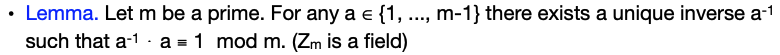

假设m=7， 要求a•a-1 mod 7 =1，则对于a = {1...6}

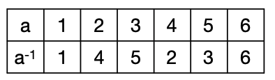

回到定义，通用哈希希望冲突概率≤1/m

证明如下：

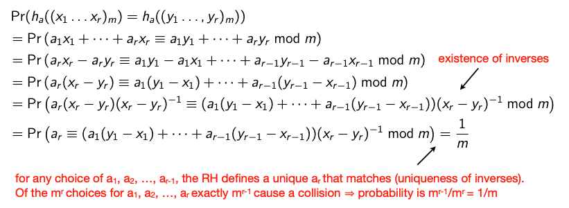

<h3 id="Static-Dictionaries-and-Perfect-Hashing">Static Dictionaries and Perfect Hashing 静态字典与完美哈希</h3>

上面提到过的需要增删改的是动态字典，对于静态字典有完美哈希的解法。

**静态字典**：静态字典是一种特殊类型的字典，它的大小在创建后是固定的，不能更改。

我们希望先预处理一下，实现查找功能O(1)实现

**完美哈希**：完美哈希是一种解决哈希冲突的技术，它可以实现在静态字典中快速查找。完美哈希使用一种特殊的哈希函数，该函数可以将每个键映射到一个唯一的哈希值，而不需要解决哈希冲突。这样，我们可以在常数时间内查找特定键，因为每个键都对应唯一的位置。完美哈希可以在静态字典中实现快速查找，但是它需要额外的计算来生成哈希函数，并且如果字典的大小发生变化，则必须重新生成哈希函数。

分三步来解决这个问题：

1. **Solution 1**: Collision-free but with too much space. 无冲突但空间使用过多

   具体思路是

   - 使用一个通用哈希函数将元素映射到大小为n^2的数组中。有50%的概率获得完美的哈希函数。如果没有完美的哈希函数，则重试。
   - ⟹ 在获得完美哈希函数之前，期望的尝试次数是O(1)。
   - ⟹ 对于静态集合S，我们可以使用O(n^2)的空间支持O(1)的最坏情况查找时间

2. Solution2: 许多碰撞但线性空间

   具体思路就是把1的空间换成n

3. Solution 3. Two-level solution. 两层模式  FKS scheme
   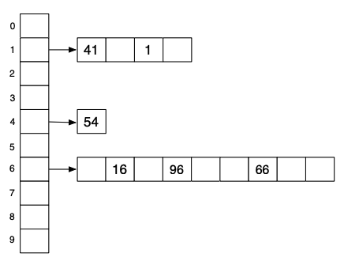

   在第1级使用有很多冲突和线性空间的解决方案。

   在第1级解决每个冲突，采用第2级无冲突解决方案

   查找(x)：在第1级查找以找到正确的第2级字典。在第2级字典中查找

   可以实现O(n) space and O(n) 的预处理时间.

<h3 id="Dynamic-Perfect-Hashing">动态完美哈希（Dynamic Perfect Hashing）</h3>

动态完美哈希（Dynamic Perfect Hashing）是一种哈希技术，它可以在O(1)的时间内对一个集合中的任意元素进行插入、查找、删除等操作，同时保证没有哈希冲突。以下是动态完美哈希的一般实现流程：

1. 先使用静态完美哈希生成一个哈希表。静态完美哈希是指在已知元素集合的情况下，可以构造出一个哈希函数，保证任意两个元素哈希值不同。静态完美哈希通常使用一些算法，例如Cuckoo hashing或者Randomized Quicksort等。
2. 对于任意要进行操作的元素，先计算其哈希值，并在静态哈希表中找到其对应的桶。桶中可能有多个元素，需要使用一些数据结构（例如二叉搜索树或者链表）来维护其中的元素。
3. 当向哈希表中插入或删除元素时，可能会破坏哈希表的完美性质，导致哈希冲突。为了避免这种情况，我们可以使用动态哈希表进行修正。具体来说，我们需要动态调整桶的大小，以保证桶中元素的数量不超过某个阈值。当桶中元素过多时，我们可以重新构建哈希函数，并将桶中的元素重新哈希到新的桶中。这一过程需要O(n)的时间和空间，其中n是桶中元素的数量。
4. 如果出现哈希冲突，可以使用二次哈希（quadratic probing）或者链式哈希（chaining）等方法解决。具体来说，二次哈希是指在桶中依次探查下一个位置，直到找到一个空桶。链式哈希是指在桶中使用链表来存储冲突的元素。

总体来说，动态完美哈希是一种高效的数据结构，可以在保证没有哈希冲突的同时，实现快速的插入、查找和删除操作。

<h2 id="Predecessor-problem ">Predecessor Problem 前驱问题</h2>

算法是由问题驱动的，这次讨论的是**前驱问题（Predecessor problem）**，是指在一个有序集合中，查找给定元素的前一个元素（当然也有Successor Problem后继问题）。这个问题的解决方法需要根据不同的数据结构来选择不同的算法。

例如，如果有一个有序数组arr=[1, 3, 5, 7, 9]，需要查找元素6的前驱。可以使用二分查找算法，在数组中查找最后一个小于等于6的元素，即5，作为6的前驱。

1. 定义：

假设有集合S,支持以下操作

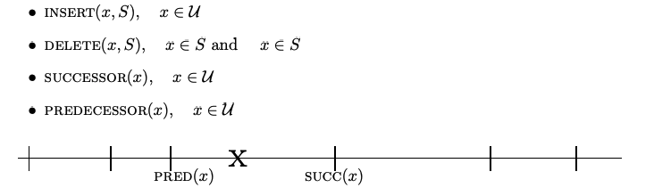

2. 经典方法和结果

   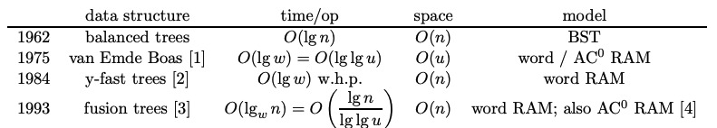

   这些是关于前驱/后继问题的经典解决方案，大约是1993年左右的。

2. 应用

- **nearest neighbor problem 最近邻问题**（简单版本）
- **Central problem for internet routing 互联网路由的中心问题** ：
  传送一个包，去一个地址匹配最长的前缀 192.110.144.123
- 其他

<h3 id="van-Emde-Boas">解决方法1 ：van Emde Boas</h3>

目标：实现O(loglogu)time

先一步一步接近最终方案

1. 一共分5步
   1. **Solution 1: Bitvector**

      这里使用了直接寻址表（Direct-address tables）作为数据结构，对于集合set {2; 3; 4; 5; 7; 14; 15}，给一个16长度的数组，存在的为1，不存在的为0。只不过这里的数组是位向量（Bitvector）, 它由一系列二进制位组成，每个位只能是0或1。

      这种情况下查找Predecessor(x) 也就是walk left，需要时间O(u)，u是bitvector的长度

      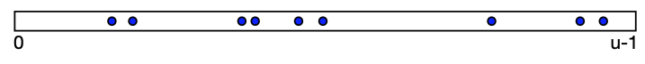

      

   2. **S2: 两层位向量bitvector**
      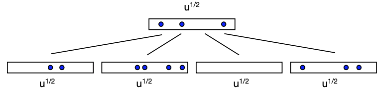

      把数组拆为上层大小$u^{1/2}$的数组，和下层同样大小的且数量为$u^{1/2}$的数组。如果小数组里面有的话，上层数组对应位置为1，否则为0。查询的时候先在对应小数组里面找，小数组没有上大数组，然后再去小数组里面找。每个数组找需要$u^{1/2}$的时间，一共Time. O($u^{1/2}$ + $u^{1/2}$ + $u^{1/2}$) = O($u^{1/2}$)

   3. **Solution3: 两层位向量，不过换查找方式**

      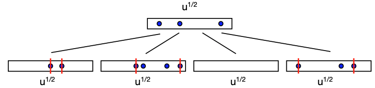

      在这种情况下，每个底部的数组记录min和max

      假如上面的指引称为 hi(x) 下面的指引称为 lo(x)

      - 如果hi(x)和lo(x) ≥ min,即下面[lo(x)]所在数组最小值，在其内部向左遍历即可
      - 如果hi(x)和lo(x) < min, 或者hi(x)不在上面，继续往左走，返回第一个非空位置的max

      这种查找方式还是需要在上下去走的，不过只需要在一个数组内走一遍再加一个额外查找，

      所以时间为 u1/2 + O(1) 即O($u^{1/2}$)

   4. 3的基础上再来一层

      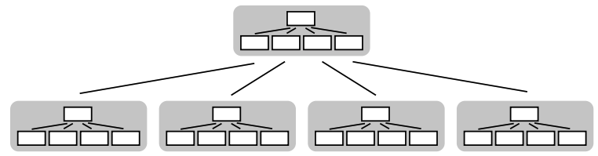

      递归一层的话，时间可以节省为$(u^{1/2})^{1/2}$ = $O(u^{1/4})$

   5. van Emde Boas：

      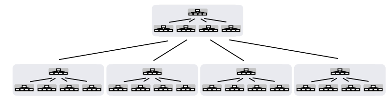

      递归的处理直到每个小数组为常量

      时间上为O(log log u)

      空间O(u)

      如果与完美哈希结合，可以把空间减少到O(n)

      增加与删除都很容易

   van Emde Boas 树可以应用于需要高效支持动态集合操作（如插入、删除、最大值、最小值、前驱、后继等）的场景，特别是当元素都是整数且整数集合比较稠密时效果更好。例如，**在路由算法中，van Emde Boas 树被用于快速查找下一跳路由器；在图论中，它被用于高效计算最短路径；在计算机网络中，它被用于实现高速缓存路由器和查找路由表等**。

<h3 id="Tries">Predecessor 解决方法2: Tries</h3>

目标和van Emde Boas一样，O(n) space ， O(log log u) query time

同样按步骤来理解这个过程 

- trie 又慢又占空间
- X-fast trie 快但是占空间
- Y-fast trie 快空间还少

详细解释如下

1. **tries**

   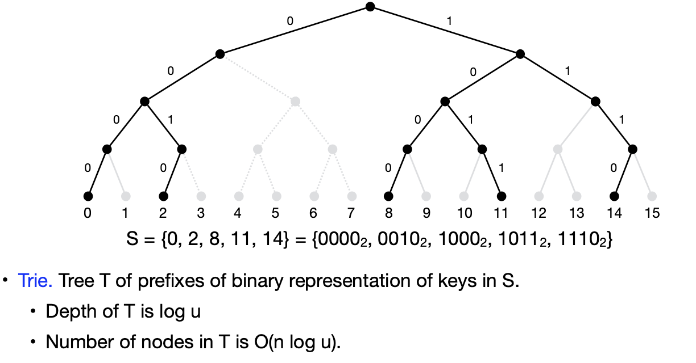

   上面的树表示了一个大小为 u=16 的 universe 的 trie。每个元素都被视为从根到叶子的路径，按顺序给出数字的位。处于活跃根到叶子路径上的节点（对应于 S 中的某些元素）被标记为 1。或者，如果一个节点下面有一个叶子对应于 S 中的一个元素，则将该节点设置为 1。

   如果找前继，可以从上到下找x的最长公共前缀。找到前驱或后继后，我们只需维护 S 的排序双向链表即可找到另一个元素。

   Time. O(log u) 

   Space. O(n log u)

2. **X-fast trie 数据结构**

   X-Fast Trie是一种基于Trie树和哈希表的数据结构

   每一层存储一个prefixes的字典
   Eg: d1 = {0,1}, d2 = {00, 10, 11}, d3 = {000, 001, 100, 101, 111}, d4 = S

   Predecessor(x) 算法：在层级之间二分查找找到x最长的前缀

   举个例子：$Predecessor( 9 = 1001 )_{2}$:

   - 第二层$10_{2}$存在，继续找剩余的1/2的树
   - 第三层$100_{2}$存在，继续找剩余的1/4的树
   - $1001_{2}$在第四层不存在，$100_{2}$就是最长的prefix

   对于第一种解法，需要从上往下走，则时间logu

   - 在哈希表中存储树中所有 1 位的位置（使用动态完美哈希）即存储 x ∈ S 的所有前缀的二进制表示。 
   -  二分搜索以找到哈希表中 x 的最长前缀，即从 x 到根的路径上最深的带有 1 的节点。 
   - 查看另一个子节点的最小值或最大值以找到前驱或后继。 
   - 使用 S 上的链表查找另一个元素。

   **空间：O(nLogu)**  **其中 n 是集合中元素的数量，U 是集合元素的范围**，这主要是因为 X-Fast Trie 存储了一个 hash table 和一个 linked list

   **时间：O(loglogu)** **X-fast trie在不同level中二分找，则loglogu实现最长前缀匹配**

3. **Y-fast trie**

   Y-Fast Trie是一种基于Trie树和有序表的数据结构，如图

   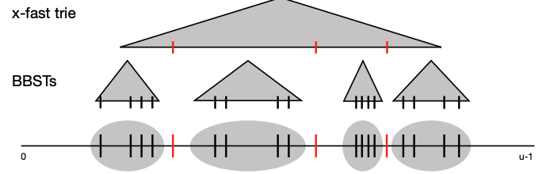

   > BBST的全称是Balanced Binary Search Trees，即平衡二叉搜索树，也称为自平衡二叉搜索树（Self-Balancing Binary Search Tree），是一种保持树平衡的二叉搜索树。它们通过旋转操作等方法维护树的平衡，使得每个节点的左右子树高度差不超过1，从而保证在最坏情况下的时间复杂度为O(log n)。
   >
   > 红黑树也就是BBST的一种

   简单来说，

   - 先把集合S分为n/logu大小的组，一共有n/logu的keys
   - 假设S'就是keys的集合，S'的大小为n/logu
   - 把S‘构建为x-fast trie，每组内容用平衡二叉搜索树构建

   举个例子：

   假设我们有一个动态集合，其中元素为整数，从 $0$ 到 $15$ 的整数是该集合的全集，即u=16。首先，我们将该集合分成 $4$ 组，每组包含 $4$ 个元素，用二进制表示即为 $00$，$01$，$10$，$11$。接着，我们选取每个组中最大的元素作为代表元素，这些代表元素是 $0$，$4$，$8$，$12$。每个组的元素可以使用平衡二叉搜索树（BBST）进行存储和查询，如红黑树或AVL树。

   然后，我们将这些代表元素 $0$，$4$，$8$，$12$插入一个完美哈希表中，哈希表用于查询元素是否在集合中，并且可通过双向链表存储以提供增量的顺序。

   例如，我们想要查找集合中数字 $7$ 的前驱和后继。我们首先使用哈希表在常数时间内查找该数字，然后在y-fast trie结构中找到包含该数字的组所对应的代表元素，它是 $4$。然后我们只需要在代表元素 $4$ 所在的组中查找数字 $7$ 的前驱和后继。我们可以使用该组中的平衡二叉搜索树，例如红黑树，以 $O(\log \log u)$ 的时间在其中执行前驱和后继查找。

   **时间上：**

   上层X-fast trie: O(log log u)找到对应的组（前缀）

   在BBST上 : O(log (group size)) = O(log log u). (树高)

   • ⟹ **O(log log u) 一共**

   使用此结构，我们可以在 $O(\log \log u)$ 的时间内执行查找最小值，最大值，前驱，后继和成员操作，并且在平均情况下可以在 $O(\log u)$ 时间内执行插入和删除操作。

   虽然**X-fast tree** 找predecessor需要也是O(loglogu)时间，但是因为X-fast 存储了所有元素到哈希表中，假设n个元素，树高logu，**x-fast需要空间O(nlogu)**。

   对于**y-fast tree**，上层x-fast trie 需要O(S'•log u) = O(n / log u • log u) = n，下层的平衡搜索二叉树需要O(n)，所以需要**空间一共O(n)**，空间上更有优势。

   它利用了Indirection的思想。关键在于保持聚类的大小不变，这可以通过在聚类大小达到Θ（lg u）时拆分聚类，或在聚类大小小于n 4 / lg u时将两个聚类合并来实现。在拆分或合并聚类时，需要在y-fast tree中更新常数数量的代表元素。每个操作的复杂度是O（lg u）。但是，拆分或合并仅在每个聚类被访问超过Ω（lg n）次后才发生，因此平均时间复杂度是O（1）。

### references
> http://courses.compute.dtu.dk/02282/2023/hashing/universalhashing.pdf
> http://courses.csail.mit.edu/6.851/spring07/scribe/lec11.pdf
> http://courses.csail.mit.edu/6.851/spring07/scribe/lec12.pdf
> Log-logarithmic worst-case range queries are possible in space Θ(N)
Author links open overlay panelDan E. Willard