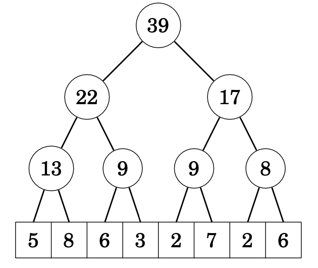
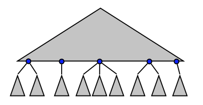

  - [问题描述](#desc)
    - [1. Range Minimum Queries](#Range-Minimum-Queries)
    - [2. Lowest Common Ancestor](#Lowest-Common-Ancestor)
    - [3. Level Ancestor](#LA)
  - [RMQ相关](#RMQ-solution)
    - [RMQ: Sparse table solution 稀疏表解法](#RMQ-sts)
    - [±1RMQ 问题](#+-1RMQ)
    - [RMQ to LCA](#RMQ-to-LCA)
    - [LCA to ±1RMQ](#LCA-to-+-1RMQ)
  - [Segment trees 线段树](#Segment-trees)
    - [dynamic RMQ with Segment trees 线段树处理动态RMQ](#dynamic-RMQ-Segment-trees)
  - [Level Ancestor](#LALA)

<h2 id="RMQ-LCA">Range Minimum Queries and
Lowest Common Ancestor</h2>
**区间最小值查询（RMQ）**和**最近公共祖先（LCA）**是计算机科学和数据结构中常用的两种算法。

RMQ用于查找数组的给定范围内的最小值。它在各种应用中被使用，例如在图中查找最短路径、查找最长公共子串等等。

另一方面，LCA用于查找树中两个节点的最近公共祖先。它应用例如在树中查找两个节点之间的距离、查找一组节点的最近公共祖先等等。

RMQ和LCA都是计算机科学中重要的算法，在各种应用中被广泛使用。

之所以放在一起，因为这两个问题是可以互相转换的

一个一个来

<h2 id="desc">问题描述</h3>

<h3 id="Range-Minimum-Queries">1. Range Minimum Queries</h3>

对于Range Minimum Queries问题，预处理一个数组A，让他实现RMQ(i,j)：返回A[i...j]中最小的元素

e.g. :RMQ(2,5) = 2 (index 4)

基础的解法

- 线性搜索 linear search 
  - 空间O(n)就一个数组
  - 时间O(j-i) = O(n)
- 保存所有的解答
  - 空间O(n^2) 时间O(1)

- Sparse table solution
  - Space: O(n log n) • Time: O(1)

<h3 id="Lowest-Common-Ancestor">2. Lowest Common Ancestor</h3>

对于公共祖先问题，预处理一棵树T，让他支持操作LCA(u,v)：返回节点u 和 v的最小公共祖先

基础解法：

- 线性搜索：从跟往子节点走，做出标记
  - 空间O(n) 就是树的时间
  - 时间O(树高) = O(n)
- 保存所有答案：
  - 空间O(n^2) 时间O(1)

<h3 id="LA">3. Level Ancestor</h3>

关于Level Ancestor问题，假定给一颗有根树T, 给定节点x和一个整数k，我们的目标是找到x节点的第k级祖先

当然，k不能大于x的深度。

虽然最近公共祖先(LCA)和level ancestor看起来像是相似的问题，但需要使用相当不同的技术来解决它们（至少目前为止）。然而，range minimum query**(RMQ)问题基本上与查找最近公共祖先（LCA）的问题相同**。

<h2 id="RMQ-solution">RMQ相关</h2>

<h3 id="RMQ-sts">RMQ: Sparse table solution 稀疏表解法</h3>

保存所有长度为 2 的幂的区间的结果

保存所有配对的答案空间太大了，为O(n^2)。这么干的话**空间O(nlogn)**

查找过程：

- 对于区间[i...j]，找到2^k ≤ j-i+1的k
- 再找两个区间内最小的

时间复杂度O(1+1+1) = O(1)

预处理时间：共n个index，每个保存logn个结果，O(nLogn) 

<h3 id="+-1RMQ"> ±1RMQ 问题</h3>

 ±1RMQ，RMQ问题和±1RMQ问题都是与查找数组中的最小元素相关的问题，但是在定义和解决方法上有所不同。

RMQ问题中，给定一个长度为n的数组A，要求找到A[i]到A[j]之间的最小值及其下标。

而在±1RMQ问题中，给定一个长度为n的数组A，要求找到A[i]到A[j]之间的最小值及其下标，但是数组A中的元素只可能是1或-1。解决±1RMQ问题需要使用一些特殊的技巧，例如通过预处理块之间的最小值和块内前缀/后缀最小值来实现查询的快速回答。

因此，RMQ问题和±1RMQ问题在定义和解决方法上存在明显的不同，需要采用不同的算法来解决它们。

当进行±1RMQ问题时，查询结果可以加上或减去1。这意味着我们需要找到区间[l,r]中的最小值，并在此基础上允许加上或减去1。以下是一个例子：

假设我们有一个数组A=[4, 2, 1, 5, 3]，需要解决的查询是区间[2,4]的±1RMQ问题。在这个查询中，我们需要找到区间[2,4]中的最小值，并允许在此基础上加上或减去1。

首先，我们找到区间[2,4]中的最小值，它是A[2]=1。然后，我们允许在此基础上加上或减去1，即我们可以得到区间[2,4]中的最小值为0、1或2。在这个例子中，我们可以得到以下三个答案：

- 如果我们减去1，则最小值为0（1-1=0）。
- 如果我们不加或减，则最小值为1。
- 如果我们加上1，则最小值为2（1+1=2）。

因此，在解决±1RMQ问题时，我们需要找到区间的最小值，并允许在此基础上加上或减去1，以便得到多个可能的答案。

解决方案2 ：**2-level solution 两层稀疏表方案** 

把数组A分为大小$\frac{1}{2}log n$的块，定义一个数组 A‘，大小|A'|=$\frac{2n}{logn}$,其中A'[i]保存第i个块的最小值。再定义一个同样大小的数组B，B[i]是第i个块的中A'[i]即最小值的位置。因为RMQ其实返回的也是最小值的位置而不是最小值，因此用B来追踪最小值从哪来。

然后每一个块进行稀疏表构建。

处理RMQ(x,y)变成了寻找min in {

- i-j中间蓝色块中最小的
- i-1中最小的
- j+1中最小的

}

**因为A'是每个块的最小值组成的数组**，B为A'[i]在数组A的位置，A'大小|A'| = $\frac{2n}{logn}$，对A'进行稀疏表构造（比如用二次幂来作为区间），空间为O(|A′|log|A′|) ，算出来**空间O(n)**。

在这个稀疏表的查找时间为 O(1).

然而

- **所有总空间为O(n) + 所有块的稀疏表的空间**
- **时间为：O(1)+O(1)+O(1) = O(1) 即两个表的查询，稀疏表的查询，最小的比较值，这三个操作的和**

接下来的问题是怎么算所有块构造的稀疏表的空间

简单想想，块的大小为1/2 logn，每个表为$O(log^{2}n)$一共nlogn的空间

若观察一下，很多块的结构可能相同，我们需要存储的是所有正则化的块的答案

如图的X和Y, 可以把他们正则化，一共有多少个不同的正则化的块呢？

Lemma 4. 假设每个块的长度为$\frac{1}{2}*logn -1 = l$，则最多一共有$2^{l}$≤√n个不同的块,也就意味着我们需要创建√n个ST。每个表格的大小为$O(log^{2}n)$，需要的空间为$O(n^{\frac{1}{2}} ⋅ log^{2}n)$

此外，由于输入数组的长度可能无法被块大小整除，如果输入数组的长度不是块大小的整数倍，还需要一些空间来存储规范化块之间的间隙，最坏的情况下有n/logn-1个块需要额外空间（数组除以块大小），空间复杂度为O(n/logn)。

所以所有块构造的稀疏表的空间大小为$O(n^{\frac{1}{2}} ⋅ log^{2}n)$+O(n/logn) = O(n)。（？？？？论文这么写，但我感觉应该是不到n的）

所以一共的空间大小为O(n)，查询时间为O(1)，空间上比interval of length a power of 2更省（nlogn）

<h3 id="RMQ-to-LCA">RMQ to LCA</h3>

其实不只是±1RMQ，其实LCA 和 RMQ 问题都可以在常数查询时间和线性存储空间下得到最优解，不过这需要先把RMQ问题约化为LCA然后再约化为±1RMQ，先从笛卡尔树（Cartesian tree）开始。

笛卡尔树（Cartesian Tree）是一种二叉树

笛卡尔树的构建方式是，给定一个序列A，我们可以首先找到A中的最小值，将其作为根节点，并将序列分成两个部分，分别对应左子树和右子树。然后，我们可以递归地构建左子树和右子树，每次选择剩余序列中的最小值作为子树的根节点。这样就构建了一棵笛卡尔树。

笛卡尔树具有以下性质：

1. 笛卡尔树是一棵二叉树，每个节点都有一个键和一个值。
2. 笛卡尔树的中序遍历是原序列A。
3. 笛卡尔树的每个节点都满足堆的性质，即其父节点的值大于（或小于）其子节点的值。

笛卡尔树在解决RMQ问题时非常有用。通过构建笛卡尔树，可以在O(n)的时间内预处理原序列，并在O(log n)的时间内响应RMQ查询。在笛卡尔树中，每个节点代表原序列中的一个子区间，并存储该子区间的最小值。因此，通过比较两个区间的最小值，可以找到它们之间的最小值。

可以发现如果要寻找RMQ(2,5)即[2,5]中的最小值其实也就是找cartesian tree中2和5的lowest common ancestor

<h3 id="LCA-to-+-1RMQ">LCA to ±1RMQ</h3>

LCA约化到±1RMQ的则需要用到 —— 欧拉遍历表示法（Euler tour representation）

Eluer tour representation 按照上图的方式遍历

用E代表Eluer tour representation的路径，A代表E[i]的节点深度，R代表节点在E中第一个出现的值

而LCA(i,j) = E[$RMQ_{A}(R[i], R[j])$]，比如LCA(4,7) = $RMQ_{A}(5,12)$

E的大小是2n-1,构建他的时间是O(n)，总图预处理的时间为

在上述缩小的数组L中，相邻元素之间的差为+1或-1。我们得到这个±1限制，因为对于欧拉遍历中的任意两个相邻元素，一个元素总是另一个元素的父节点，因此它们的深度差正好为1。因此，我们将±1-RMQ问题视为特殊情况。

结论：RMQ and LCA can be solved in O(n) space and O(1) query time

<h2 id="Segment-trees">Segment trees 线段树</h2>

线段树是一种支持区间查询和数组更新的数据结构。线段树可以支持求和查询、最小值和最大值查询等许多其他查询，以便两个操作都可以在O(log n)时间内完成。

从结构上看线段树是一棵二叉树，底层的节点对应数组元素，而其他节点包含处理区间查询所需的信息。

比如说整一个支持求和查询（sum queries）的线段树，以以下数组为例：

每个内部节点的值是相应数组值的总和，并且可以计算为其左右子节点值的总和

例如，考虑范围[2,7], 使用尽可能高的节点计算总和，每个树级别最多需要两个节点 9 + 17 = 26.

如果数组有更新，我们应该更新所有依赖于更新值的节点。这可以通过遍历从更新的数组元素到顶部节点的路径并更新路径上的节点来完成，从底部到顶部的路径始终由O(log n)个节点组成，因此每次更新都会更改树中的O(log n)个节点。

<h3 id="dynamic-RMQ-Segment-trees">dynamic RMQ with Segment trees 线段树处理动态RMQ</h3>

segment trees 可以解决Dynamic Range Minimum Queries动态范围最小查询问题，

对于dynamic RMQ 问题，它需要支持以下操作

- Add(i, k): Set A[i] = A[i] + k (k can be negative). 
- RMQ(i,j)

比如说查询RMQ(5,13)：

1. 令a=5 b=13, 令s=min{tree[a], tree[b]}
2. a移动到右儿子，到了上面灰色的2，b移动到上级的2，左儿子, s= min{s, tree[a], tree[b]}
3. 一直往上移动，直到a,b相遇

这么做比遍历[5,13]快，能做到 ***O*(log *n*) time**

至于说怎么实现Implementation，用一个数组就够了

数组大小是2n， 所以空间复杂度O(n)

如果我们要更新，把Add(5,7)即5那里的值从1变成8

更新时间也就是树高O(logn)

<h2 id="LALA">Level Ancestor</h2>

问题描述上面有写过，对于个Level ancestor query LA(v, k).  v是节点， k是深度，查找一个节点的第k层祖先

> 如果一个算法的预处理时间为f(n)，查询时间为g(n)，我们将说该算法具有复杂度⟨f(n);g(n)⟩

接下来由浅入深的解决这个问题

1. **Solution 1: 暴力解法**  <O(n^2 ), O(1)>

   用一个查询表，一个axis放node，另一个axis放level，即每个node到root的路径。

2. **solution2: 没有数据结构 存储树**

   LA(v,k): Walk up. 

   Time. O(n) 

   Space. O(n)

3. **Solution3: jump pointers** 跳跃指针算法

   每个节点v存储1、2、4的祖先
   

   查询是通过反复跳转从节点到节点来回答的，每次跳跃超过当前祖先和目标祖先之间剩余层级的一半以上。因此，最坏情况下的跳跃次数受到 O(log n) 的限制。通过使用动态编程来填充跳跃指针来进行预处理。

   Time. O(log n) 

   Space. O(n log n)

4. **Solution 4: Long Path Decomposition 长路径分解 **: <O(n), O(√ n)>

   它的基本思想是将无向图分解成一些不相交（nondisjoint）长路径。

   通过递归删除树中最长路径并在剩余的连通子树上迭代来分解树，

   具体步骤如下。在T中找到一条最长的从根到叶子的路径，如果有多条则随机选择一条，并将其从树中删除。这个删除操作将剩余的树分解为子树T1、T2、……。然后递归地对这些子树进行相同的操作，即删除它们的最长从根到叶子的路径。当树变成单条路径时，递归结束。

   **每个被删除的路径按自顶向下的顺序存储为一个数组，并且每个数组都有一个从其第一个元素（路径的根）指向其在树中的父节点（上一级递归的路径数组中的一个元素）的指针。**

   

   在最坏的情况下，最长路径分解为k，k−1，...，2，1的最长路径，每个路径只有一个子节点，导致高度为O(√n)的数组树

   

   **定理**：**任何从根节点到叶节点的路径都经过不超过O(√n)个长路径**。其中n是图中节点的数量

   **结论**：长路径分解中的一个结论是，**对于任意一棵树T的最长路径分解，所有最长路径的总长度不超过n**

   然后把每个长路径存入数组，使用跳跃的方式

   Time. O(√n) • Space. O(n)

5. **Solution 5: Ladder Decomposition 梯形分解 **: <O(n), O(lg n)>

   

   

   **Ladder decomposition. :**

   Ladder Decomposition算法的基本思想与Longest Path Decomposition相似，但是每条路径向后（树的上方）扩展两倍。如果扩展的路径到达了根节点，则停止扩展。

   由于梯子属性，我们知道节点v位于至少为h(v)的最长路径上。因此，在到达根节点之前最多进行O(log n)次梯子跳跃，因此查询的时间复杂度为O(log n)。预处理与Solution 4类似。

6. **Solution 6: Ladder Decomposition + Jump Pointers ** <O(n lg n), O(1)>

   这个算法的思想是将 jump pointers（算法 B）和 ladders（算法 D）结合起来。
   

   每个查询将使用一个 jump pointer 和一个 ladder 来到达所需节点。

   对于LA(v,k):

   - 高度为k的节点在至少为2k高的梯子上, 跳跃后，我们在高度至少为k/2的节点上
   - 找到包含该节点而且还包含目标祖先的ladder ，从而导致 O(1) 查询时间。

   空间的话Space. O(n) + O(n log n) = O(n log n)

7. **Solution 7: Top-Bottom Decomposition <O(n), O(1)>**

   看其他论文，也叫macro/micro-tree.

   由于我们不需要在所有节点上都有跳跃指针，我们称具有跳跃指针的节点为跳跃节点。建议是只将叶子节点指定为跳跃节点。然而只有在树包含O(n/log n)个叶子节点的特殊情况下才能加快速度，

   所以，我们的目标是指定O(n/log n)个跳跃节点，尽可能地“覆盖”整个树。

   

   

   **将树结构分成三个部分**

   - 跳跃节点Jump nodes（也叫macro node）：

     - 跳跃节点至少有 ≥ $\frac{1}{4} log n$ 个descendants. 

     - 而跳跃节点的每个儿子的后代大小≤$\frac{1}{4} log n$

     - 最多有O(n/log n)个跳跃节点

   - Top tree 也叫 Macro-tree, 由Jump nodes + ancestors组成

     - 跳跃节点的LA问题都可以在<O(n), O(1)>内解决

   - Bottom trees 也叫 micro tree

     - 所有的跳跃结点的后代u，数量 <$\frac{1}{4} log n$
     - 小树的量不大，可以做一个详尽表使用表格算法。他们最多√n个形状。
     - 搞到所有的形状，然后应用table algorithm，这个需要 $O(√n log^{2} n) $ < O(n)的时间
     - 对于每棵bottom tree，我们可以在DFS过程中做好映射，查表的时候可以用，这样可以在常数时间内跳表

     可以看见，上下的树预处理时间都为O(n), 而且查询时间均为O(1)

   

   **对于查找**

   所以：

   如果v在宏树中，先跳到v的叶子后代，然后从叶子向上跳，爬梯子到达目标祖先。

   如果v在一个微型树中并且LA(v, l)也在微型树中，则使用该叶子的查找表进行查询。

   如果v在一个微型树中并且LA(v, l)不在微型树中，则先跳到v的叶子后代，然后从叶子向上跳，爬梯子到达目标祖先。

   

   **解释1: 关于只保留叶子的ladder：**

   如果对于所有的jump nodes进行阶梯分解，我们可以在O(n)时间找到他们的jump pointers。然后进行一次深度优先搜索，找到jump nodes的儿子u，同样u也可以进行解体分解找到jump pointers。事实上，我们只需要保留u的梯子和它的跳跃节点就够了。我们可以把这个u的跳跃节点定义为jump nodes，总共挑选出O($\frac{n}{log n}$)个跳跃节点。

   对于每个micro tree 我们都会进行预处理，并生成一个table。对于每个micro tree，都会构建一个ladder。ladder用于micro tree内部节点的跳跃。

   **解释2: micro tree的数量上限为√n：**

   micro tree的形状不会太多，其叶子小于$\frac{1}{4} log n$，而且树的形状由traversed from child to parentd的路径描绘，要么down edge,要么up edge，而这棵树的edge < $\frac{1}{4} log n$，每条edge遍历2次（可以参考下面的tree encoding）,  所有树可能的形状数量为$2^{log n /2}$ = √n。（原来1/4用在了这里...卧槽）

   **解释3:Top-Bottom Decomposition 空间如何为O(n)**

   

   先解释一下为何bottom tree 的空间为O(n)

   - tree encoding: 使用平衡括号对每个底层树 B 进行编码，最多叶子数量$\frac{1}{4} log n$ * 2，大小即$\frac{1}{2} log n$ bits.

   - Integer encoding: 如果换成整数编码（四位四位的整编），大小 < $log(\frac{1}{4} log n)$ * 2 => 2loglogn bits

   - LA encoding : Concatenate into code(B, v, k) 压缩为code(b,v,k)编码，即表格编制

     • ⟹ |code(B, v, k)| < 1/2 log n + 2 log log n bits.

   所以Space空间$ 2^{|code|} < 2^{1/2 log n + 2 log log n }= n^{1/2} log^{2} n = o(n)$

   上下空间加起来O(n), 查询时间 Time. O(1) 