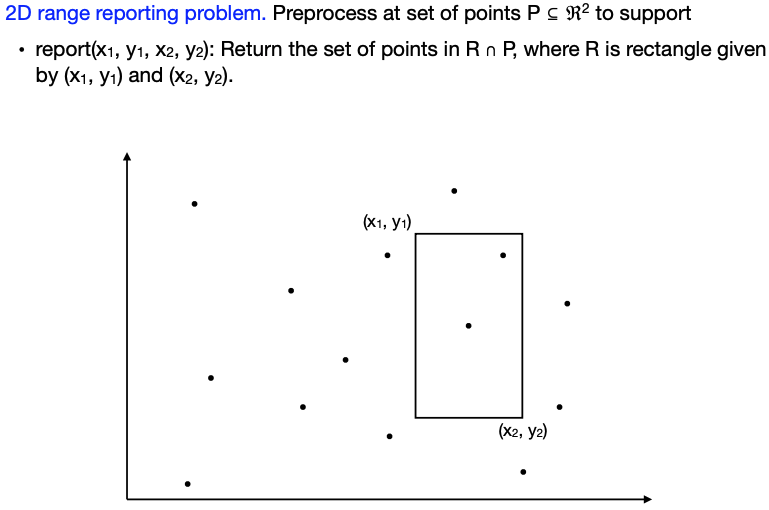
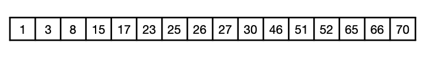
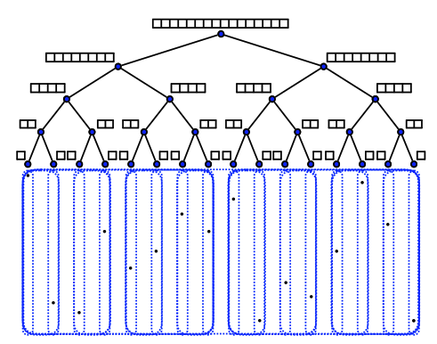
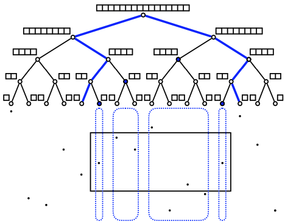
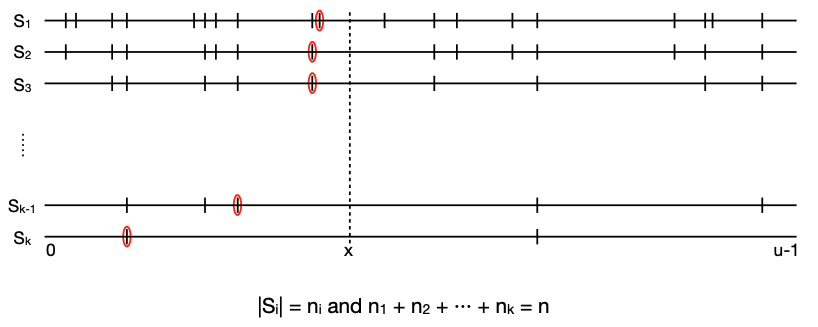
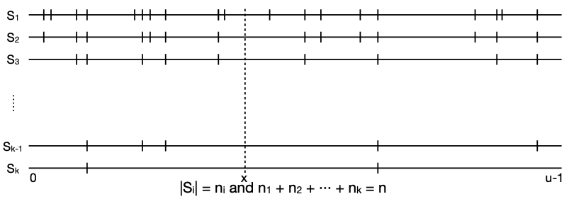
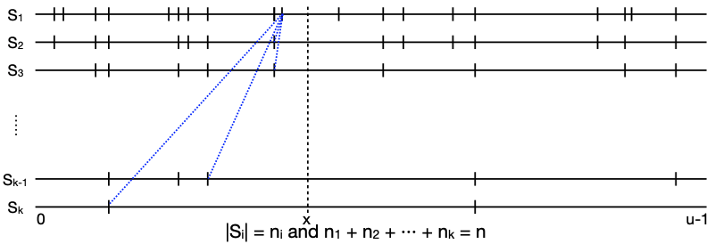
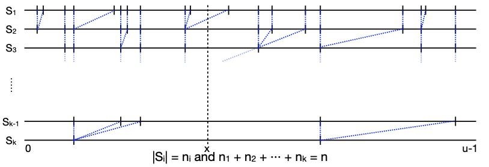
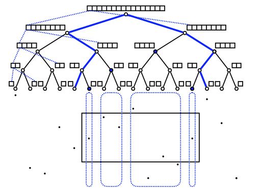
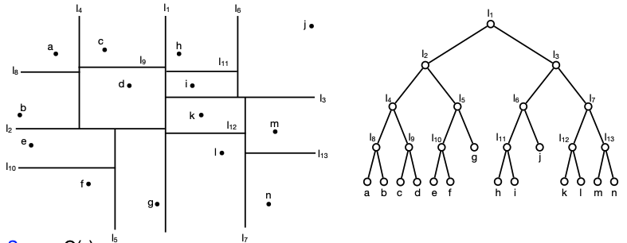

  - [Range Report problem](#RR)
    - [1D Range Report](#1DRR)
      - [Range Tree 范围树](#Rtree)
    - [2D Range Report](#2DRR)
      - [2D Range Tree](#Rtree2)
      - [Predecessor in nested sets 嵌套集中的前继查询问题](#Predecessor-in-nested-sets)
      - [2D Range Tree with bridge](#Rtree2_bridge)
    - [kD trees](#kD-trees)

<h2 id="RR">Range Report problem</h2>

在计算几何（computational geometry）中，许多搜索问题和区间查询可以通过在单独的有序列表中进行相同关键字的迭代搜索来解决。如果这些有序列表可以与度数为d的图的节点进行一对一的对应，使得迭代搜索总是沿着该图的边进行，则我们可以比显然的二进制搜索序列更好地解决问题。

Range Report problem 范围报告问题

举个例子

给一个点阵，要求支持操作report(x1,y1,x2,y2)返回p与R交集的点，这也叫orthogonal range queries

应用有很多，一个自然的应用是数据库查询（例如，有多少人在给定的年龄范围和收入范围内？）

回答正交范围查询的标准工具是范围树(range tree)。范围树之所以有用，是因为它们具有合理的空间效率，并且具有高效的预处理和查询时间。

<h3 id="1DRR">1D Range Report</h3>

**1D ranger report problem 1维范围报告问题:** 

预处理一个拥有n个点的集合 P ⊆ ℜ 

-  要求实现 report(x1, x2): 返回 [x1, x2]区间内的点

<h4 id="Rtree">Range Tree 范围树</h4>

会发现，输出时间取决于输出的大小，如果要简化这个问题，只用比较技巧不用哈希或者bit怎么办？

- 把它存到一个排序过的数组中(一维可以不用BST)
- 对于操作report(x1,x2):  二分查找x1的prodecesor, 然后遍历数组找到x2的successor
- 时间：O(logn+occ), 二分+occ
- 空间：O(n)
- 预处理O(nlogn)
- 以上这是在comparison-based model中的optimal

<h3 id="2DRR">2D Range Report</h3>

对于二维的情况，我们有以下目标

1. (n log n) space and O(log n + occ) query time 
2. O(n) space and O($n^{1/2}$ + occ) query time.

实现这个目标分为四步

1. 泛化 1D range reporting. 
2. 2D range trees. 
3. 2D range trees with bridges. 
4. kD trees.

<h4 id="Rtree2">2D Range Tree</h4>

接下来直接聊2D range trees

1. **数据结构**

   - x 坐标上构建完美平衡二叉树
   - 每个节点v 存储v 下面按y 坐标**排序的**点数组。

   

   - **空间： O(n) + O(n log n) = O(n log n).**
   - 预处理时间： O(n log n)

2. 查询report(x1, y1, x2, y2):
   

   - 过程

     - 找到x1的前继和x2的后继

     - 每个off-path node 做一次1D y-range 查询，即找到y1, y2所属的范围

     - 返回结果集合

   - 查询时间分析

     - x轴的Predecessor + successor: O(log n)
     - 对于y轴，要做 < 2log n次的 1D queries，每次O(log n + occ in subrange) 
     - 查询时间：O($log^{2}n+occ$)

   - **空间：O(nlogn)**

   - **预处理：O(nlogn)**

3. **扩展：对于d维的情况**

   - 查询时间：O($log^{d}n+occ$)
   - 空间：O($nlog^{d-1}n$)

4. **思考题**：我们是否真的需要$log^{2}n$级别的查询，能否优化到logn+occ???

<h4 id="Predecessor-in-nested-sets">Predecessor in nested sets 嵌套集中的前继查询问题</h4>

先看一个其他的问题

**问题定义：**

让S = {S1, S2, …, Sk} 为域 U的一组集合而且 U ⊇ S1 ⊇ S2 ⊇ ∙∙∙ ⊇ Sk

实现一个操作predecessor(x):  能返回x在S1, S2, …, Sk中的**所有前继**

**目标：**实现嵌套集中的前继查询占用O(n)空间和O(logn+k)的查询时间

**实现分成三步：**

1. **Sorted Arrays 排序数组 ：慢，线性空间**
   

   - Predecessor：每个set都是一个排序的数组，查询前继的话就是每个数组都做二分查询

   - 时间 : O(k logn)
   - 空间 : O(n)

2. **tabulation 表格：快，空间爆炸**

   

   - 数据结构：排序的S1,然后每个S的前继记录下来
   - Predecessor(x): 在S1二分查找位置，然后表中获取前继
   - 时间：$O(log n_{1} +k)$ = O(logn+k)
   - 空间：O(nk)

3. **Sorted arrays with bridges.：快，空间少**

   

   - 数据结构：每个集合的排序数组+桥（bridges）

     **桥即是记录了每个元素e在后一个S中前继的位置**

   - Predecessor(x): 先S1中二分查找，然后报告所有前继

   - **时间：$O(logn_{1}+k)$ = O(logn+k)**

   - **空间：O(n)**

   - **预处理：O(nlogn)**

这只是实现了嵌套集合的处理，对于非嵌套集合需要用到 fractional cascading, 可以将范围树的查询时间从O(log^d n+k)降低到O(log^(d-1) n+k)

<h4 id="Rtree2_bridge">2D Range Tree with bridge</h4>

之前的2D range tree，每一层都要做一次二分查找，比较慢，接下来用桥的思路做优化。

1. 思路

   - 考虑每一个节点V都有一个Vl和Vr的孩子，V本身是一个数组，Vl和Vr是它的子数组
   - 其实所有的搜索都是在一个y-range上，真没必要拆成那么多个小range一个个找

2. 数据结构：

   - 每一个数组V内的点都要存储在子数组内的桥

3. 操作report(x1,y1,x2,y2)：2D range tree query

   先在根数组上二分查找+在bridges上进行查找

4. 性能
   - 时间：O(log n + occ) 
   - 空间：O(nlog n) ，是一样的
   - 预处理：O(nlog n)

还可以继续优化，空间只需要O(n)

<h3 id="kD-trees">kD trees</h3>

现在，我们介绍范围树的替代方法，即kd树。kd树在二维情况下特别有用，接下来仅在二维情况下讨论它们。

kd树允许我们仅使用O(n)的存储空间，但我们必须在额外的查询时间上付出代价。

#### The 2D tree (k = 2)

- 基于点集P的平衡二叉树
- 通过交替使用水平和垂直线将P递归地划分为包含（大致）相同数量的点的矩形区域。 
- 每个节点在树中存储区域和线。

空间O(n) 预处理O(nlogn)

Report(x1, y1, x2, y2)：从根节点开始遍历二维树。在节点v上： 

-  情况1：v是一个叶节点：如果包含在范围内，则报告region(v)中唯一的点。 
- 情况2：region(v)与范围不相交：停止。 
- 情况3：region(v)包含在范围内：报告region(v)中的所有点。
- 情况4：region(v)与范围相交，并且v不是一个叶节点。递归向左和向右。
- 时间O(√n)

定理：我们可以解决2D范围报告问题，具有以下时间和空间复杂度：

 • O(n)空间

 • O(√n + occ)时间

 • O(n log n)预处理

结论：

我们能解决2D range report 

- 使用带上brigeds的2D range tree 在空间O(n log n) 和查询时间 O(log n + occ)  实现，再或者
- 使用KD tree 在O(n)空间和 O(n1/2 + occ) 查询时间搞定
- 预处理时间都是O(nlog n)

### Reference 

>[Scribe notes from MIT](http://courses.csail.mit.edu/6.851/spring10/scribe/lec03.pdf)Computational Geometry: Algorithms and Applications, M. de Berg, O. Cheong, M. van Kreveld and M. Overmars
>
>[Fractional cascading: I. A data structuring technique](http://dx.doi.org/10.1007/BF01840440), B. Chazelle and L. Guibas, Algoritmica, 1986
>
>[Analysis of range searches in quad trees](http://dx.doi.org/10.1016/0020-0190(75)90034-4), J. L. Bentley and D. F. Stanat, Inf. Process. Lett., 1975