  - [Amortized Analysis](#Amortized-Analysis)
    - [Multipop stack](#Multipop-stack)
    - [Incrementing a binary counter 二进制计数器](#Incrementing-a-binary-counter)
    - [Dynamic tables 动态表](#Dynamic-tables)
  - [Splay Trees 旋转树](#Splay-Trees)
    - [Self-adjusting BST 自适应二叉搜索树](#Self-adjusting-BST)
    - [Splaying 旋转](#Splaying)
    - [About Splay Trees 关于旋转树](#About-Splay-Trees)
  - [Dynamic Graphs: Dynamic edge orientation 动态图：动态边定向](#ddgeo)
    - [关于动态Dynamic](#aboutDynamic)
    - [Sparse graphs：稀疏图](#Sparse-graphs)
    - [Dynamic bounded out-degree orientations 动态有界出度定向](#Dynamic-bounded-out-degree-orientations)
      - [the omniscient algorithm 全知算法](#the-omniscient-algorithm)
      - [putting it together](#putting-it-together)

<h2 id="Amortized-Analysis">Amortized Analysis</h2>

要聊Amortized数据结构，要先从Amortized Analysis开始，详细内容在算法导论第17章（3th edition）有。

在摊销分析(Amortized Analysis)中，我们平均分配对一系列数据结构操作所需的时间。通过摊销分析，我们可以证明，如果我们对一系列操作进行平均，即使在序列中的单个操作可能很昂贵，操作的平均成本仍然很小。摊销分析与平均情况分析不同之处在于，它不涉及概率；摊销分析保证了在最坏情况下每个操作的平均性能。

能用到的方法有

- Summation (aggregate) method 聚合分析 : 

  通过确定一系列n个操作的总代价上限T(n)，然后平均每个操作的代价为T(n)/n。将平均代价作为每个操作的摊分代价，从而所有操作都具有相同的摊分代价。

- Accounting (tax) method 账户法:

  通过确定每个操作的摊分代价来解决当有多种操作类型时每个操作的代价可能不同的问题。账户法会在序列的开头过度收费某些操作，并将超额费用存储为对数据结构中特定对象的“预付款项”。序列后期，这些预付款项可以用于对代价较低的操作进行补偿

- Potential method 势能法

  它类似于账户法，通过确定每个操作的摊分代价并可能在序列开头过度收费一些操作来补偿后期的低收费操作。势能法将信贷作为整个数据结构的“势能”，而不是与数据结构中的单个对象相关联。

具体来说，为数据结构定义一个势能函数，势能函数应该能够反映算法的性能和关键操作的代价，流程如下

1. 定义一个势能函数（potential function）：,$\Phi$ 这个函数描述了算法在某个时刻的“能量状态”
2. 初始化势能：确定算法开始时势能函数的初始值。最初为零且始终为非负数
3. 分析操作代价：分析算法中的每个操作的实际代价。Use potential function to bound the amortized cost of the operations you're interested in. 
4. 计算势能变化：计算每个操作完成后势能函数的变化。这里需要关注势能变化与操作实际代价之间的关系
5. 计算分摊代价：分摊代价等于操作的实际代价加上势能变化。这个值反映了算法中某个操作在“平均意义上”的代价。
6. 分析总体性能：对所有操作的分摊代价求和，得到算法的总体性能。Show $\Phi(D_{i}≥0)$ for all i .

寻找合适的potential function是门艺术，技巧为：如果操作的实际成本很高，则由于该操作引起的潜在减少必须很大，以保持分摊成本低

摊分分析中分配的费用仅用于分析目的。它们不需要出现在代码中，也不应出现在代码中

以下是三个场景

<h3 id="Multipop-stack">Multipop stack</h3>

带有附加操作MULTIPOP的堆栈是一个可以进行Amortized Analysis的典型场景。

支持压入栈push:O(1), 也支持MultiPop(k): 一次性跳出多个元素O(k)

需要证明的是，整体操作不超过2n

1. Summation (aggregate) method 聚合分析

   每个出栈必然意味着一个进栈，所以总时间O(n)

   每个平均操作2n/n = 2

2. Accounting (tax) method 账户法:

   每次入栈push，消耗两分，额外一份给在栈上的元素记上。

   每次出栈，消耗一分，用作空栈上的操作。

3. Potential method 势能法

   

<h3 id="Incrementing-a-binary-counter">Incrementing a binary counter 二进制计数器</h3>

二进制计数器，它通过单个操作INCREMENT从0开始计数。会有0/1翻转的操作

平均操作2

<h3 id="Dynamic-tables">Dynamic tables 动态表</h3>

1. **问题描述：**给一个默认大小的表初始化，只能使用O(n)空间的数组。最后要支持插入和删除操作

2. **动态表的处理方法：**

   - **Doubling操作**：如果数组已满（元素数等于数组大小），复制元素添加到双倍大小的新数组中

     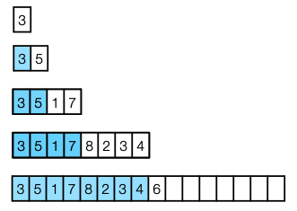

   - 这么做的结果是：

     - 插入操作时间：插入N个元素的话，时间n + number of reinsertions = n + 1 + 2 + 4 + 8 + ···· + 2log n < 3n.
     - 空间O(n)

3. **动态表的账户法分析**

   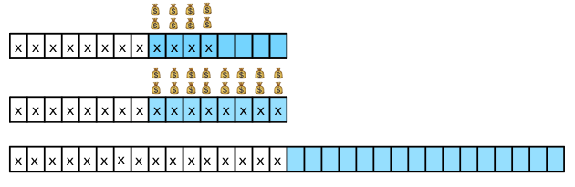

   没到一半的时候，插入消耗1，同时存2

   超过一半的时候，分配2。

   如果满了，就doubling，用存下来的钱支付重复插入的工作

   平均下来每个操作为3

   同理halving也一样

4. **动态表的势能法分析**

   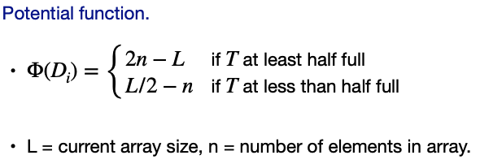

<h2 id="Splay-Trees">Splay Trees 旋转树</h2>

一个高度为h的树最多有2^h个叶子节点，因此n个叶子节点的二叉树的最小高度为 ⌈lg n⌉, 在最坏情况下，搜索、插入或删除所需的时间与树的高度成正比，因此通常情况下，我们希望将高度尽可能保持接近于lg n。

我们可能做到的最好的情况是有一个完美平衡的树，在这棵树中，每个子树都有尽可能接近一半的叶子节点，而且两个子树都是完美平衡的。完美平衡树的高度为 ⌈lg n⌉，因此最坏情况下的搜索时间为 O(log n)。然而，即使我们从一个完美平衡的树开始，恶意的插入和/或删除序列也可能使树变得任意不平衡，将搜索时间推高到 Θ(n)。

为了避免这个问题，我们需要定期修改树来维护“平衡”。有几种办法可以做到这一点（比如AVL 树、红黑树、高度平衡树、权重平衡树、有界平衡树、路径平衡树、B 树、Treap、随机化二叉搜索树、跳表和跳跃列表）。

这一节要聊的是Splay Trees 旋转树

<h3 id="Self-adjusting-BST">Self-adjusting BST 自适应二叉搜索树</h3>

先讲一下**自适应二叉搜索树 Self-adjusting BST**  （Sleator-Tarjan 1983），拥有以下特征 

- 越靠近根节点访问月频繁
- 树在每个操作后重新组织自己。 
- 访问节点后，通过splay操作将其移动到根节点。 
-  插入、删除和搜索的最坏情况时间复杂度为O（n）。每个操作的平摊（Amortised）时间为O（log n）。 
- 操作包括：搜索、前驱、后继、最大值、最小值、插入、删除、连接 （Search, predecessor, sucessor, max, min, insert, delete, join.）。

除了旋转树之外，还有其他的自适应二叉搜索树，例如：

- 惰性权重平衡树（Lazy Weight-Balanced Trees）
- 替罪羊树（Scapegoat Trees）
- 红黑树（Red-Black Trees）
- AVL树（AVL Trees）
- Treap（Treaps）
- 伸展树的变体，例如Top-down splay trees、Bottom-up splay trees、Greedy splay trees等。 

每种树都有其自己的优点和适用场景，可以根据具体的需求选择适合的自适应二叉搜索树。

<h3 id="Splaying">Splaying 旋转</h3>

旋转spalying也就是做一些列的旋转，直到x成为根。我们假设p(x)是x的父亲。

有以下三种

1. **右/左旋转 right/left :** 用来形容x没有爷爷的时候的情况

   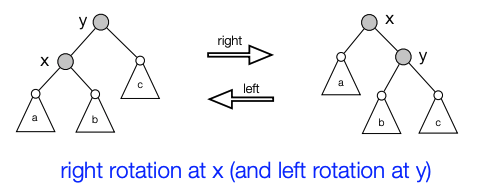

2. **Zig-zag(or zag-zig)**: 当x或者p(x)是左儿子，其他东西是右儿子的时候, 旋转x两次

   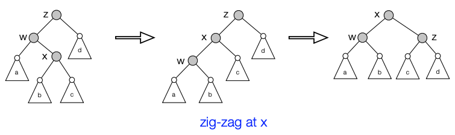

   在Zig-zag伸展树中，节点的旋转方式是“Z”字形的，具体来说，它包括两个操作：Zig和Zag。当一个节点成为其父节点的右孩子，而父节点又成为其祖父节点的左孩子时，就需要进行Zig操作；而当一个节点成为其父节点的左孩子，而父节点又成为其祖父节点的右孩子时，就需要进行Zag操作。

   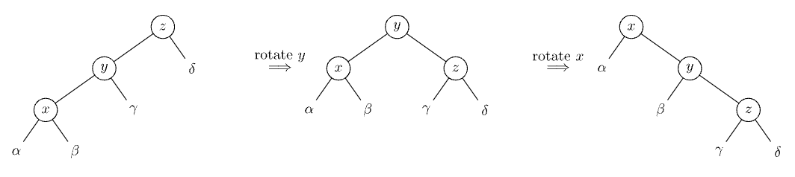

   当x和它的父节点y都是它们父节点的左侧或右侧子节点时，我们首先旋转y，然后再旋转x。

3. **roller-coaster:** 如果 x 和 p(x) 要么都是左儿子或者都是右儿子，即一条线，旋转一次

   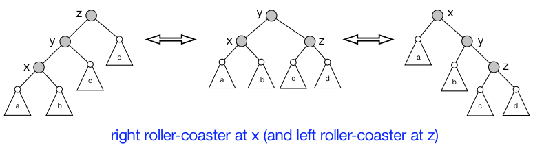

   Roller-coaster伸展树的旋转方式更加复杂，它可以被视为一系列Zig和Zag操作的交替进行。具体来说，每次对一个节点进行伸展操作时，都会沿着从该节点到根节点的路径交替进行Zig和Zag操作，直到该节点成为根节点为止。

<h3 id="About-Splay-Trees">About Splay Trees 关于旋转树</h3>

**splay tree 支持以下操作**

- Search(x)：使用常规搜索算法查找包含键x的节点（或前驱/后继）。将找到的节点伸展到根节点。
- Insert(x)：使用二叉搜索树的算法插入包含键x的节点。将插入的节点伸展到根节点。
- Delete(x)：查找节点x，将其伸展到根节点并删除它。树现在被分成两个子树。在左子树中查找键值最大的节点，将其伸展到根并通过将其作为新根节点连接到右子树中（也可以右子树找最小的放到根链接左子树）。
  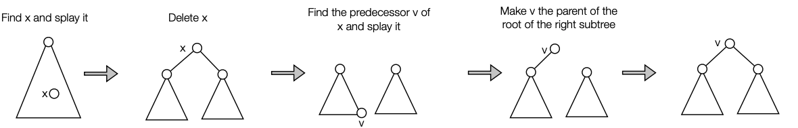

#### Analysis of splay trees 旋转树分析

**用势能法（potential method）来分析**

1. 假设对于节点v, size(v) = v的子节点数

2. 令 rank(v) = ⎣lg size(v)⎦

3. **potential 函数：** 伸展树的潜在函数可以定义为其节点rank的总和

   $\Phi$ = $\sum rank(v)$ = $\sum_{v}⎣lg size(v)⎦$

4. **Rotation Lemma:** 任意节点v的单次旋转的平摊代价最多为1 + 3 rank’(v) - 3 rank(v)，而双旋转的平摊代价最多为3 rank’(v) - 3 rank(v)。

   在这里，rank′(v)表示旋转之后的排名（无论是单旋转还是双旋转）

5. **Splay Lemma**:  splay(v)的平摊代价最多为1 + 3rank’(v) - 3 rank(v)

通过将所有旋转的平摊代价相加，我们发现伸展一个节点v的总平摊代价最多为1 + 3 rank′(v) − 3 rank(v)。

其中rank′(v)是整个splay操作后v的rank（中间的rank会在一个漂亮的 telescop ing sum 中消掉）。

但是，在splay操作之后，v变成了根节点！因此，rank′(v) = ⌊lg n⌋，这意味着伸展操作的平摊代价最多为3lgn−1=O(logn)。 

**我们得出结论：在伸展树中进行每个插入、删除或搜索的平摊时间都是O(log n)**

**证明**：

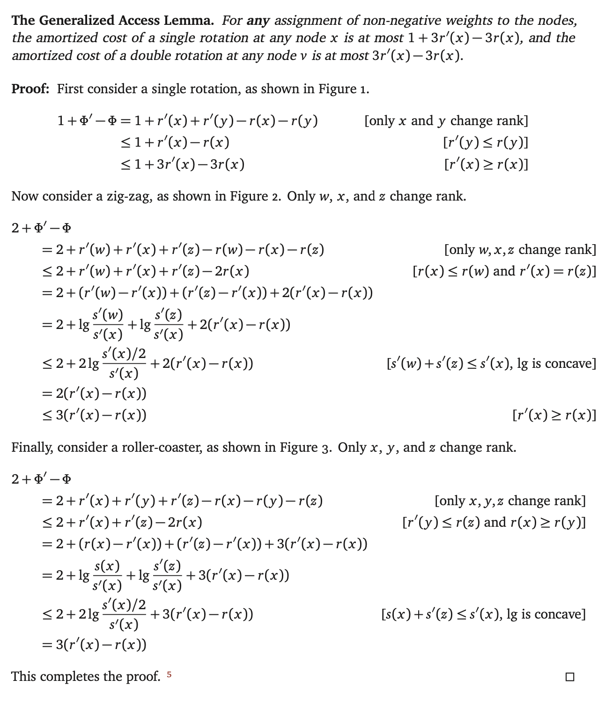

<h2 id="ddgeo">Dynamic Graphs: Dynamic edge orientation 动态图：动态边定向</h2>

<h3 id="aboutDynamic">关于动态Dynamic</h3>

**动态图(Dynamic Graphs )**：是指在计算机科学中用来表示网络或图形结构的数据结构，其中图形结构的节点和边可以随着时间的推移而发生变化。

**动态边定向(Dynamic edge orientation)：**是指在动态图中，可以动态地改变边的方向，以反映图形结构的变化。动态边定向在许多应用程序中都很有用，例如社交网络分析、网络流优化、交通流分析等。

**关于动态Dynamic：**

1. 思路：

   一半来说算法遵循 ：算法问题 → 算法 → 解决方案，这个流程，

   而动态算法呢：问题更新 → 动态算法 → 解决方案更新

2. 常见的有

   ▶ 在**数据结构**中添加/删除**元素** 

   ▶ 在**图**中添加/删除**边**，←注意，O(log n)位。 

   ▶ 在**字符串**或**曲线**中添加/删除/更改**字符或点**

3. 好处是：

   ▶ 有用： 

   -  ▶ 高效地维护大型、不断变化的数据集中的信息， 
   - ▶ 在静态算法、破坏逻辑、其他模型中应用... 

   ▶ 重新审视基本问题和属性 

   - ▶ 图连通性、平面性、距离、最小割、着色、聚类（connectivity, planarity, distance, min-cut, colouring, clustering）等。

4. 工具箱

   ▶ 维护/更新某些数据结构， 

   ▶ 摊销算法

拿上文提到的splay trees为例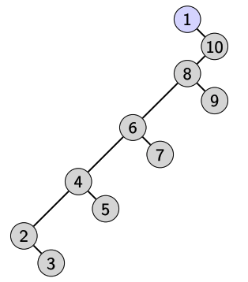

我们需要动态插入节点1...10，这个过程需要旋转。我们需要分析这个结构，则会用到potential function，摊销使我们能够从一个新的角度来解决这个问题，应用不同的想法

<h3 id="Sparse-graphs">Sparse graphs：稀疏图</h3>

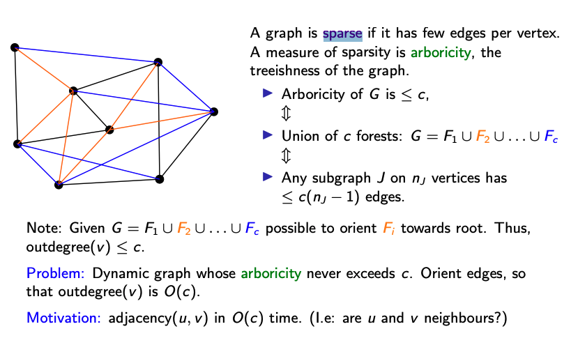

稀疏图是指顶点数较多，但边数相对较少的图。衡量稀疏度（sparsity）的是度数（Arboricity） ≤ c

- **稀疏度（Sparsity）**：是一个用来描述图中边的分布稀疏程度的概念。

  稀疏度通常用图中实际边数与图中所有可能边数的比值来表示。对于一个包含 n 个顶点的无向图，所有可能的边数是 n(n-1)/2，对于有向图则是 n(n-1)。

- **度数（arboricity）：**度数是一个衡量图稀疏程度的指标，它描述了图中边的集中程度。

  具体来说，一个图的树的度数是指最少需要多少棵树才能将这个图中的所有顶点和边都覆盖。树的度数越小，图越稀疏；树的度数越大，图越密集。

通常情况下，稀疏图的边数与顶点数的比例为O(1)或O(log n)，其中n是顶点数。与稠密图相比，稀疏图中边的数量相对较少，因此对于很多图算法来说，稀疏图的处理速度更快。

这也带来了问题：我们需要确保动态图其树枝度（arboricity）永远不超过c。需要给边定向，使得每个节点的出度（outdegree）为O(c)。

<h3 id="Dynamic-bounded-out-degree-orientations">Dynamic bounded out-degree orientations 动态有界出度定向</h3>

**出度( out-degree )**: 是指从该顶点出发的有向边的数量，入度（表示指向一个顶点的有向边的数量）

**出度方向(out-degree orientations):** 出度方向指的是有向图中一个顶点的所有出边的方向, 它的出度方向是一个集合

**动态有界出度方向问题**：指的是在一个动态图中，**为每个顶点分配一个出度方向**，**并保证每个顶点的出度不超过一个给定的常数**。在这样的图中，可以进行插入和删除边的操作，同时保持出度方向的约束。

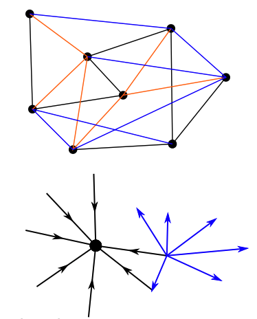

初始化: 

- Arboricity ≤ c，森林数量小于c
- G = F1 U F2 U...Uc

问题是：

图是动态的，要确保arboricity一直≤c ，顶点的出度都不超过 6α（即 ∆ = 6α）当然，这个限制不一定是紧凑的（compact）

分析相关：

对于插入、删除等操作时间，用amortised的思想分析

用递归的方式进行flip, 如果∆设置不对（太大太小都不行），那就改

<h4 id="the-omniscient-algorithm">the omniscient algorithm 全知算法</h4>

**全知算法:**是一种理想情况下的动态数据结构，可以维护一个动态图的有界出度方向，**即为每个顶点分配一个出度方向**，并保证每个顶点的出度不超过一个给定的常数。

全知算法可以在常数时间内处理插入和删除边的操作，同时保持出度方向的约束。这是通过在图上执行一系列的局部调整来实现的，从而保持整个图的有界出度方向。全知算法是一种理论上的算法，其主要用途是作为参考算法，用于衡量其他算法的性能和效率。在实际应用中，全知算法的时间复杂度很难达到最优，因此需要采用其他的数据结构和算法来实现动态有界出度方向。

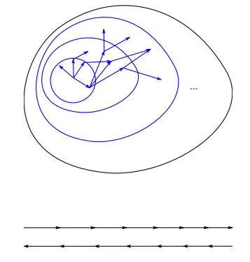

聊聊算法细节

1. **思路**：α 为度数（arboricity），设定6α为溢出，然后翻转溢出顶点所有相连的边，以降低该顶点的出度，这个过程一直持续到没有顶点发生溢出为止。

   比如说A的出度为6，连接到顶点B、C、D、E、F和G，这时候A所有边内翻，A的出度为0；然后再检查BCDEF，继续翻

2. **定理**：考虑维护一个2α-定向，当 out-degree(u) ≥ 2α 时，存在一条长度为 log n 的路径到达某个出度 < 2α 的顶点v。这个节点一定存在。

3. **证明：**

   1. 首先，至少有一个顶点v的出度小于等于α（任意顶点）。因为我们正在处理一个稀疏图，其树的度数（arboricity）为α，所以图中一定存在这样一个顶点
   2. 考虑$V_{i}$是顶点 u 的第 i 个出度邻域。换句话说，Vi 是与 u 通过 i 条边直接或间接相连的顶点的集合。我们要找到一条路径，使得路径上的某个顶点的出度小于 2α。

   2. 如果路径上的某个顶点 v 已经满足出度小于 2α，那么我们已经找到了满足条件的路径
   3. 如果$V_{i}$中不存在这么一个顶点v，那么｜$V_{i}$｜> $2^{i}$，即$V_{i}$集合中点的数量一定大于$2^{i}$（每个点至少链接两个点，肯定的）
   4. 假设$V_{j}>2^{j}$，但我们还没找到对应的点v，考虑$V_{j}$的出度 > $2\alpha 2^{j}$，则他们肯定链接了$2\alpha 2^{j} /\alpha = 2^{j+1}$个点，也就是$V_{j+1}$
   5. 照这么下去，经过 log n 步之后，|Vlog n| = G，也就是说路径的长度为 log n。所以当 out-degree(u) ≥ 2α 时，存在一条长度为 log n 的路径到达某个出度 < 2α 的顶点v

4. **结论**：**存在一种全知的2α-定向算法，每次动态操作最多只需执行log n次翻转操作**。

5. **注意：**

   这里选择 6α 作为溢出阈值而不是 2α，主要是为了提供一个更宽松的容错范围，使得算法具有更好的性能。

   因为当顶点的出度达到 6α 时，它的出度是树的度数（arboricity）的 6 倍，这意味着与该顶点相连的边相对较多，导致图变得更加密集。

   在这个算法中，我们希望通过翻转边来降低溢出顶点的出度。当顶点的出度达到 6α 时，我们有足够的边可以翻转，并且这个过程不会过于频繁地触发。如果我们选择 2α 作为溢出阈值，那么可能会导致频繁地翻转边，从而影响算法的性能。

<h4 id="putting-it-together">putting it together</h4>

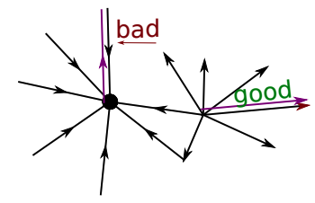

如果使用**贪心算法**，如果出现了overflow（而不是6α）就翻转所有的edge直到没有溢出

接下来使用**势能方法（potential method**）对其进行分析，我们需要考虑算法的势能变化。首先，回顾全知算法算法的基本思想：当溢出（out-degree(v) > 6c）时，翻转所有边，并继续翻转直到没有溢出。在这个过程中，我们认为一条边是“好边”（good edge）如果它与全知算法的结果一致。

现在，我们分析溢出时翻转所有边的情况。在这种情况下：

1. **至少有 4c 个“坏边”（与全知算法不一致的边）变为“好边”；**
2. **至多有 2c 个“好边”变为“坏边”。**
3. **我们用势能（Potential）表示“坏边”的数量**。

贪心算法的分摊代价是：每次边更新操作所需的翻转次数减去势能的变化。由于翻转操作使得更多的“坏边”变为“好边”，因此势能会减小。我们希望证明：贪心算法每次边更新操作的分摊代价为 O(log n)。

我们可以计算势能的变化：

ΔPotential = 转换为“坏边”的数量 - 转换为“好边”的数量 ≤ 2c - 4c = -2c

由于Potential减小了 2c，这意味着每次边更新操作所需的翻转次数至多为Potential减小的 2 倍。又因为全知算法（omniscient algorithm）每次动态操作需要翻转 log n 次，而贪心算法在分摊意义上每次边更新操作所需的翻转次数至多为全知算法的 2 倍。

因此，根据势能方法分析，我们得出结论：**贪心算法在动态有界出度定向问题中，每次边更新操作的分摊翻转次数为 O(log n)**。

### Reference 

>Chapter 17 in Algorithms from Cormen, Leiserson, Rivest, Stein 
>
>Notes by Jeff Erickson: [scapegoats and splaytrees](https://jeffe.cs.illinois.edu/teaching/algorithms/notes/10-scapegoat-splay.pdf) 
>
>Paper by Sleator and Tarjan: [Self-adjusting binary search trees](https://www.cs.cmu.edu/~sleator/papers/self-adjusting.pdf). See also: [Brinkmann, Degraer, de Loof](https://citeseer.ist.psu.edu/viewdoc/download?doi=10.1.1.84.790&rep=rep1&type=pdf) on practical performance of splay trees. 
>
>More exercises on amortized algorithms in [02110](https://www2.imm.dtu.dk/courses/02110/2022/weekplans/amortized22.pdf).
>
>splay operation Visualize see https://people.ksp.sk/~kuko/gnarley-trees/Splay.html
>
>[Dynamic Graph Orientations](https://link.springer.com/content/pdf/10.1007/3-540-48447-7_34.pdf) by Brodal and Fagerberg, See also: [Berglin & Brodal](https://link.springer.com/content/pdf/10.1007/s00453-018-0528-0.pdf), [Christiansen & Rotenberg](https://arxiv.org/pdf/2203.06039.pdf)