  - [Suffix Trees 后缀树](#Suffix-Trees)
    - [String Indexing/String Dictionaries](#String-Indexing-String-Dictionaries)
    - [Tries](#Tries)
      - [Compact Tries 紧凑树](#Compact-Tries)
    - [Suffix Trees 后缀树](#Suffix-Trees)
      - [Applications: Longest Common Substring 最长公共子串](#Applications-Longest-Common-Substring)
  - [Radix and Suffix Sorting](#Radix-and-Suffix-Sorting)
    - [Radix Sorting 基数排序](#Radix-Sorting)
    - [Suffix Sorting 后缀排序](#Suffix-Sorting)
      - [解决方案1 Radix Sort](#Solution-1-Radix-Sort)
      - [解决方案2：前缀加倍 Prefix doubling](#Solution-2-Prefix-doubling)
      - [解决方案3：差分覆盖采样 Difference cover sampling（DC3）](#Difference-cover-sampling)
  - [Compression](#Compression)
    - [Lempel-Ziv](#Lempel-Ziv)
      - [Lempel-Ziv 77](#Lempel-Ziv-77)
      - [Lempel-Ziv 78](#Lempel-Ziv-78)
    - [Re-Pair and Grammars](#Re-Pair-and-Grammars)
      - [Re-Pair compression 重新配对压缩](#Re-Pair-compression)
      - [Grammars compression 语法压缩](#Grammars-compression)


<h2 id="Suffix-Trees">Suffix Trees 后缀树</h2>

<h3 id="String-Indexing-String-Dictionaries">String Indexing/String Dictionaries</h3>

**问题介绍：**

1. **字符串索引问题(String indexing problem)**: 

假设有一个由字符集Σ中的字符组成的字符串S。预处理S，构建一个数据结构，支持以下操作：

- search(P)：返回P在S中所有出现的起始位置。
- 示例：如果S=yabbadabbado，那么search(abba)={1,6}。 

为了解决这个问题，我们可以考虑构建后缀数组（suffix array）或者后缀树（suffix tree）等数据结构，以支持高效的字符串搜索操作。


**2. 字符串字典问题（String dictionary problem.）**

假设有一个由k个字符串Si（1≤i≤k）组成的集合S = {S1,S2,…,Sk}，每个字符串由字符集Σ中的字符组成。预处理S，构建一个数据结构，支持以下操作：

- search(P)：如果存在一个Si使得P=Si，则返回yes。
- prefix-search(P)：返回所有S中以P为前缀的字符串。 

为了解决这个问题，我们可以考虑构建字典树（trie）等数据结构，以支持高效的字符串搜索和前缀匹配操作。在字典树上搜索P时，我们可以沿着P的每个字符对应的子树进行遍历，直到到达某个叶子节点，如果该叶子节点代表的字符串恰好为P，则返回yes。在字典树上搜索P的前缀时，我们可以类似地沿着P的每个字符对应的子树进行遍历，并在遍历过程中记录下所有到达的叶子节点代表的字符串即可。

<h3 id="Tries">Tries</h3>

假设有一个由s个字符串Si（1≤i≤s）组成的集合S，且S中没有任何一个字符串是另一个字符串的前缀，alphabet为 Σ。让S的总长度为n；一个字符串S由一个 root-to-leaf path $T_s$表示

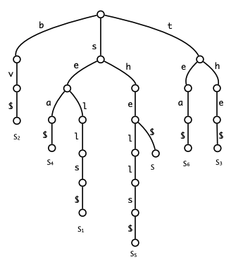

比如这个tries由sells\$, by\$, the\$, sea\$, shells\$, tea\$, she\$.这些字符串组成。

#### **它具有以下特征**

- 每个edge代表一个character
- 一个字符串S由一个 root-to-leaf path $T_s$表示，要获取它可以通过连接路径上的edge
- 任意两个字符串的共同前缀在$T_s$上最多只共享一条路径。
- 对于TS中的任意一个节点v，其每个儿子必须都不同

Trie中的任意一个节点v都代表由根节点到v路径上所有边标记所对应字符的连接得到的字符串str(v)。

#### Trie具有以下性质：

假设树 T 保存S ，有 s 个字符串，总长度 n ，alphabet 大小 d

- T中的节点数量是O(n)。
- T中的叶子节点数量是s。
- T中的任意一个节点最多有d个子节点。
- T的高度等于S中最长字符串的长度

#### 搜索时间

**假设搜索一个长度为m的模式P**，字母表大小d，搜索过程中，需要识别某个节点的出边是否是子目标中的字符，则搜索模式P时间复杂度为O(dm)。m是常量，d如果不是常量，则可以用

- 完美哈希 O（1）
- balanced BST O(log)

#### trie的时间和空间复杂度

若把d看作常量

- 每次搜索时间为O(m)
- 空间为O(n)
- 预处理O(n)

<h4 id="Compact-Tries">Compact Tries 紧凑树</h4>

在字符串集合S上构建的Trie $T_s$ 可能会有许多只有一个子节点的节点，也可能会存在由许多单子节点节点组成的长路径。为了解决这个问题，我们可以将这样的路径压缩成单条边，构建一棵新的树T

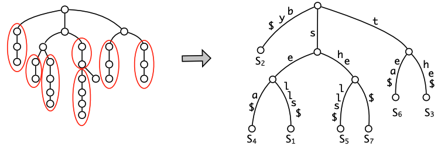

紧凑Trie是一个存储由字符集大小为d的s个总长度为n的字符串集合S的Trie T，具有以下性质

- T的每个内部节点至少有2个子节点，至多有d个子节点。 
- T有s个叶子节点。 
- T的节点数量小于2s。

对于字符集大小为常数的情况，可以在O(n)时间内构建紧凑Trie。对于较大的字符集，可以使用平衡二叉搜索树（如2.3节所述）或哈希表构建Trie，这样构建的时间复杂度为O(n log σ)或O(n)的期望时间复杂度。

对于字符集大小为常数d的紧凑Trie，具有以下时间和空间复杂度： 

- search(P)搜索长度为m的字符串的时间复杂度为O(m)。  
- prefix-search(P)前缀搜索的时间复杂度为O(m+occ)，其中occ是字符串出现的次数。 
- 空间复杂度为O(n)。 
-  预处理时间复杂度为O(n)。

<h3 id="Suffix-Trees">Suffix Trees 后缀树</h3>

回顾**字符串索引问题(String indexing problem)**: 

假设有一个由字符集Σ中的字符组成的字符串S。预处理S，构建一个数据结构，支持以下操作：

- search(P)：返回P在S中所有出现的起始位置

接下来将展示如何在O(m)的查询时间和O(n)的空间复杂度下解决字符串索引问题(String indexing problem)。

#### suffix trees

也就是字符S所有后缀的紧凑树，在这里S =  yabbadabbado\$ 我们在S的末尾添加一个新字符\$，确保后缀集合是无前缀的.

后缀树中的每个叶子节点都有一个数字，表示它对应于S的哪个后缀。

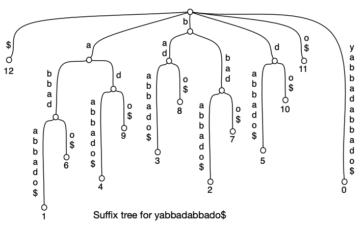

在存储中并不会标上字符而是索引，这里是为了清晰哈，实际上应该长这样
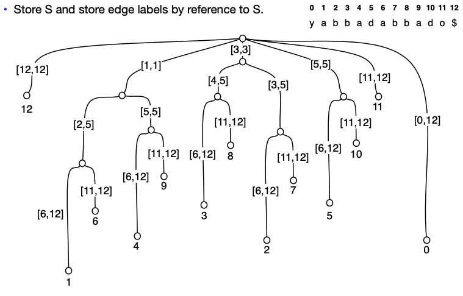

#### 搜索

比如说搜索P = abba

从根节点开始，按照P中下一个字符所对应的边继续遍历。

如果搜索在没有读完P的情况下停止，那么P不会出现在S中。

否则，搜索将停在某条边（或节点）上。现在遍历该边下的子树，并返回该子树中叶子节点的标签。

在这里，abba将停在[2,5]，返回其叶子节点index1、6

#### 结论

**搜索时间： O(m+occ).**

**空间**：边的数量+标签的数量 = 》**O(n) space**

**预处理时间复杂度为：**O(sort(n,|Σ|))

在构建后缀树之前，我们需要对字符串中的字符进行排序，以便于在后缀树中进行插入操作。字符集Σ中有|Σ|个不同的字符，因此对n个字符进行排序所需的时间为O(sort(n,|Σ|))。因此，预处理时间复杂度为O(sort(n,|Σ|))。

#### 相关应用：

- Approximate string matching problems 近似字符串匹配问题
-  Compression schemes (Lempel-Ziv family, ...)  压缩方案（Lempel-Ziv家族等）
-  Repetitive string problems (palindromes, tandem repeats, ...)  重复字符串问题（回文，串联重复等）
-  Information retrieval problems (document retrieval, top-k retrieval, ...信息检索问题（文档检索，top-k检索等）

<h4 id="Applications-Longest-Common-Substring">Applications: Longest Common Substring 最长公共子串</h4>

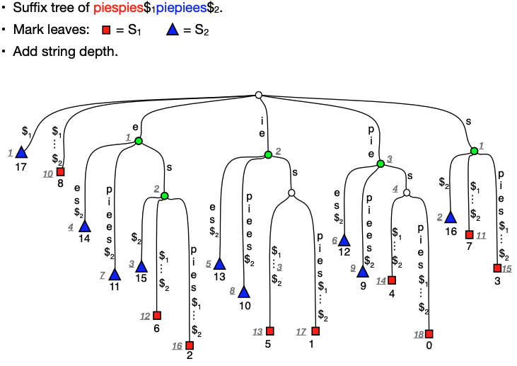

对于两字字符串S1、S2。对 S1\$S2\$.构建后缀树，然后找到他们的最长公共子串。

S1和S2的最长公共子串是在具有$1和$2子树的节点中具有最深字符串深度的节点

**具体算法**：

1. 构建S1$1和S2$2的广义后缀树T
2. 自底向上递归标记广义后缀树的节点。如果一个节点的一个子节点被标记为$i$，则该节点被标记为$i$。然后对树进行深度优先遍历，在遍历的过程中对每个节点的字符串深度（节点的字符串深度为父节点的字符串深度+它们之间的边上字符的数量）进行累加。在遍历过程中记录字符串深度最大的同时被标记为$1$和$2$的节点$v$。
3. 在深度优先遍历之后，我们知道最长公共子串的长度`（`=`v`的字符串深度），以及哪个节点$v$对应于此子串。现在可以轻松地返回节点$v$所表示的字符串$str(v)$。前往$v$子树中的任何一个叶子。此叶子标记有在S1$1S2$2中的位置$p$，它是$str(v)$出现的起始位置。如果该位置在S1中，则返回子串S1[p...p+`]；如果该位置在S2中，则对应于$str(v)$的子串在位置$p_0=p-(|S1|-1)$在S2中开始，返回子串S2[p0...p0+`]。

时间复杂度：$O(n)$，其中$n$是$S1$和$S2$的长度之和。

空间复杂度：$O(n)$，需要存储$S1$和$S2$的广义后缀树。

<h2 id="Radix-and-Suffix-Sorting">Radix and Suffix Sorting</h2>

<h3 id="Radix-Sorting">Radix Sorting 基数排序</h3>

**Radix Sort（基数排序）**[Hollerith 1887]。

将包含n个来自U={0，...，$n^k-1$}的整数的序列排序，k是整数的位数，要求

- 将序列中的每个元素写成一个基于n的整数x =（x1，x2，...，xk）
- 按从右到左的顺序根据每个数字对序列进行排序。排序应该是稳定(stable)的
- 时间O(nk)

**stable sort 稳定排序**：指当有相等元素存在时，排序前和排序后它们的相对位置不会改变的排序算法

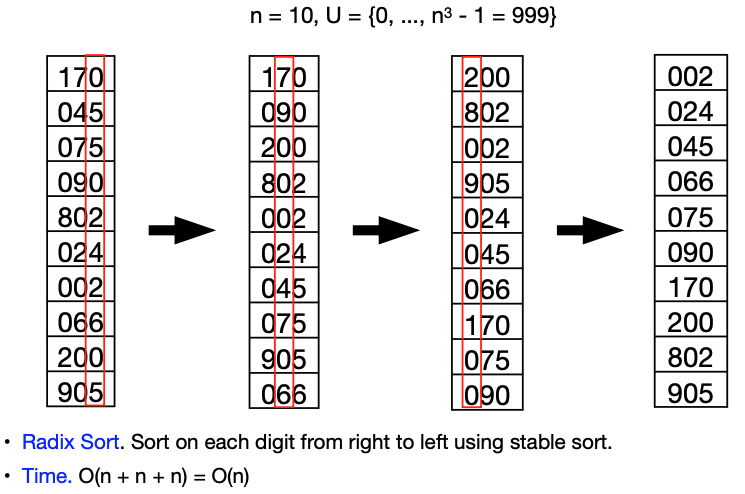

这个例子，n=10, k=3

#### 算法：

Radix Sort 是一种非比较性的排序算法，它将数字按位进行排序。对于一个有 n 个元素的数字序列，Radix Sort 算法需要对每一位进行排序，直到所有位都排完为止。在排序过程中，需要保证每一位排序后元素的相对顺序不变，这就是所谓的“稳定性”。

具体来说，Radix Sort 算法首先将数字表示为 k 位的 n 进制数，然后**从最低位开始排序**，**按照当前位上的数值将数字分入不同的桶中**，**再按顺序从桶中取出数字，形成新的序列。接着对上一位进行排序，重复以上过程，直到最高位排序完成。**

由于每次排序的时间复杂度是 O(n)，一共需要进行 k 次排序，因此 Radix Sort 的时间复杂度为 O(nk)。如果 k 较小，那么它的时间复杂度会非常低，但如果 k 较大，它的时间复杂度可能会比一些基于比较的排序算法还要高。

值得一提的是，Radix Sort 算法可以应用于不仅仅是数字的排序。只要能够将元素表示为 k 位的 n 进制数，Radix Sort 就能够进行排序。比如字符串排序时，可以将每个字符转化为其 ASCII 码值，然后按照字符在字符串中出现的顺序排序。

#### 以下是 Radix Sort 算法的伪代码实现：

```python
radix_sort(A, n, k):
	for i in range(k):
		# 按照第 i 位进行排序
		buckets = [[] for _ in range(n)]
			for j in range(n):
			digit = (A[j] // (n**i)) % n
			buckets[digit].append(A[j])
			# 重新组合序列
			A = [elem for bucket in buckets for elem in bucket]
	return A
```


<h3 id="Suffix-Sorting">Suffix Sorting 后缀排序</h3>

**后缀排序（Suffix sorting）**：

给定一个长度为 n 的字符串 S 字母表$\Sigma$，对 S 的所有后缀进行**字典序排名（lexicographic order ）**，其中，后缀的字典顺序排序与作为后缀树的叶子中的后缀是相同的

还是S=yabbadabbado举例子，suffix tree可以参考上文。把它按照**字典顺序**排

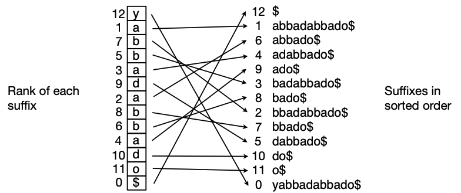

**后缀数组 Suffix array**： 也就是后缀排序后的数组

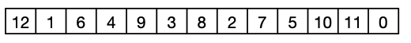

**后缀排序的目标**：快速计算字符串S的所有后缀的字典序。 

为简单起见，假设|Σ|= O(n) 

接下来分为三步解决方案 

- 解决方案1：基数排序 Radix sorting
- 解决方案2：前缀加倍 Prefix doubling
- 解决方案3：差分覆盖采样  Difference cover sampling

<h4 id="Solution-1-Radix-Sort">解决方案1 Radix Sort</h4>


生成所有的后缀，用\$填充，时间O($n^2$)

<h4 id="Solution-2-Prefix-doubling">解决方案2：前缀加倍 Prefix doubling</h4>

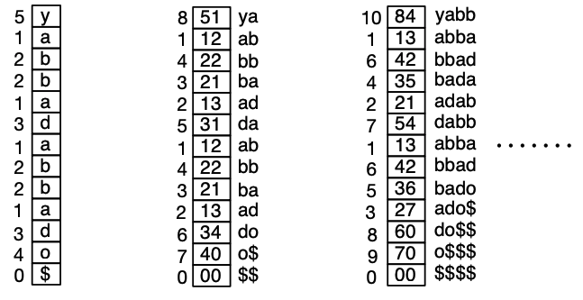

位数1、2、4、8然后依次来做排序（位数不够的\$填充），每次使用radix sort对上个步骤的进行排序.

时间**O(nlogn)**

<h4 id="Difference-cover-sampling">解决方案3：差分覆盖采样 Difference cover sampling（DC3）</h4>

用DC3这个方法来构建后缀数组要复杂一点，分为三步

- **步骤1. 排序样本后缀 Sort sample suffixes**

  - 对于满足i mod 3=1和i mod 3=2的位置i，采样所有以i为起始位置的后缀。

    将文本T分为3部分T0, T1, and T2

    - T0 = <(T[3i],T[3i+1],T[3i+2]) for i=0,1,2,...>
    - T1 = <(T[3i+1],T[3i+2],T[3i+3]) for i=0,1,2,...>
    - T2 = <(T[3i+2],T[3i+3],T[3i+4]) for i=0,1,2,...>

  - 对T0,T1进行递归，对样本后缀进行排序。这里排序用radix sort

  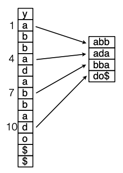 👉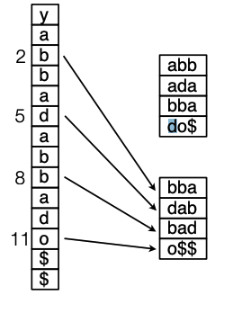👉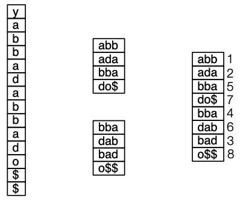 👉 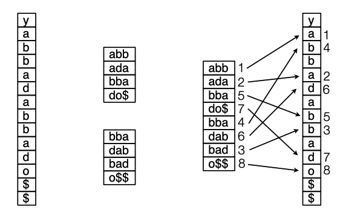

- **步骤2. 排序非样本后缀 Sort non-sample suffixes**

  - 对于余数为0的位置i，排序剩余的后缀。同样可以用radix sort

  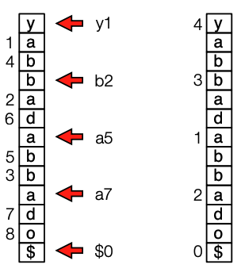

- 步骤3. 合并样本后缀和非样本后缀。

  给顶两个指针i、j。因为T1和T2是已经排序过了的，让i在T1 T2排序后的内容里走，j在T0里面走

  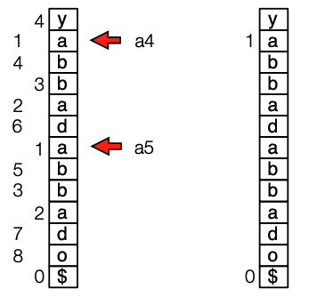

  i，j都从1开始，比较i、j所指的字符，按照字典顺序排序，如果字符一样，就根据指针数据排序，如果有跨区的情况，就增加位数。

  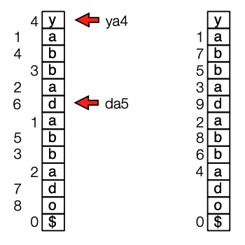

**方案3 Difference Cover Sampling DC3分析：**

- 步骤1. 对样本后缀进行排序。 
  - 采样所有从位置i = 1 mod 3和i = 2 mod 3开始的后缀。 **O(n)**
  - 递归地对样本后缀进行排序。 **O(2n/3)**
-  步骤2. 对非样本后缀进行排序。 
  - 对剩余的后缀（从位置i = 0 mod 3开始）进行排序。**O(n)**
-  步骤3. 合并。
  -  合并样本和非样本后缀。 **O(n)**

 令 T(n) = 对长度为n的字符串进行后缀排序的时间，其中n是大小为n的字母表的长度。 

则 T(n) = T(2n/3) + O(n) = O(n)


**结论**：

1. 我们可以在O（n）的时间内对长度为n的字母表Σ大小为n的字符串进行后缀排序
2. 我们可以在O（sort（n，|Σ|））的时间内对长度为n的字符串在字母表Σ上进行后缀排序。

<h2 id="Compression">Compression</h2>

压缩类型有很多

统计压缩Statistical compression

- Huffman编码、算术编码、Burrows-Wheeler变换、PPM、... 

字典压缩。

-  Lempel-Ziv 77、Lempel-Ziv 78、Lempel-Ziv-Welch、... 

基于语法的方案。 

-  Re-Pair、sequitur、greedy、bisection、... 

Kolmogorov压缩。 

- 终极压缩方案。

 变换技巧。

-  差分Differencing、Burrows-Wheeler变换、游程编码 run-length encoding,、傅里叶变换 Fourier transform、...

<h3 id="Lempel-Ziv">Lempel-Ziv</h3>

**Lempel-Ziv 算法通过建立一个先前出现字符串的字典进行压缩**。与使用字典预测每个字符的概率并基于上下文单独编码每个字符的 PPM 不同，**Lempel-Ziv 算法编码不同长度的字符组**。原始算法也没有使用概率，字典中的字符串要么存在，要么不存在，字典中所有字符串的概率相等。一些新的变种，如 gzip，确实利用了概率的一些优势。

在最高层次上，这些算法可以描述如下：

给定文件中的一个位置，查找前面的部分以找到以当前位置开始的字符串的最长匹配，并输出一些代码，引用该匹配。现在将指针移动到匹配的位置之后。算法的两个主要变体分别由 Ziv 和 Lempel 在 1977 年和 1978 年发表的两篇独立的论文中描述，通常称为 LZ77 和 LZ78。这些算法在搜索距离和查找匹配的方式上有所不同。LZ77 算法基于滑动窗口的思想。该算法仅在当前位置之前固定距离的窗口中查找匹配项。Gzip、ZIP 和 V.42bis（标准调制解调器协议）都基于 LZ77。LZ78 算法基于对向字典添加字符串的更保守的方法。Unix 压缩和 Gif 格式都基于 LZ78。

<h4 id="Lempel-Ziv-77">Lempel-Ziv 77 </h4>

**编码**1：Sliding Windows（滑动窗口）

- 从左到右解析成短语
- 选择最长的匹配子字符串，输出一个三元组（p，n，c），其中包含匹配在窗口中的位置p，匹配长度n和匹配后面的下一个字符c
- 通过（前一个出现的距离、长度、额外字符）或单个字符对短语进行编码

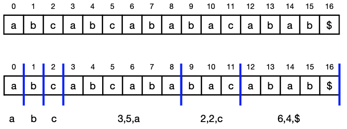

**编码2:** 

- 对于一个字符串，我们首先将其建立后缀树

- 在每个节点下存储最小的叶子

- 我们进行从左到右的贪心解析

  从根节点开始，沿着后缀树向下移动，一旦找到一个未编码的子串，则将其编码为三元组（p, n, c），其中p是该子串在后缀树中对应的最小叶子节点的路径长度，n是子串的长度，c是子串的下一个字符。我们继续从这个字符开始，向下移动后缀树，直到找到下一个未编码的子串。重复此过程直到解析完整个字符串。

- **编码时间：**O(sort(n, |Σ|).

**解码** 

Read and decode left-to-right.，时间O(n)

<h4 id="Lempel-Ziv-78">Lempel-Ziv 78</h4>

**编码1**

- 从左到右解析为短语
- 选择之前出现过的最长短语加上一个单独字符。 
- 编码短语（前一短语，字符）或单个短语。

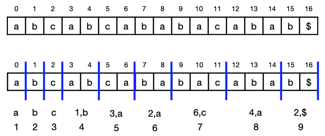

**编码2**:

- 动态构建和遍历LZ78 trie（字典树）

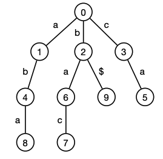

- 时间：O(n)：Read and decode left-to-right.，时间O(n)

**解码**

<h3 id="Re-Pair-and-Grammars">Re-Pair and Grammars</h3>

<h4 id="Re-Pair-compression">Re-Pair compression 重新配对压缩</h4>

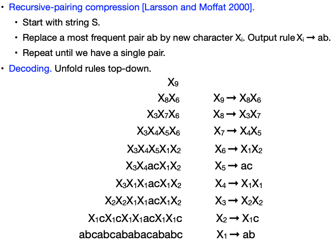

找到重复次数最多的用Xi替代，最后直到只有一组配对

<h4 id="Grammars-compression">Grammars compression 语法压缩</h4>

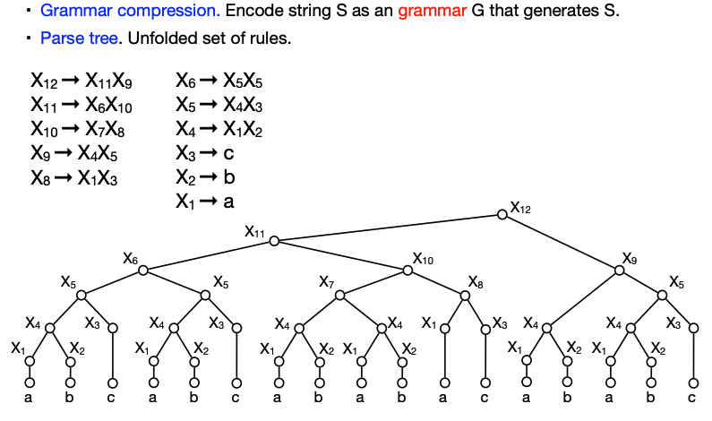


### Reference

>[Algorithms on Strings, Trees, and Sequences, Chap. 5-9, D. Gusfield](http://courses.compute.dtu.dk/02282/2023/suffixtrees/notes.pdf)
>
>[Linear work suffix array construction](http://doi.acm.org/10.1145/1217856.1217858), J. Kärkkäinen, P. Sanders, S. Burkhardt, J. ACM, 2006
>
>[Scribe notes from MIT](http://courses.csail.mit.edu/6.851/spring10/scribe/lec07.pdf)Algorithms on Strings, Trees, and Sequences, Chap. 5-9, D. Gusfield
>
>[On the sorting-complexity of suffix tree construction](http://doi.acm.org/10.1145/355541.355547), M. Farach-Colton, P. Ferragina, S. Muthukrishnan, J. ACM, 2000
>
>[Introduction to Data Compression, section 5](http://www.cs.cmu.edu/~guyb/realworld/compression.pdf), G. E. Blelloch.
>
>[Improved Approximate String Matching and Regular Expression Matching on Ziv-Lempel Compressed Texts](http://dl.acm.org/citation.cfm?id=1644018), P. Bille, R. Fagerberg, and I. L. Gørtz, TALG, 2009.
>
>[Random Access to Grammar-Compressed Strings and Trees](http://dx.doi.org/10.1137/130936889), P. Bille, G. M. Landau, R. Raman, K. Sadakane, S. Rao Satti, O. Weimann, SICOMP, 2015
>
>A Universal Algorithm for Sequential Data Compression, J. Ziv and A. Lempel, T. Inf. Theory, 1977.
>
>Compression of Individual Sequences via Variable-Rate Coding, J. Ziv and A. Lempel, T. Inf. Theory, 1978.


