  - [Approximation Algorithms 近似算法](#Approximation-Algorithms)
    - [计算复杂性分类](#quantamagazine)
    - [About Approximation algorithms](#about-Approximation-algorithms)
    - [load balancing 负载平衡问题](#load-balancing)
      - [Simple greedy (list scheduling)](#Simple-greedy-list-scheduling)
      - [Longest processing time rule (LPT)](#Longest-processing-time-rule)
    - [k-center](#k-center)
    - [k-center: Greedy algorithm](#k-center:-Greedy-algorithm)
      - [k-center 分析](#k-center-analysis)
      - [k-center: analysis greedy algorithm](#k-center:-analysis-greedy-algorithm)
    - [Bottleneck algorithm](#k-center-Bottleneck-algorithm)
      - [Analysis bottleneck algorithm](#Analysis-bottleneck-algorithm)
  - [Traveling salesman problem 旅行商问题](#Traveling-salesman-problem)
    - [Double tree algorithm](#Double-tree-algorithm)
    - [Christofides’ algorithm](#Christofides-algorithm)
  - [Set cover](#Set-cover-problem)
    - [Set Cover: Greedy algorithm](#Set-cover-problem-Greedy-algorithm)


<h2 id="Approximation-Algorithms">Approximation Algorithms 近似算法</h2>

<h3 id="quantamagazine">计算复杂性分类</h3>


什么对计算机来说很容易，什么几乎不可能？这些问题构成了计算复杂性的核心。

1. **P**
   **全称**：多项式时间（Polynomial time)
   **简述**：能用经典计算机**轻易解决**的所有问题
   **精确描述**：

   - P类中的算法必须在n^c的时间内停止并给出正确答案，其中n是输入的规模，c是常数

2. **NP**
   不确定多项式时间（Non-deterministic Polynomial time)
   **简述**：能用经典计算机**快速验证答案**的所有问题
   **精确描述**：

   - 很难找到正确的解，但是判断一个解是否正确十分容易。
   - NP-complete问题：属于NP问题，且属于NP-hard问题。 
   - NP-hard问题：比NP问题都要难的问题。

   **典型问题**：旅行商问题 （The traveling salesman problem）:
   给定一些相互远离的城市，是否存在一条穿过所有城市的路径，路径长度小于给定值？

   **研究者们关心**：P=NP吗？而计算机科学家现在根本没法解决这个问题，这个问题也是信息学领域的最高峰。

3. **PSAPCE**
   **全称**：多项式空间（Polynomial Space）。**PSPACE**是**计算复杂度理论中能被确定型图灵机利用多项式空间解决的判定问题集合**，是Polynomial SPACE的简称。
   简述：PSPACE包含了所有可以通过合理内存来解决的问题
   **精确描述**：

   - 在PSAPCE类的问题中，你不在乎时间，只关心一个算法所需的内存空间。计算机科学家已经证明PSPACE包含PH类，而PH类包含NP，同时NP还包含P类。

   **典型问题**：

   - P, NP, PH类中的所有问题，都属于PSAPCE类

 <h3 id="about-Approximation-algorithms">About Approximation algorithms</h3>

快速、便宜和可靠（Fast. Cheap. Reliable）三个方面中，只能选择其中两个，而不能同时满足这三个方面。

对于NP-hard problems的问题，也只能在下面三选二

• 最优解
• 多项式时间 ： 但如果存在一个多项式时间算法可以解决它，那么这个问题就成为了P问题
• 所有实例：问题的所有可能的输入，即所有可能的情况

**近似算法Approximation algorithms.** ：就是在时间和质量中权衡
若对于优化问题的任意实例I，算法A返回的解的价值用A(I)表示，那么当以下条件满足时，算法A被称为是**α近似算法**：

- A的运行时间为多项式时间 polynomial time
- A返回一个合法解 valid solution
- 对于最小化问题，有A(I) ≤ α ∙ OPT，其中α ≥ 1
- 对于最大化问题，有A(I) ≥ α ∙ OPT，其中α ≤ 1

**例子**

**无环图问题 Acyclic Graph problem**： 给定有向图G=(V,E)，从E中选一个最大基数（cardinality）的边集，使得得到的图是无环图。

- 给出一个1/2近似算法解决这个问题
- Lower bound - what is the best we can hope for? 
- Arbitrarily number the vertices and pick the bigger of the two sets, the forward going edges and the backward going edges. 任意编号顶点并选择两个集合中较大的一个：前向边集和后向边集。

算法步骤：

1. 初始化一个空集S，用于存放选取的边。

2. 对于给定的有向图G=(V, E)，首先找到图G中所有的有向环。

3. 对于找到的每一个有向环C，执行以下操作： 

   a. 选择C中任意一条边e，并将其加入集合S。 

   b. 从图G中移除边e，使得C变为一个无环子图。

4. 如果在图G中还存在有向环，重复步骤3，直到图G中所有的有向环都被处理完毕。

5. 返回集合S作为解。

该算法是一个1/2近似算法，因为在每一个有向环中至少选择了一条边。在最差情况下，最优解中可能包含了所有的有向环中的所有边，但由于我们每次至少选择了一个有向环的一半数量的边，因此算法可以保证找到的解至少是最优解的1/2。

**最小极大匹配问题Minimum Maximal Matching** 

- 一个匹配在图G=(V,E)中是一个边的子集M ⊆ E，使得M中没有两条边共享一个端点。 
-  一个极大匹配是一个不能扩展的匹配，即不能添加一条从E $\setminus$M到M的边而不违反约束条件
- 设计一个2近似算法来查找一个无向图中最小基数的极大匹配。
- • Lower bound: Any maximal matching is at least half the maximum maximal matching. Why? 下界：任何极大匹配都至少是最大极大匹配的一半。为什么？

算法步骤：

1. 初始化一个空集合M，用于存储匹配的边。

2. 对于图G中的每一条边e=(u, v)，执行以下操作： 

   a. 如果顶点u和顶点v都不在M的边中出现过，将边e加入集合M。 

   b. 更新图G，将顶点u和顶点v从图中删除。

3. 当图G中没有剩余的边时，返回集合M作为解。

解释下界： 在最差情况下，最优解可能包含了所有最大匹配中的所有边。但是，在我们的2-近似算法中，我们每次都至少选择了一对没有共享端点的边。因此，算法可以保证找到的解至多是最优解的2倍。换句话说，任何最大匹配至少是最大最大匹配的一半。这是因为在最优解中的任意一对边都不共享端点，而在我们的算法中，每次至少选取了一个没有共享端点的边。所以算法找到的解至少是最优解的1/2。

**以上这些算法都属于近似算法（approximation algorithm）**。近似算法是指在有限时间内求解一个优化问题的解，但不一定是最优解的算法。这类算法通常在处理NP难问题时使用。

在给出的两个问题中，我们设计了近似算法来解决它们：

1. 第一个问题中，我们给出了一个1/2近似算法来寻找有向图中的最大基数无环边集。在这个算法中，找到的解至少是最优解的1/2。
2. 第二个问题中，我们给出了一个2-近似算法来找到无向图中最小基数的最大匹配。在这个算法中，找到的解至多是最优解的2倍。

 <h3 id="load-balancing">load balancing 负载平衡问题</h3>

load balancing 负载平衡问题，该问题出现在多个服务器需要处理一组作业或请求时。

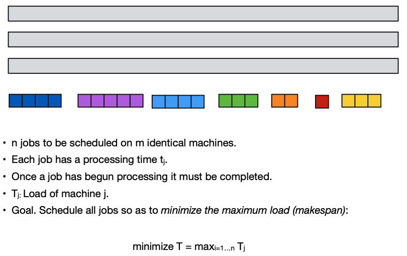

我们试图将每个作业分配给其中一台机器，以便所有机器上的负载尽可能“平衡”。虽然我们没有证明这一点，但寻找最小加工时间的分配的调度问题是NP-hard问题

 <h4 id="Simple-greedy-list-scheduling)">Simple greedy (list scheduling)</h4>

我们首先考虑一个非常简单的贪心算法来解决这个问题。该算法按任意顺序通过作业集合；当它处理作业j时，将j分配给当前负载最小的机器。

上述贪心算法是一个2近似算法： 

• polynomial time 

• valid solution

• factor 2

##### Approximation factor 近似因子

接下来分析一下

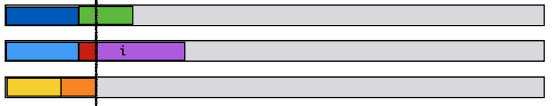

分析一下lower bounds:

- 因为每个job都要处理，所以$T^*$一定大于最大的那个工作： $T^*$ ≥ $\max_j t_j$
- 至少有一台机器，被分配了平均工作，所以 $T^*$ ≥ $\frac{1}{m}\sum_j t_j$

继续分析：

- 令i为最后一个完成的工作

- 在i开始执行之前所有的机器都在忙，这一刻为s = $T_i - t_i$

- 将时间表划分为s 之前（After）和之后(Before)

- After ≤ $T^*$

- Before:

  - 所有的机器都在忙 =》s时刻的总工作量 m•s

    m•s ≤$\sum_j t_j$ => s ≤ $\frac{1}{m}\sum_j t_j$ ≤ $T^*$

  - **所以排期的长度：s+$t_i$ ≤ $T^*$ + $T^*$ = 2$T^*$**

 <h4 id="Longest-processing-time-rule">Longest processing time rule (LPT)</h4>

在贪心的基础上优化一下，我们按处理时间递减的顺序对作业进行排序。优先分配最长的工作，一旦机器空闲，就将列表中的下一个工作分配给它。

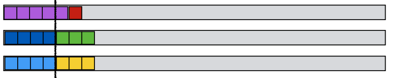

分析一下啊：

- 假设 t1 ≥ t2 ...≥tn
- Assume wlog that smallest job finishes last. 假设最小的工作最后完成（“wlog” 是“without loss of generality”的缩写，意为“不失一般性”。）
- 如果 $t_n ≤ T^*/3$，那么 T≤4/3 $T^*$
- 如果 $t_n > T^*/3$, 那么则每个机器最多可以处理 2 个 OPT 中的工作。
- **Lemma 引理**：对于任何处理时间超过最优 makespan 的三分之一的输入，LPT 可以计算出最优调度。
- **Theorem 定理**：LPT 是一种 4/3 Four-thirds 近似算法。

 <h3 id="k-center">k-center</h3>

k中心问题(k-center problem)是位置理论中的一个问题：给定n个城市和所有城市之间的最短路径距离，目标是选择k个城市作为中心，使得离最近中心最远的城市尽可能靠近(city farthest from its closest center is as close as possible)。

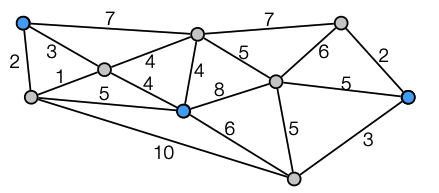

**输入：**整数 k 和一组包含每对站点 i，j ∈ S 之间距离 d(i,j) 的站点 S。

- d 是度量空间：
  - dist(i,i) = 0
  - dist(i,j) = dist(j,i) 
  - dist(i,l) ≤ dist(i,j) + dist(j,l)

**目标**：选择一个集合 C ⊆ S，|C|=k，以最小化站点到其最近中心的最大距离。

 **覆盖半径cover radius：**站点到其最近中心的最大距离。

 <h3 id="k-center:-Greedy-algorithm">k-center: Greedy algorithm</h3>

贪婪算法：

- 随便挑一个i in S
- 把i放入C = {i}
- 当｜C｜ < k 
  - 找到距离 C 中任何聚类中心最远的站点 j
  - 添加j到C
- 返回C

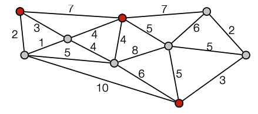

贪婪算法是一个2-approximation 的算法

- polynomial time 
- valid solution 
- factor 2

 <h4 id="k-center-analysis">k-center 分析</h4>

最好的情况 - 最佳集群：每个站点都分配到其最近的最佳中心

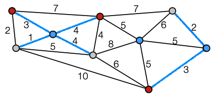

- 假设 $r^*$为最优半径optimal radius.

- 声明：同一最佳集群中的两个站点彼此之间的距离最多为2r*

  

 <h4 id="k-center:-analysis-greedy-algorithm">k-center: analysis greedy algorithm</h4>

**咱分析一下贪婪算法**

- 已知$r^*$为最优半径optimal radius，同一最佳集群中的两个站点彼此之间的距离最多为2r*

**考虑一下最优集群的两种情况**

1. **算法在最优集群中各挑了一个中心**

   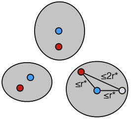

   每个点到其最近的中心都 ≤ 2$r^*$

2. **一些最佳集群没有中心。**

   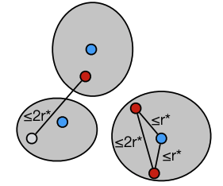

   - 有些集群有多于一个中心，这两个中心之间的距离 ≤ 2r*。
   - 当选取同一集群的第二个中心时，它是距离任何中心最远的站点。
   - 任何点到其最近中心的距离至多为2r*。

**结论就是2-approximation成立**

 <h3 id="k-center-Bottleneck-algorithm">Bottleneck algorithm</h3>

假设我们知道最优范围r

算法：

- set R=S and C =Ø
  - 当R ≠ Ø do
    - 随便选一个j in R
    - add j to C
    - 去掉R中所有d(j,v)≤2r的点
- 返回C

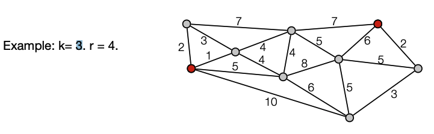

<h4 id="Analysis-bottleneck-algorithm">Analysis bottleneck algorithm</h4>

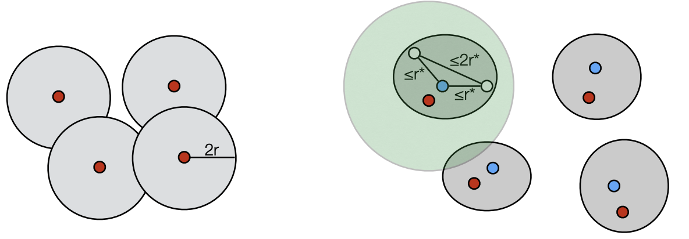

- 假设 r* 是最优半径。 

- 覆盖半径最多为 2r = 2r*。  
-  我们最多只能在每个最优聚类中选一个： 
  - 同一最优聚类中两个节点之间的距离 ≤ 2r*。 
  - 当我们在最优聚类中选择一个中心时，所有同一最优聚类中的节点都将被移除。
  - 所以**我们不能选择超过 k 个中心**
- 可以使用算法来“猜测”r\*（最多 $n^2$ 个值）。 
  - 如果算法选择了超过 k 个中心，那肯定在某个集群中多选了一个
  - 在同一个最优集群的两个节点之间的距离 ≤ 2r\*
  - 如果在某个最优聚类中选择了超过一个中心，则 2r < 2r*。

<h2 id="Traveling-salesman-problem">Traveling salesman problem 旅行商问题</h2>

在旅行商问题（TSP）中，给定一组城市{1,2，…，n}，输入由一个对称n×n矩阵C = ($c_{ij}$)构成，该矩阵指定从城市i到城市j的旅行成本。

按照惯例，

- 我们假设从任何城市到自身的旅行成本等于0，$c_{ii} = 0$ 成本为非负数；
- 矩阵对称的事实意味着从城市i到城市j的旅行成本等于从j到i的成本。$c_{ij} = c_{ji}$
- $c_{ij} ≤ c_{ik} + c_{kj}$  (triangle inequality)

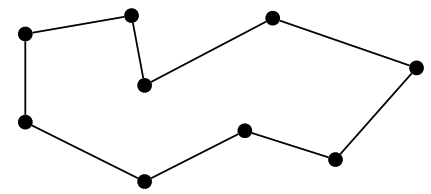

**目标是：遍寻所有城市，每个城市只路过一次，找到最少的花费**

<h3 id="Double-tree-algorithm">Double tree algorithm</h3>

**最小生成树（Minimum Spanning Tree，MST）**是一种图论中的基本算法。它在给定带权无向连通图的所有边的权值之后，生成一棵包含图中所有顶点的树，并且树的所有边的权值之和最小。也就是说，**MST算法能够找到一棵最小的覆盖所有节点的树。**

MST就是TSP问题的lower bound:

- 从 OPT 中删除边 e 可以得到一棵生成树。 
- OPT ≥ OPT - ce ≥ MST。

对于Double tree algorithm算法

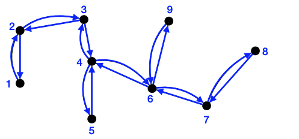

- 输出minimum spaning tree

- Double 数的每条边

- 构建Euler tour $\tau$ (a tour visiting every edge exactly once)

- 找出捷径 $\tau'$然后每个点只访问一次

  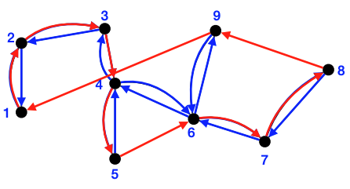

- **length($\tau'$) ≤ length($\tau$) = 2 cost(T) ≤ 2 OPT.**

**结论 ： The double tree algorithm 是一个 2-approximation algorithm for TSP.**

<h3 id="Christofides-algorithm">Christofides’ algorithm</h3>

Christofides 算法

- 先输出minimal spanning Tree  - T

- 不需要double所有的边，只需将其转换为Eulerian graph（如果图中存在一个遍历所有边且每条边恰好被经过一次的路径，则该图是欧拉图）

  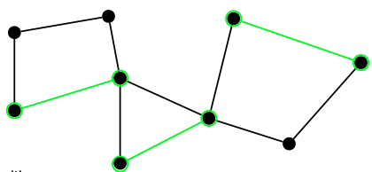

  - **当且仅当 G 连通且所有节点为 even degree**，G 是欧拉图。 

- 考虑 T 中所有奇度顶点的集合 O（绿色的点）

- 在 O 上找到**最小成本完美匹配（minimum cost perfect matching） M** （绿色的线）

  - Matching：没有边共享一个端点
  - Perfect：所有顶点都匹配
  - O 上存在完美匹配：图中奇数顶点的数量为偶数（6个）

- T + M 是欧拉图（就是上图）

- 构建Euler tour $\tau$

  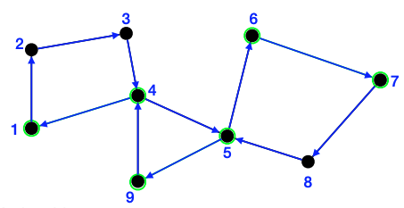

- 找出捷径 $\tau'$然后每个点只访问一次

  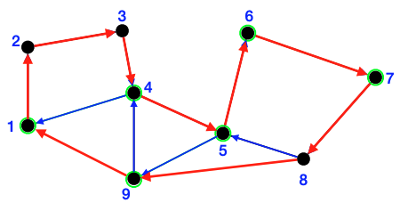 

- length($\tau'$) ≤ length($\tau$) = cost(T) + cost(M) ≤ OPT + cost(M).

- cost(M) ≤ OPT/2.

  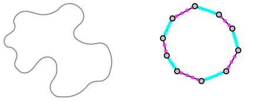

  - 可以把OPT分成两个perfect matching O1 and O2
  - Cost(M) ≤  min(cost(O1), cost(O2)) ≤ OPT/2.

- 所以: length($\tau'$) ≤ length($\tau$) = cost(T) + cost(M) ≤ OPT + OPT/2 = 3/2OPT .

结论：**Christofides’ algorithm is a 3/2-approximation algorithm for TSP.**

<h2 id="Set-cover-problem">Set cover</h2>

**集合覆盖问题（set cover problem）**

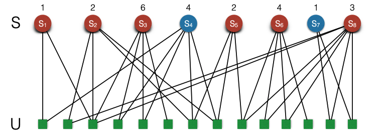

- 集合U 有 n 个元素
- m个子集S1,...,Sm， 其中每个集合Si都有一个关联的非负权值wi
- **目标**：是找到一个集合覆盖（Set cover）C，使其总权值最小。

<h3 id="Set-cover-problem-Greedy-algorithm">Set Cover: Greedy algorithm</h3>

贪心算法，为了选择下一个集合，它会寻找那些似乎对目标产生最大影响的集合。

理想的集合具有两个特征：它们具有小的权重wi，且覆盖了很多元素。

因此，将这两个标准结合起来，使用wi/|Si $\land$ R|来衡量（R代表剩余的元素）因此该比率给出了“每个元素覆盖成本”。

```php
# Greedy-Set-Cover:
Start with R = U and no sets selected 
While R̸=∅
	Select set Si that minimizes wi/|Si ∩ R|
	Delete set Si from R 
 EndWhile
Return the selected sets
```

 Greedy-set-cover is a n **O(log n)-approximation algorithm:** 

- polynomial time 

- valid solution 

- **factor O(log n)**

### reference

> [A Short Guide to Hard Problems](https://www.quantamagazine.org/a-short-guide-to-hard-problems-20180716/)
>
> Algorithm Design, Kleinberg and Tardos, Addison-Wesley, section 11.0, 11.1, 11.2, 11.3 
>
> [The Design of Approximation Algorithms](http://www.designofapproxalgs.com/index.php), Williamson and Shmoys, Cambridge Press, section 2.2 + 2.3 + 2.4.
>
> [A unified approach to approximation algorithms for bottleneck problems](http://dl.acm.org/citation.cfm?id=5933), D. S. Hochbaum and D. B. Shmoys, Journal of the ACM, Volume 33 Issue 3, 1986.