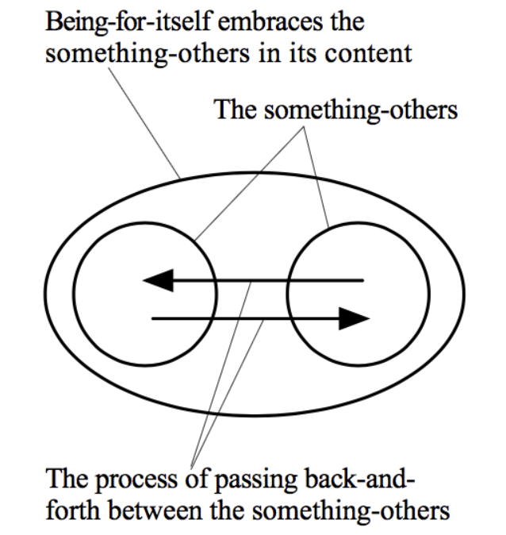
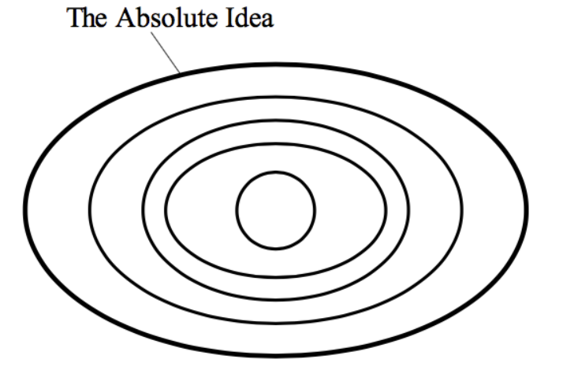
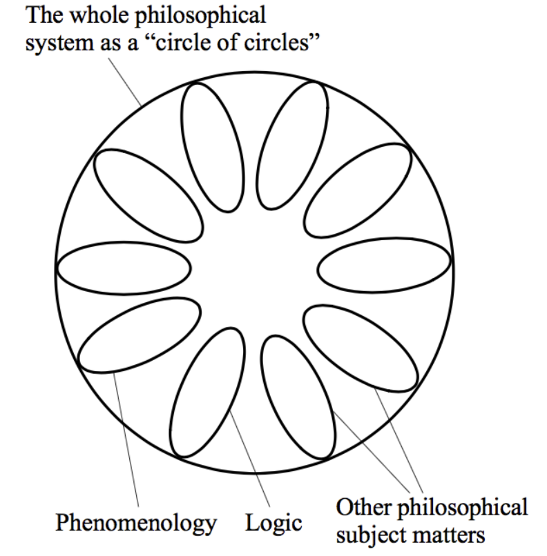
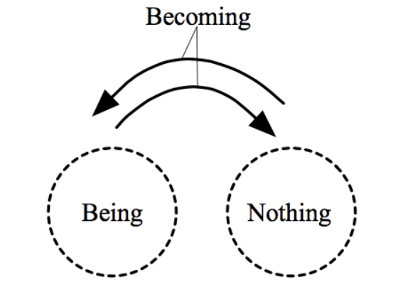

  - [开头](#intro)
  - [古典时代](#classical_age)
    - [苏格拉底方法](#Socratic)
    - [柏拉图主义的辩证法](#plato)
    - [亚里士多德的辩证法](#Aristotle)
  - [现代](#modern)
    - [黑格尔的辩证法](#Hegel’s_Dialectics)
      - [黑格尔对辩证法的描述](#Hegel’s_Dialectics)
      - [黑格尔本人怎么用辩证法](#Hegel’s_application_Dialectics)
      - [凭什么是辩证法](#why_does_hegel_use_dialectics)
    - [马克思-恩格斯的辩证法 -- 辩证唯物主义](#Hegel’s_Dialectics)
  - [辩证法的适用领域](#field)

<h2 id="intro">开头</h2>

 ** 辩证法 ** 是一个困扰我很久的概念，其实高中政治有学过，当时背了背定义，能做题即可，而且分科之后再也没管了。后续生活中也会碰到，但总是感觉不对劲。

生活里聊天的时候其实还好，一般大家说我们要辩证的看待某个问题的时候，基本上都是正面说一下，反面说一下。有些大聪明会从好几个角度来剖析，最后说：“答案取决于当事人的立场”，或者“让一切交给时间来检验”之类的话，然后他一脸神秘微笑地看着你。

电视里看到的时候就不一样了，基本上是很官方的场合，什么“[学好用好军事辩证法](http://theory.people.com.cn/n1/2023/0301/c40531-32633543.html)”，“[唯物辩证法是疫情防控战争中的思维利器](http://www.dangjian.com/shouye/sixianglilun/lilunqiangdang/202007/t20200727_5727359.shtml)”，[浅析老子辩证法思想](https://hanspub.org/journal/PaperInformation.aspx?paperID=52792)。似乎用了这个方法就拥有了充足的正确保障。而且只要用上了就显得高级了一点。类似的词有很多，比如“辩证唯物主义”，"历史唯物主义"，这些词时常组合在一起，况且出现频率之高，真追问起来，却又不大懂。

 **  我作为一个喜欢追问的人，很讨厌这种一知半解的状态，希望得到一个明确的理解 ** 。然后在搜索过程中发现了另外一个很有意思的事情，这世上有些人似乎对辩证法颇有怨念，类似[辩证法与放屁](http://www.bw40.net/3325.html)，[辩证法是如何降低智商的](https://forum.iask.ca/threads/832821/)，[人世间最大的谎言——辩证法](https://readmoo.com/book/210234567000101)，这种文章的搜索结果排名还不低，可见其具有不小的市场。读一读内容，却发现戾气甚重，再一看作者，基本上都是自由派的公共知识分子。可见在中文世界，辩证法主要还是用在了政治领域，夸它的人有滥用的嫌疑；而那些抹黑辩证法的人，主要还是因为他们看执政者不顺眼。

若要祛魅，必须要回到哲学语境，可惜哲学语境并不是一个热衷于把话说清楚的语境，不过越是这样就越有挑战嘛。

大致梳理了一下，辩证法可以分为以下几种:

1.  ** 用于辩论的辩证法 ** ，祖师爷就是喜欢在街上拉人抬杠的苏格拉底，这一类辩证法侧重于论战的艺术。
2.  ** 来自于宗教的辩证法 ** ，比如印度教辩证法、佛教辩证法、中世纪辩证法、犹太教塔尔穆德辩证法，以及新教辩证法等，都是一些带有宗教色彩的思辨推理方法。
3.  ** 黑格尔的辩证法 ** ，最有名的就是正反合，即：问题→反应→解决方案，一种哲学分析方法。
4.  ** 马克思-恩格斯的辩证法 ** ，来源于黑格尔辩证法，将其用到了对事物发展规律的解释上。
5.  ** 被视为政治符号的辩证法 ** ，这是从符号学的角度去理解辩证法，在这里辩证法是作为被研究的客体。

有一个注意点， ** 辩证法和诡辩术 ** 很容易混为一谈，毕竟他们都喜欢推翻已有的论题并给出矛盾的观点。不过还是很好区别的，一个主要是为了求知，一个主要是为了装X。

接下来浅浅的进入一下辩证法的世界，众所周知，哲学家都不好好说话，他们不使用数学符号，但又需要构建一个抽象且足够复杂的场域，所以他们用的是用脱离口语的一套黑话。而且哲学家常常遵循“道可道非常道”的原则，有意保留模糊空间，这种臭毛病对于理科生来说是很讨厌的，所以涉及到哲学的话题往往争论极多，谁也不服谁，支持率高的词条必然大段大段的引用祖师爷的原文。

作为理科生是不服气的，解释权岂能被你们垄断，不就是文本么，咱也能啃！以下都是简单梳理，多举例子，争取能懂。

一切的一切总是要从古希腊开始。。。

<h2 id="classical_age">古典时代</h2>

<h3 id="Socratic">苏格拉底方法</h3>

苏格拉底是雅典著名的街溜子，喜欢徘徊在大街上拉人辩论，辩证法就在这种来回辩论或者说对话中演变出来。

这时的辩证法也就是无限反问，通过问一系列的问题来让一个模糊的观念尽量精确起来，这是一个探索的过程，以找到矛盾为乐，但最终是为了探索真知。

> 苏格拉底与欧谛德谟对谈
> 苏：虚伪属于正义，还是非正义？
> 欧：非正义。
> 苏：偷盗、欺骗、奴役等，属于正义，还是非正义？
> 欧：非正义。
> 苏：对于那些极大损害了国家利益的敌人，一个将军惩罚了他们，并对他们加以奴役，属于正义，还是非正义？
> 欧：正义。
> 苏：将军偷走了敌兵的财物，或者战斗中欺敌呢？
> 欧：这当然属于正义，但我是说欺骗朋友。
> 苏：一位元帅，因为士兵们士气不振而精神崩溃，他欺骗部下“援军很快到来”以激励士气呢？
> 欧：应该也是正义吧。
> 苏：一个生病又不肯服药的孩子，父亲说“药不苦、很好吃”，骗孩子吞了下去，病也好了。属于正义，还是非正义？
> 欧：正义。
> 苏：一个发了疯的人，他的朋友怕他自残，偷走了他的刀子与利刃，这属于正义，还是非正义？
> 欧：是，应属正义。
> 苏：你不是说，朋友之间不能欺骗吗？
> 欧：请允许我收回我刚说的话。

<h3 id="plato">柏拉图主义的辩证法</h3>

先捋清楚几个术语。

-  ** 形而上学（metaphysical） ** ：meta为超越，physis指的是自然或物理世界。所以形而上学研究的是超越经验、抽象而一般的问题，包括存在、现实、知识、真善美等。本体论（Ontology）是形而上学的一个重要部分

-  ** 本体论（ontology） ** ：这个词源于希腊语的“ὄντος”（ontos）意为“存在的”，所以“本体论”研究存在本质的问题，即研究什么是实在，什么是存在。例如宇宙的存在，观念的存在。

-  ** 第一原理（First Principle） ** ：指的是一个无需进一步证明的原理或假设，是一切的起源

柏拉图始终认为真理存在于超感性的理念中，比如真善美这些理念，他关心的是本质、本源。所以他把辩证法已经上上升到本体论和形而上学的层面，柏拉图在《理想国》中提到，辩证法是一个既有推论性又具有直觉性的过程。即辩证法不仅是一种逻辑推理的方法，更是一种宇宙存在和知识获取的方式。我们可以通过运用辩证法，把感性的认知提升到知性的理解。我们的对理念的把握可以不断提升，直到掌握作为起源的第一原理。

他认为，哲学家，其实也是辩证家。辩证法是一个探索的过程，我们开始于假定和猜测，最终抵达第一原理，哲学家在这个过程中获得至善的知识。

<h3 id="Aristotle">亚里士多德的辩证法</h3>

-  ** 修辞学 rhetoric： ** 来自古希腊词"rhetorikos"，是一种公众辩护和控诉对手的技巧和艺术，主要应用于公众演讲和辩论中
-  ** 传统逻辑 ** ：亚里士多德开创的逻辑学

虽然是柏拉图的学生，但亚里士多德和柏拉图差别很大，总的来说他各方面比老师现实了很多，所做的事情也更具体和实际，有点哲学家中的工程师的感觉。在辩证法这个领域，他强调，修辞学和辩证法密切相关，修辞学是辩证法的"对应物"或"衍生物"，因为它们都是处理论证的，只是使用的场合和目的不同。辩证法是处理更为学术、理性的论证，而修辞学是处理更为公众、感性的论证。

亚里士多德是传统逻辑的创始人，最有名的就是“三段论”的推理方式，

> 如果所有人（M）都是必死的（D），（大前提）
> 并且所有希腊人（G）都是人（M），（小前提）
> 那么所有希腊人（G）都是必死的（D）。（结论）

至于说逻辑学和辩证法，在他眼里都是致力于理解和探索正确知识的思考和论证方式，但他们侧重的点不同。逻辑学偏向于形式化、结构化的思考，而辩证法则更偏向于探讨和争辩。

若是做一个严谨性的排名，估计在他眼中：逻辑学 > 辩证法 > 修辞学。

<h2 id="modern">现代</h2>

再往后发展如中世纪的哲学，辩证法都差不多隶属于逻辑学，所以我跳过直接到现代。

<h3 id="Hegel’s_Dialectics">黑格尔的辩证法</h3>

照例先理清涉及到的术语

-  ** 怀疑主义 （skepticism） ** ：是一种哲学立场，主张对知识和真理的认识持有怀疑态度，认为人类的认识能力有限，无法获得确凿无疑的知识
-  ** 认识论（epistemology） ** ：哲学的一个重要分支，主要研究知识、信念和思维的性质、起源、方法和极限。比如我能知道什么？我怎么知道我知道？

先从黑格尔与前辈的对比来大概理解一下他在干嘛。

黑格尔的辩证法和前辈相同的是，都有一个对立的矛盾双方。在柏拉图和苏格拉底这里，这个矛盾双方是争吵的人，但是在黑格尔这里，矛盾取决于所讨论的话题，矛盾双方也不再是人。比如在逻辑学领域，对立面可以是相冲突的逻辑概念；在他的《精神现象学》这本涉及认识论的著作中，对立面可以是意识和意识试图理解或认识的对象。不过黑格尔辩证法大体上还是遵循了前人留下来的传统，都遵循从简单的定义开始演进到复杂的观念这个过程。

哲学家普遍认为，既然一切理论都从“简单”开始，那这个“简单”必须是坚实的、绝对真确的东西，必须接受最严格的质疑。但根据传统的反证法的逻辑，如果论证的前提矛盾，就必须得出前提条件是错误的结论——这就让我们失去前提，很容易陷入虚无或空洞。黑格尔认为，理性必然产生矛盾，你找多少前提也没用，怀疑主义容易让人裹足不前。

举个经典例子：

>  ** 观点a：假设我们怀疑所有的感知都可能是错误的，因此不能确定我们所知的任何东西的真实性 ** 

有时候眼见确实不一定为实，但就此完全否定感知的可靠性还是过分了。若用反证法来证明感知是可靠的，可能就会说：“如果感知是不可靠的，那么我就无法确认任何事情的存在，包括我自己的存在”。然而，我思故我在，我的存在是显而易见的。所以这儿就形成了一个矛盾，我不能同时存在和不存在。这个矛盾表明了观点1是错误的。

ok，反证结束，我反驳了观点a，然后呢？没有然后，我并没有建立任何新的理解世界的基础，没说“哪些感知是靠谱的？”，“感知是如何工作的？”。只是反驳了一个观点，并没有走的更远，仍然停留在知识的虚无状态。这就是黑格尔所批评的“虚无”问题，他认为哲学应该寻找的是一个更为积极、建设性的知识基础。

为此黑格尔发展了辩证法，这也是他哲学的标志。

<h4 id="Hegel’s_Dialectics">黑格尔对辩证法的描述</h4>

黑格尔在他的《逻辑百科全书》（*Encyclopaedia Logic*）第一部分提供了他对辩证法的说明。

> The form or presentation of logic has three sides or moments (EL §79). These sides are not parts of logic, but, rather, moments of “every concept”, as well as “of everything true in general” (EL Remark to §79

他说，逻辑的呈现有三个阶段/时刻，这些阶段不是逻辑的一部分，而是这些概念所处的时刻。

1.  ** 第一个时刻——理解的阶段 ** ，在这个时刻里，某个概念A确定了。
2.  ** 第二个时刻——”辩证“的阶段 ** ，从理解的那一刻起，意识到了一些局限性，并形成了一个A的对立面。黑格尔将这个过程描述为“自我扬弃”的过程。
3.  ** 第三个时刻——“综合的”或“积极理性的”的阶段 ** ，我愿称之为想通啦的那一刻，这时抓住了前两者的对立统一性或者是消解了一些中间状态。

举个例子：

首先是理解阶段，这个阶段关注的是事物的固定性。比如，我们可以说一个种子就是一个种子，它具有自己的特性和定义，如大小，形状，颜色，以及它的潜在能力，也就是它可能生长为一棵树。

然后是辩证阶段，这个阶段关注的是事物的变化性。这个阶段会挑战前一阶段的确定性。虽然我们认为种子是一种固定的事物，但种子却发生了变化，它开始发芽，生长为一棵小树。在这个过程中，种子本身“自我否定”，既取消了自己原有的状态（种子状态），也保留了自己的本质（即成为树的潜力）。

最后是综合阶段，这个阶段关注的是第一个阶段和第二个阶段之间的统一。我们认识到“种子”和“树”并非是完全独立的实体，而是一个连贯的过程中的不同阶段。种子包含了成为树的潜力，而树则是种子发展的结果。超越种子和树的概念，我们理解到的是一个生命过程。

黑格尔认为，这种辩证法超越了柏拉图辩证法的任意性，达到了科学的水平。原因如下

1. 一种认知会在形成的同时扬弃它自己，这种扬弃是由事物本身的性质决定的，是自动且必然发生的运动。
2. 这种自我扬弃不需要引入外来的什么东西，向新阶段的过度所需要的条件一开始就蕴含着了。
3. 扬弃不代表对前者的全盘否定，某些早期概念在后期仍然有效。
4. 后来的概念既决定也超越了早期概念的局限性或局限性。
5. 辩证的结果是一个新概念，但比前一个概念更丰富，更高级，因为它否定且包含前一个，它是自身及其对立面的统一。

辩证的过程会导致综合性和普遍性的提升，最终会产生一个绝对（absolute）概念。这个概念是对所讨论的主题最终的包罗万象的概念综合。比如“苹果”这个词，它可以是一个水果，包含了甜的、红的、蔷薇科苹果亚科苹果属等等概念，还能指代某科技公司，甚至某宗教故事。“苹果”能被各种定义，各种转换，如此反复，无穷无尽，转换最终汇聚到了一个叫“苹果”的概念上，这是一个动态、发展的过程，它从单一的、固定的定义出发，通过自我否定和转化，最终达到一个全面、普遍的概念。

当然，在黑格尔这里，这个绝对概念不是苹果啦，而是逻辑学、现象学或者其他哲学主题。这每个主题会互相引导，当把他们组合起来的时候，便能看到黑格尔的整个哲学体系。在黑格尔眼中，他用辩证法所搭建的这个庞大体系是真正科学的，进步的。

<h4 id="Hegel’s_application_Dialectics">黑格尔本人怎么用辩证法</h4>

现在知道黑格尔的辩证法是什么了，接下来看怎么运作。

假设世上什么都没有，我们先构建一个概念

-  ** 存在 Being： ** 表示纯粹的存在

我们定义了它，这一刻就是存在的第一时刻。随后我们可以立即意识到，这世上存在存在的另一面，即没有存在，这便是存在的第二时刻，随后它扬弃了自身，引导出概念

-  ** 虚无 Nothing: **   对存在的否定

同样的，虚无也有三个时刻。我们理解了虚无，马上会意识到，无也是不确定的，它是由存在定义的，自身也是一个指代不存在的存在，无也意味着存在的存在，即虚无自身也蕴含了存在。一般人听到这儿头就开始有点晕，晕就对了，晕意味着你意识到了不对劲。无也得扬弃自身，必须引入一个新的概念

-  ** 变成 Becoming： ** Becoming 同时包含存在和无, 并且从这两个概念中产生出来

这意味着存在和虚无可以互相转换，我们也发现 ** 变成 ** 这个概念扬弃了原先的概念，指代了一种既是存在又是虚无的概念，但它又是由存在和虚无定义的。我们能发现这个过程是自发的，必然的，从我们定义存在的那一刻起，后续的一切都会生长出来。

中国人很容易想到老子道生一，一生二，当然，这是最基础的一个例子，也是最原初的例子，还有很多复杂情况，大部分都可以用辩证法去理解和把握。

<h4 id="why_does_hegel_use_dialectics">凭什么是辩证法</h4>

获得知识的途径有很多，黑格尔确实总结出了一种获取知识理解万物的公式，问题在于凭什么辩证法地位这么高？

这必须得提到前人的工作，比如 ** 大卫休谟 ** 和 ** 康德 ** 。

在休谟看来，我们通过感官来认知世界是幼稚的，就算我们能做实验，那也只是客观世界的镜像。而且科学崇尚因果律（如果A导致B， 则A发生了B必然发生），休谟认为这也是想当然，没有什么能保证因果性是必然的（三体粉丝很熟悉的农场主假说）， ** 休谟认为人无法通过理性获取科学知识 ** 。

康德不喜欢休谟的结论，认为其陷入了怀疑论，康德认为科学和知识应该以理性为基础，人能用理性构建一个认知结构。比如地心说认为世界围着地球转，日心说是地球围绕太阳转，这是一个转换坐标原点的过程。康德对休谟的怀疑论提出了类似的解决思路。就算我们不知道世界是什么样的，但是我们可以建立理性和知识的联系，康德说，如果不是知识围绕着世界是什么样子——而是知识围绕着我们是什么样子。人类共享一种认知结构，这种认知结构规范了人类对世界的体验，就我们的知识而言，世界确实围绕着我们转。

康德这么解释，虽然给人类使用理性构建科学认知提供了合法性，但也不得不承认，人类无法跳出自己心理、生理结构的缺陷去看到世界本来的面目，依然保留了怀疑论的空间。

黑格尔继承了康德的观点，即 ** 我们之所以能认识世界，是因为我们的理性 ** ，但我们如何跳出自身的局限性呢，我们又能如何跳出自己的大脑来理解这个世界呢？黑格尔认为，康德错在认为理性或合理性只存在于我们的头脑中，而不是存在于我们和世界本身。人的大脑与这个世界不是隔绝的，人的大脑以及理性思维不就是这个宇宙的创造物吗？存在于人身上的那种理性，也是世界定义自身的基本原则——这世界本身存在理性让其自身变的可以理解。

黑格尔肯定了使用理性来获取这个世界知识的可行性，不过这还不够解释为什么辩证法更优秀。还是得提到柏拉图，柏拉图认为我们只有通过 ** 形式（Forms，也译为“理念”或“实体”） ** 来认识世界。举个例子，我们可以考虑"美"这个概念。在柏拉图的哲学中，存在着"美的Form"，它是所有美的事物——无论是美丽的景色，美丽的艺术品，还是美丽的人——共享的抽象、永恒、不变的本质。一个美丽的姑娘，她的美来源于这个美的form，她并不是这个美，她只是通过化妆打扮在某种程度上参与或者模仿了"美的形式"。而人是会死的，美的形式并不会。不过人可以把握到这种形式，不管是画家、建筑师、音乐家、还是女孩子，他们都是某种程度上把握到了美这个形式，触摸到了这个世界的真实，我们可以说他们某种程度上理解了这个世界——美，那部分。

但柏拉图的“形式”过于形而上，这个世界本身并容不下它，他的形式必须被放逐在一个绝对理想化的领域里面，是一个静态的固定的定义。就像我们说正方形这个概念，但这个世界并不存在绝对符合正方形的东西。世界是混乱的，混沌的，但黑格尔有自信说辩证法可以把握这种混乱，因为他在眼中，理性并不是柏拉图心中那种静态的普遍性的概念组成的，相反，这些概念本该是混乱、矛盾、辩证的。这种辩证让他能不断扬弃早前的基础，而新产生的概念不仅包含以前的概念，还能掌握世界本身变得混乱的辩证过程。同样是美，在黑格尔的眼中，美不是不变的，有的时候美，有的时候不美，而且蕴含着丑。

更进一步，辩证法就是黑格尔对理性本身的定义。

> dialectics is “the principle of all natural and spiritual life” (SL-M 56; SL-dG 35), or “the moving soul of scientific progression” (EL §81).
>
> 辩证法是“自然和精神生活的原则”，或科学进步的动态灵魂。

虽然他这么说，但有个难点，黑格尔必须表明理性可以在没有大脑中介的情况下也能运行。这个问题可以参考上文的 ** Being-Nothing-Becoming ** 的例子。Being本身就会自我扬弃，然后会自行进入后续概念或形式。一个点爆炸产生宇宙，空间开始膨胀，能量与物质开始扩散，引力形成了星系；植物根据光线和重力调整生长方向；蜜蜂在DNA中就刻入了社会组织分工能力；这一切它发生了就是发生了，理性可以说是自我驱动的，存在于万事万物，不需要我们的头脑来发展它。

 ** 小结一下， ** 黑格尔肯定了理性，通过暗示理性存在于世界本身来告诉我们通过理性认知世界的可行性。同时肯定了辩证法能够突破静态形式的枷锁，以一个运动的角度，去把握复杂和混沌。而且这个过程也并没有完全抛弃原始的观念，以发展的目光看待一切，包含一切本身。他给了人们希望，即人类通过思维的发展和历史的进程，可以去接近和实现绝对理性的境界，洞悉世界的本质。

<h3 id="Hegel’s_Dialectics">马克思-恩格斯的辩证法 -- 辩证唯物主义</h3>

在黑格尔的辩证法中，意识的发展和思维的运动是推动历史进程的主要动力。他认为世界的本质是精神的展开，将其视为推动历史进程和世界变化的主要动力，人类通过思维和理性的发展来认识和改造世界。不过黑格尔的哲学过于抽象，谁说谁有理，并不能解释人世间社会不公的问题。费尔巴哈则提出“唯物质才是真实”的世界观，这个思想被马克思采纳并用来解释世界的经济、历史、社会活动。

其实马克思和恩格斯本人没用过辩证唯物主义这个词，是后续的社会主义者创造的。马克思本人曾谈到过“历史的唯物主义概念”，后来恩格斯将其称为“历史唯物主义”。可以发现，“辩证法”这几个字，马克思死活不想提，就是不想跟黑格尔扯上关系。不过后人还是做出比较后，称黑格尔的辩证法为唯心的辩证法，称马克思的辩证法为唯物的辩证法。

在马克思这里，辩证法不是用来处理精神世界的，而应该处理“物质”的东西，即经济生产活动。黑格尔口中的矛盾，在马克思这里，是实实在在的社会矛盾，需要斗争去解决的。

回想前文，逻辑的呈现有三个阶段/时刻

1.  ** 第一阶段--理解 ** ：在工业革命的年代，什么是这个世界的主导秩序？答：资本主义；
2.  ** 第二阶段--辩证 ** ：那个时代，资本主义最尖锐的对立是什么？答：工人阶级和资产阶级的对立；
3.  ** 第三阶段--综合 ** ：资本主义生产以自然法则的不可抗拒性，产生了它自己的否定，无产阶级，接下来事物会如何发展？答：英特纳雄耐尔

容易被形而上的东西比如观念、精神、形式等东西所吸引是哲学家们的老毛病了。世上总有一批又一批的人去追求思想、精神、等等这些浪漫又虚无缥缈的东西，又有一批人想着要把大家拉回现实，因为这个现实又冷酷的真实世界，有太多要我们去解决的问题了。就像柏拉图和亚里士多德（形而上vs形而下）；道家vs儒家；理论科学家vs实验观察者；艺术家vs工程师。马克思他将物质和社会实践置于辩证法的核心地位，他认为社会存在决定社会意识，而不是相反。相当于给所有思想家当头棒喝：“搞理论的，重要的是什么？实践！实践！还是TMD实践！“

马克思和恩格斯把辩证法放进现实世界里，让哲学从精神走向了物质，并用它引导社会运动。在那之后，拿走辩证法接力棒的就不再只是单纯的学者了，而是政治家，革命家，科学家。他们要做的是把辩证法用到具体的领域中，改造物质世界。比如列宁、托洛茨基、教员。

<h2 id="fields">辩证法的适用领域</h2>

辩证法的却很厉害，能解释很多事情，其本身也大大推动了人类历史发展，但是，这世上观念和思想何其之多，什么“实证主义，逻辑经验主义，存在主义，形而上学，唯心主义”。哪个词背后不都是一个复杂庞大的世界观架构体系，且都有其旺盛的生命力？而且，无论任何观念或思想，都有其适用领域，辩证法呢？适用领域是什么？不确定这个，就没办法确定，它有没有被滥用。

首先能肯定的是，哲学、历史、社会科学这些领域，是辩证法的主场。这些领域的特点就是复杂，模糊，难以量化，要思索这些领域的问题，最重要的就是能找到一个启发式方法。这种启发式方法要能够让人从更宏观更长远的角度去思考，同时这个思考还要有逻辑性，延续性，不然就会丧失正确度。而辩证法它强调对立统一、矛盾斗争和事物发展的动态过程，是绝佳的方法论。

辩证法的缺点也在于此，它本身是代表某种矛盾运动的模型，但这种模型，这让它天生不适合精确科学，像数学、物理学、化学等精确科学领域，强调精确性和确定性的科学规律，这些领域对于模糊、矛盾和冲突的容忍度较低。同样的，对于技术工程，通常需要具体、精确和可靠的解决方案，带着辩证思维的人，就请不要走进这些领域了。

那生活中呢？生活其实也是一个很复杂的场域，什么时候能用辩证法，什么时候不能用，也可以根据辩证法的特点来做判断。

比如产品经理向老板画大饼的时候，要显得自己论述有理有据、考虑充分，可用此法。但若是程序员敲代码，就用不上了。

大家在分析未来股市状况的时候，该买哪支基金的时候，可以用这个方法去思考。但真到了需要快速、明确做出行动的时候，比如一个操盘手，可能真没时间去考虑各种矛盾和对立，经验和直觉说不定更管用。

### Reference

1. https://en.wikipedia.org/wiki/Dialectic
2. https://plato.stanford.edu/entries/hegel-dialectics/
3. https://zh.wikipedia.org/wiki/%E8%BE%A9%E8%AF%81%E5%94%AF%E7%89%A9%E4%B8%BB%E4%B9%89