- [Intoduction 前言](#Intoduction-前言)
- [UML 介绍](#UML介绍)
  - [什么是UML](#什么是UML)
  - [UML 内容](#UML内容)
  - [UML 示例](#UML示例)
  - [UML 语法](#UML语法)
- [Requirements, Domain, Cases 需求,领域,用例](#Requirements_Domain_Cases)
  - [Requirements analysis 需求分析](#requirements-analysis)
  - [Domain model 领域建模](#domain-model)
  - [Use Case 用例](#use-case)
  - [User Stories 用户故事](#user-stories)
- [Acceptance Tests with Fit 验收测试](#acceptance-tests-with-fit)
  - [The FIT 自动化测试框架](#the-fit)
- [Reference](#reference)

<h2 id="Intoduction-前言">Intoduction-前言</h2>

最近学的一门课，教授给课程取的名字很简短，就叫System Integration(系统集成)。

系统集成是软件工程的分支，**指的是将不同软件的模块组合成一个有凝聚力的系统**，其中有各种挑战，如处理不同的技术、数据格式和通信协议。当把多个组件组合成一个系统时，可能会出现性能、可扩展性和安全性方面的问题。成功的系统集成需要仔细的规划、测试和记录，以确保各组件能够无缝和安全地协同工作，很头大的一件事。

系统集成是一个从结构上去梳理复杂度的一门学问，而复杂度很大程度上来源于千奇百怪的具体情况。它的理论知识其实是业界的经验总结而凝聚成的心法，就像敏捷开发（不同团队敏捷流程不同）或者中台建设（公司的架构与成本不同）。这种技术能不能掌握，还是要取决于使用者所处的应用环境和其本人的悟性了，重点在于实践，实践中锻炼抽象（abstractions）能力。


<h2 id="UML介绍">UML 介绍</h2>

<h3 id="什么是UML">什么是UML</h3>

课程涵盖内容有限，但很多篇幅都放在了**UML (Unified Modeling Language)** 这个工具的讲授上，可见其重要性。

**UML（统一建模语言）是一种标准化的可视化语言，它提供了一套图形符号和语义来表示软件系统中的各种元素和关系**，开发者可以用它来做设计，产品经理可以用它来讲解业务逻辑，测试人员可以用来模拟测试用例，图形化保证老板也能看懂，哪怕只是用来归档也是极好的。之所以它能降低相关人员(stakeholders)的沟通成本，还是因为它提供了系统结构和行为的清晰表述，它的核心逻辑是**Modeling(建模/模拟)**，而且是面向对象设计的建模，所以还可以把UML当作面向对象的可视化，还可以自动生成代码。

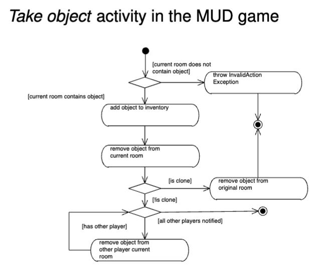

它能在设计系统、集成过程、测试系统各个环节应用，梳理清楚思路的同时，还能大幅提升沟通效率（团队工作过的人都明白沟通到底有多重要），是可以满足系统集成的很多要求的重要工具，与他相关的软件、中间件也不少，可以用来生成代码。

<h3 id="UML内容">UML 内容</h3>

UML目前已经实现了标准化，由组织[OMG][1]进行维护

UML包括各种图，共三类，十三种：

- **Structure Diagrams** 结构图
  - **Class diagrams 类图**，以类class、属性feature和关系relationships显示系统的结构
  - **Object Diagram 对象图**，示例instances的配置
  - **Component Diagram，组件图**，（微服务）组件的结构和连接
  - **Composite Structure Diagram 复合结构图**，类的运行分解
  - **Package Diagram 封装图**，模型的层次结构
  - **Deployment Diagram， 部署图**，显示软件组件如何在不同的硬件环境中被部署。
- **Behavior Diagrams** 行为图
  - **Use case diagrams 用例图**，以用例的形式描述行为者和系统之间的相互作用，在需求收集期间常用
  - **Activity Diagram 活动图**，对系统或流程中的活动流进行建模。
  - **State Machine Diagram 状态机图**，显示一个系统或对象如何在不同的状态之间转换。
  - **Interaction Diagrams** 交互图（行为图的衍生）
    - **Sequence Diagram 顺序图**，说明特定场景或用例中对象之间的相互作用
    - **Communication Diagram 通信图**（以前称为协作diagram）：对象之间的交互；强调链接
    - **Timing Diagram Diagram 交互概览图**：序列sequence和活动activity的混合图表
    - **Interaction Overview 时序图**：对象之间的交互；强调定时timing

选择画什么样的图主要取决于要着重处理系统的哪些部分，主要有这三种情况

- 系统功能：可以用Use Case diagram, state machines, activity diagram...
- 系统结构: Component diagram, Class diagram
- 系统验证: Interaction diagram

<h3 id="UML示例">UML 示例</h3>

图书馆借书系统为例

1. **用例图：**
   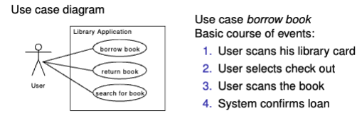

2. **组件图**：

   这里有Library接口，以及library的实现
   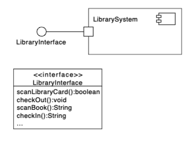

3. 类图

   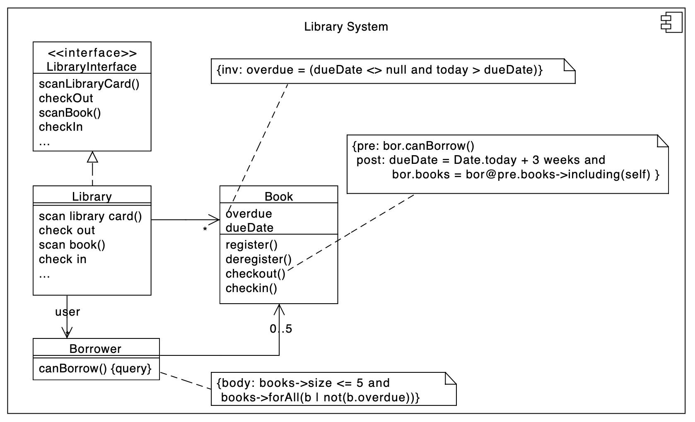

4. 状态机
   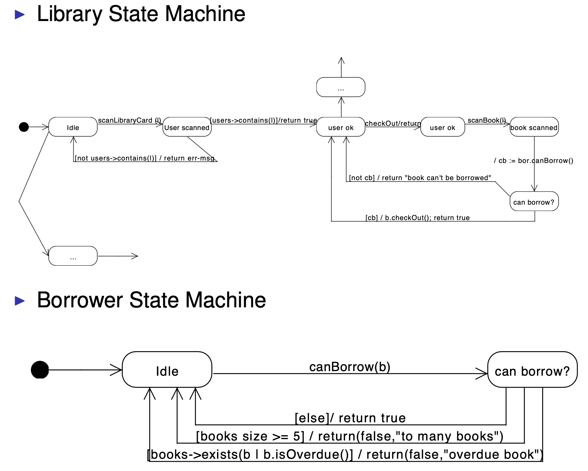

5. 用例图

   用户的步骤（该步骤需要与状态机一致）

   - 扫描借书卡
   - 打卡
   - 扫描书
   - 系统确认

   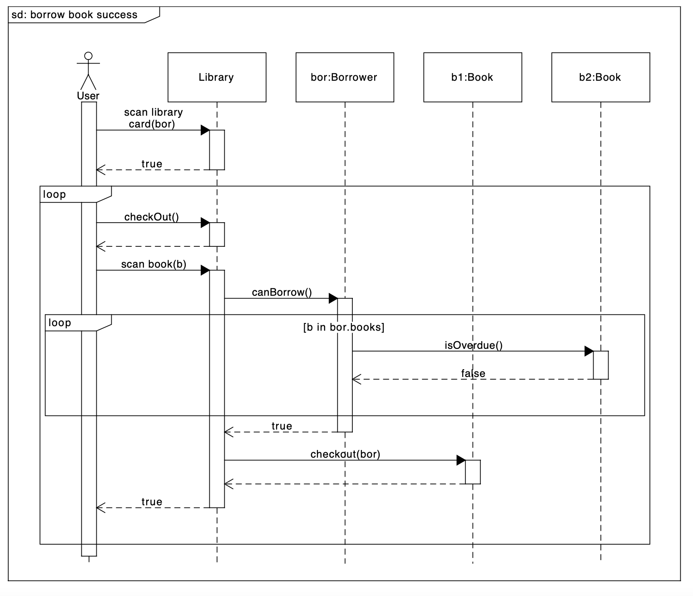

<h3 id="UML语法">UML 语法</h3>

内容过于庞杂，[官方pdf][2]接近800页，网上也有翻译成[中文版][3]的，这里只放常用的内容用于随时查阅

1. 关系表示：
   - 泛化关系（继承关系）
   - 实现关系
   - 依赖关系
   - 聚合关系
   - 组合关系
   - 关联关系

 

2. 多重性 multiplicity

   

3. 活动图 activity diagram

   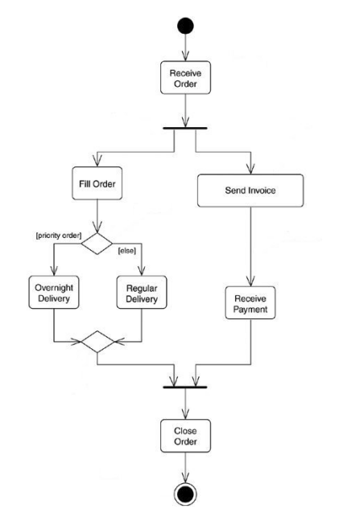
4. [时序图、活动图][4]

<h2 id="Requirements_Domain_Cases">Requirements, Domain, Cases 需求,领域,用例</h2>

标题简化了一点，实际上应该是Requirements Analysis, Domain Model, Use Cases 需求分析,领域建模,实际用例。

一个系统开发主要有这四个主要活动

- 需求分析
- 系统设计
- 集成实现
- 验证

先主要聊第一个活动

<h3 id="requirements-analysis">Requirements analysis 需求分析</h3>

一切的起源都是一个需求，一般是顾客或者老板提出来，产品经理翻译，不过也有优秀的产品经理自己完全主导的。这儿不聊产品思维，重点还是系统集成中怎么看待需求。

需求可以分两种

- 用户需求：业务导向
- 系统需求：
  - 项目规划：比如系统该怎么搭建
  - 成本规划：时间？人力？

另一个常用纬度即功能性的（Functional）需求，用来描述系统应该怎么做。以及（Non-functiona）非功能性的需求。

- 对于功能性的需求，重点是可实现性，功能可以被满足。

- 对于非功能性的需求，重点是可衡量，能测试。不要用可以，能够，可达到的字眼，要给出可量化的衡量标准。

这些需求最后都是要落实于文档的，如果你家的产品经理说的时候头头是道，逻辑能够自洽，但给文档却不详细，不可量化，最后导致项目交付不及时或者质量有缺陷，那需求分析是没有做到位的。
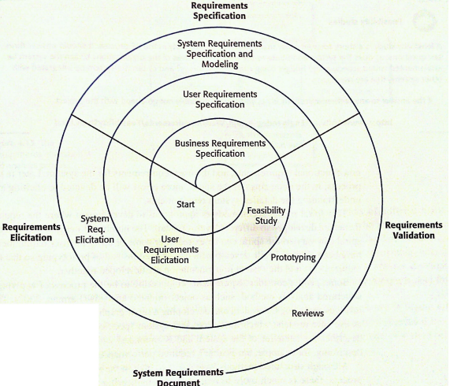

想法与实际有巨大的模糊空间，这时候领域建模，实际用例，就可以派上用场了。

<h3 id="domain-model">Domain model 领域建模</h3>

面对复杂度，建模（model）是最强有力的武器。**Model的优势，在于简介抽象，免掉细节但又能体现出核心逻辑**，能够获取解决方案的洞见，其思想贯穿了系统集成甚至说软件工程各个领域。

在需求领域，建模分两步

1. 确立**词汇表（Glossary）**，即理清楚当前场景下有哪些概念，具体定义是什么。
2. 确立这些概念之间的**关系(relationship)**。分清楚需求类型、优先级...

确定以上的内容，一个类图就呼之欲出了

<h3 id="use-case">Use Case 用例</h3>

用例是用来描绘某个场景下用户与系统的交互，对应的工具即是用例图：
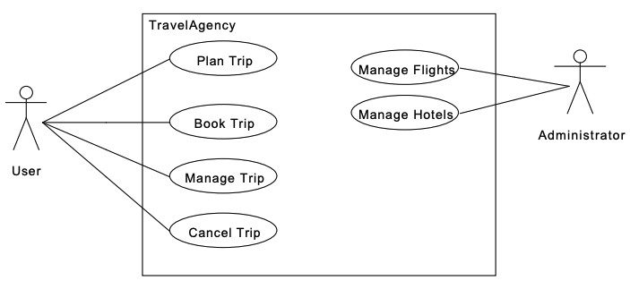

用例图能给系统功能概述，一张图背后能表达的内容能用以下模版表示

```
用例名称：旅行中介
描述：...
角色：用户、管理员
主要场景：...
次要场景：...
其他：...
```

很多关系和功能性的要求用语言很费字数，用图则一目了然。

<h3 id="user-stories">User Stories 用户故事</h3>

用户没有工程思维，脑袋里不会想着这个系统要怎么实现，他们脑回路是这样的：

作为一个xx用户，我想要做xx事情，所以我能获得xx。

用户讲的故事表面看起来很幼稚，但实际上很重要。收集他们也是需求分析很重要的部分，这也是系统更新动力的主要来源。

最直观的方式便是做一个便签墙（老外对sticker真的有执念...）。
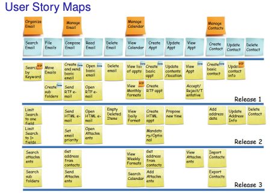

相关的电子版工具可以用[trello](trello.com) 或者[miroBoard](https://miro.com/)

<h2 id="acceptance-tests-with-fit">Acceptance Tests with Fit 验收测试</h2>

聊到测试，可以联想到很多名词，单元测试、集成测试、AB测试、灰度测试、压力测试...

其实还是要搞清楚当我们要测试的时候到底测的是什么维度的内容。

测试内容偏向于业务还是技术？如果是业务内容，可能更关注于验收是否满足用户要求和功能的稳定性；如果是技术测试，可能更关注于代码实现或者性能。自然采取的策略也会不同。

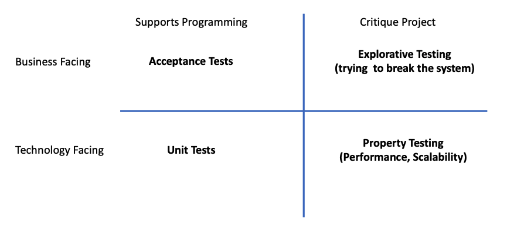

最常用的概念还是验收测试，QA发现问题，然后程序员改,，或者拖延为下一个迭代的需求。这个过程可以用一个活动图表示。

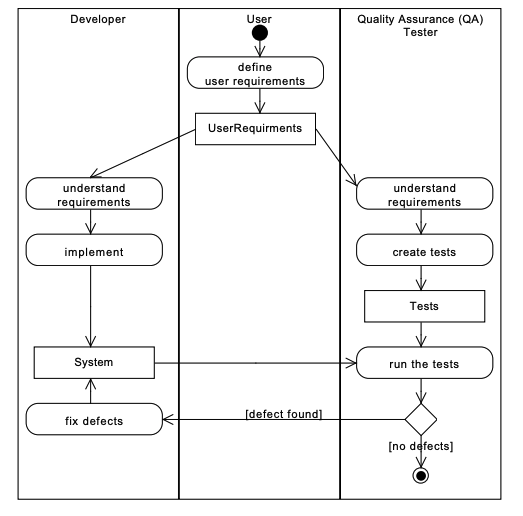

这时可以意识到，用例（use case)除了能展示需求，也是测试重要的参考内容。
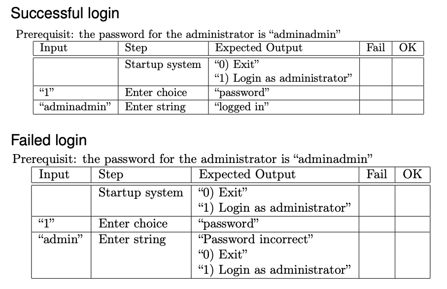

手工测试是很恶心的（manual tests are immoral！），而且QA资源往往也是稀缺的，能自动化就尽量自动化。

<h3 id="the-fit">The FIT 自动化测试框架</h3>

教授给的是[FIT框架][5]，网上搜了一下，这是一个轻量级的、开源的自动化测试框架，能够帮助测试团队进行接口自动化测试和回归测试。评价褒贬不一，有人说好在于case用wiki维护利于沟通，还能隔离代码。但也有人说这个框架被称作“集成测试框架”，但关键词在于“集成”，而不是“测试”，做为自动测试工具，Fit 则显得相当劣势，不如 xUnit、Watir、Selenium。
不过这是课程内容，我得上手玩一下。
[教程视频](https://youtu.be/lTnZZccqZls)

1. 第一步：[下载安装](http://www.fitnesse.org/FitNesseDownload)

2. 本地起服务：

   > java -jar fitnesse-standalone.jar

3. 打开本地链接：http://localhost/，端口默认80
   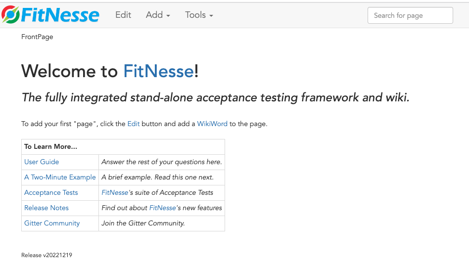

4. 点击edit，创建wiki page。
   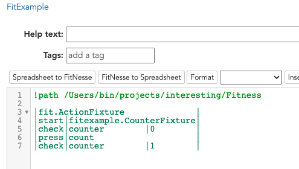

5. 对代码进行编译

   > javac -cp fitnesse-standalone.jar:. fitexample/CounterFixture.java

6. 点击测试
   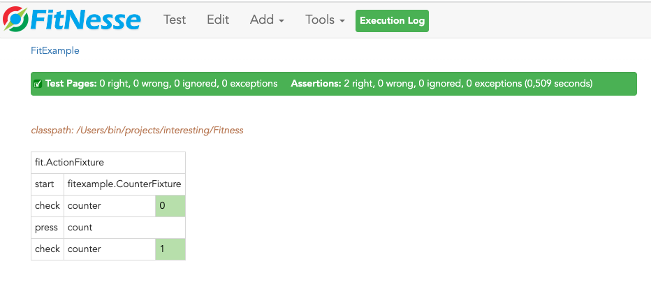

个人感觉上手确实很简单，也轻量级，wiki文档确实利于维护沟通，不过依然无法逃脱维护case麻烦的问题。有QA资源的团队可以考虑，详细的看[fitness用户指导](http://www.fitnesse.org/FitNesse.UserGuide)

<h2 id="Reference ">Reference </h2>

1. <https://www.uml.org/> "UML 官网"
2. <https://www.omg.org/spec/UML/2.5.1/PDF> "Unified Modeling Language, v2.5.1"
3. <https://zhoujg.gitbooks.io/uml-2_5-zh/content/> "UML 2.5中文參考"
4. <https://www.ordin.top/article/30#directory097808100484216296> "语法详解"
5. <http://www.fitnesse.org/FitNesse.UserGuide.WritingAcceptanceTests.FitFramework> "The FITNESS"


---


<h2 id="其他资料">其他资料</h2>

- Grady Booch, James Rumbaugh, and Ivar Jacobson The Unified Modeling Language User Guide (2nd Edition) (Users manual from the creators of UML)
-  James Rumbaugh, Ivar Jacobson and Grady Booch The Unified Modeling Language Reference Manual, Second Edition (Reference manual from the creators of UML) 
- Martin Fowler UML Distilled. Third Edition (Contains a distilled version of the most important UML diagrams) I UML 2.5.1 formal specification (https://www.omg.org/spec/UML/2.5.1/PDF)


