<!-- DON'T EDIT THIS SECTION, INSTEAD RE-RUN doctoc TO UPDATE -->
- [Requirements to Design:CRC Cards 需求到设计-CRC卡](#Requirements_to_Design)
- [Components 组件设计](#Components_structure)
- [Class Diagrams 类图](#Class_Diagrams)
  - [basic Class Diagrams 基础类图](#basic_Class_Diagrams)
- [Components and Synchronous Communication 组件同步通讯](#Components_and_Synchronous_Communication)
  - [银行ATM同步系统](#Synchronous_Bank)
  - [银行ATM组件分析](#Components_Bank)
 - [Life Cycle State Machines 状态机](#Life_Cycle_State_Machines)
 - [Design by Contract and OCL 合同和OCL设计](#w7_Contract_and_OCL)
   - [相关概念和语法](#w7_Contract_and_OC_concept)
   - [举例](#w7_Contract_and_OC_example)
- [Sequence Diagrams and Use Case Realizations 顺序图和用例实现](#w8_Sequence_Diagrams_and_Use_Case)
  - [sequence diagrams 顺序图](#w8_sequence_d)
  - [Use Case Realizations 用例实现](#w8_use_case_realization)

<!-- END doctoc generated TOC please keep comment here to allow auto update -->

<h2 id="Requirements_to_Design">Requirements to Design:CRC Cards 需求到设计-CRC卡</h2>

需求到设计是有一个套路的，接下来讲讲这个套路。
现在假设，已经有了需求模型，包括：
- 用例图 use case
- 用例详细描述
- 词汇表 glossary
- 非功能性需求

思考，如何构建
1. 组件图 component diagram
2. 类图 class diagram
3. 行为设计 behaviour design

大致步骤
1. 通过词汇表来设置类的属性、操作
2. 实现用例/用户故事

**CRC是class responsibility collaboration**的缩写，是一个面向对象设计的分析问题的工具，可以用它来辅助设计类

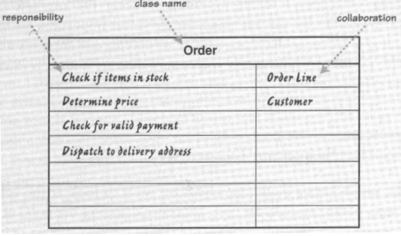
<h2 id="Requirements_to_Design">Requirements to Design:CRC Cards 需求到设计-CRC卡</h2>比如思考图书馆理系统，先用CRC cards写下所有的类，比如：User，Book, Library Application。然后思考这几个类之间的交互关系（collaboraion)。比如借书、书过期等。使用CRC，可以保证自己一直处于面向对象的思考过程，避免那种设计系统，但却总是宏观和笼统，无法进入系统的思维模式。

<h2 id="Components_structure">Components 组件设计</h2>

无论啥软件架构，都可以归纳为三种结构
- 组件（建材）
- 接口（连接器）
- 端口（对外交互）

作为一个组件，需要做到
- 可重用Resuable
- 可插拔Pluggable

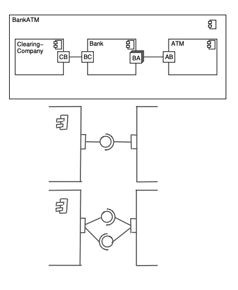

需要辨析几个概念
类class, 组件components, 微服务microservices
可以把组件理解为封装的更好的类，或者是一组互相协作的类
微服务就是各种组件的组合
即: 微服务⊃组件⊃类

<h2 id="Class_Diagrams">Class Diagrams 类图<h2>

<h3 id="basic_Class_Diagrams">basic Class Diagrams 基础类图</h3>

类图有很多用途
 - 用来需求分析
 - 用来做系统概览
 - 用来系统集成概览

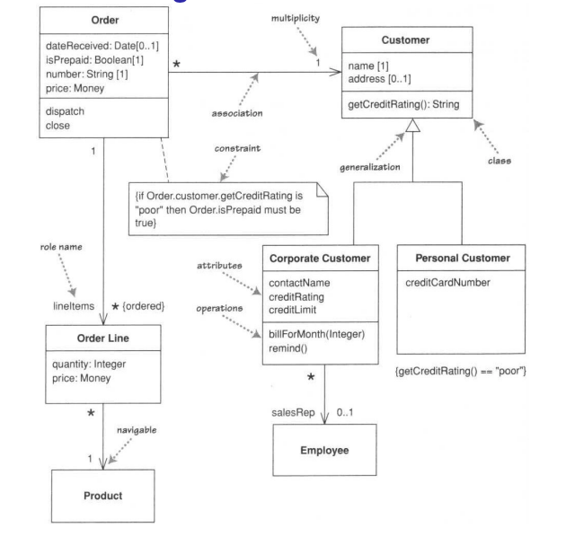

类图的组成结构：
 - Classes 类别
 - 属性
   - 属性应该是private的
   - getter setter 应该是publicd的
 - 方法
 - 关联 Associations
   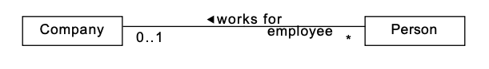
 - 角色名
 - 多重性 multiplicity
 - 泛化 generalization

包的UML表示：
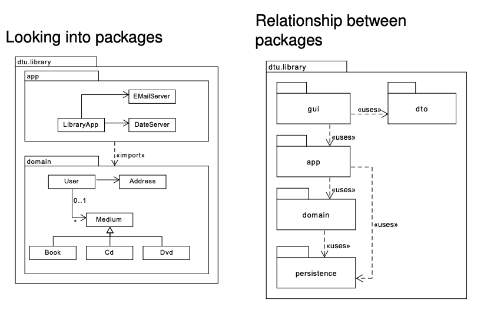
<h2 id="Components_and_Synchronous_Communication">Components and Synchronous Communication 组件同步通讯</h2>
<h3 id="Synchronous_Bank">银行ATM同步系统</h3>
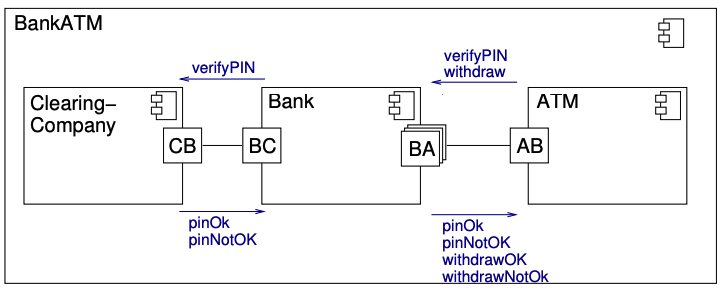

详细的银行类图设计
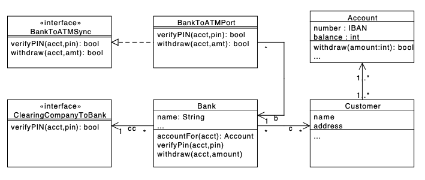

<h3 id="Components_Bank">银行ATM组件分析</h3>

>  银行组件类图示例

对于一个组件：
- 要提供端口和交互
- 组件构造
  - 子组件的代表端口
  - 类集
    - 类的继承实现，要提供交互接口
    - 接口要被使用
    - 类的行为与生命周期一致

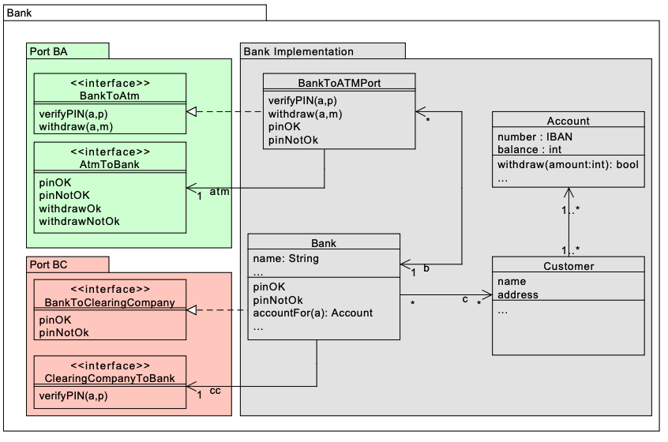

<h2 id="Life_Cycle_State_Machines">Life Cycle State Machines 状态机</h2>

场景假设：
实现一个地下保险柜的控制台

- 只有candle移除后才能看到保险箱
-  保险柜门只有在candle被更换后key转动的情况下开启
-  如果在没有更换蜡烛的情况下转动钥匙，一个杀手兔子被释放

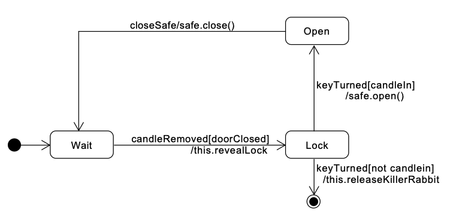

<h2 id="w7_Contract_and_OCL">Design by Contract and OCL 合同和OCL设计</h2>

**OCL（Object Constraint Language）**是一种面向对象模型的约束的正式语言。它是（UML）的一部分，用于表达UML图的规则和约束，如类图、顺序图和状态图。

OCL是一种**声明性语言**，提供了一套用于处理UML模型的操作符和函数，以及表达约束的语法。

使用OCL的主要好处是，它允许开发者正式指定UML模型的约束，这有助于确保模型的正确性和一致性。OCL可以用来检查模型的有效性，从模型中生成代码，并验证模型是否符合一组需求。

OCL中的**合同（Contracts）**是一种规范

合同可以在类或操作上定义，并包含**前置条件（preconditions）、后置条件（postconditions）和类不变量（class invariants）**等规范。前置条件和后置条件分别描述了一个操作的输入和输出行为，而类不变量则描述了一个类在其生命周期内必须满足的属性或约束。

合同可以验证代码的正确性，开发过程减少错误的发生。

<h3 id="w7_Contract_and_OC_concept">相关概念和语法</h2>

以上是定义和概述，接下来了解一下相关概念

1. **OCL （Object Constraint Language）**
   他是一种表述UML图的正式规范语言，包括
   - UML图中的变量
   - 操作的合同（contrat）
     - Pre- and postconditions 操作的前、后置条件
     - query操作的内容
2. Precondition 前置条件、postconditions
   指的是method执行前需要的条件
   postconditions是执行方法后系统需要满足的条件
3. Invariants 变量
   就是限制量，比如循环中的i
4. Constraint的类型
   - 常见的
     - 变量
     - pre- and postcondition
   - Body（仅限query操作）
   - 函数
5. 表示法
   内容放进花括号{}
   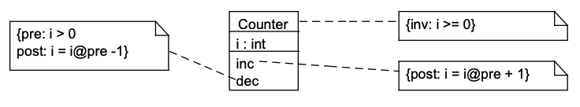
6. OCL语法
   - 数据类型：
     - 基础类型Integer real Boolean String
     - 集类型：Set, OrderedSet, Bag, Sequence
   - boolean操作符：=, <>, not, and, or, implies, . . . , x.isOCLTypeOf(C)
   - 属性：self.x
   - 操作引用：
     - self.mfunction(c1, c2) 方法调用
     - self.b -> cop() 
       ....
       语法太多，多看例子吧

<h3 id="w7_Contract_and_OC_example">举例</h3>

举个例子：银行系统加上了限制（constraints）

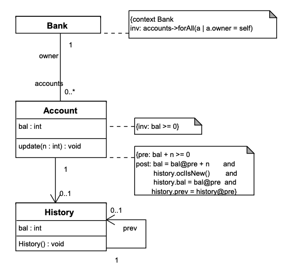

再给个OCL的例子
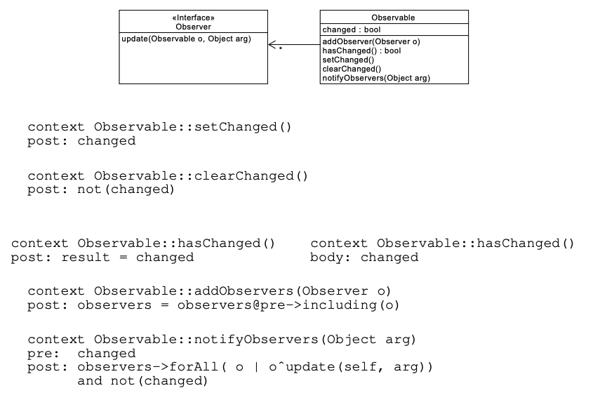

<h2 id="w8_Sequence_Diagrams_and_Use_Case">Sequence Diagrams and Use Case Realizations 顺序图和用例实现</h2>

<h3 id="w8_sequence_d">sequence diagrams 顺序图</h3>

顺序图能展现执行的过程，可以用来设计（CRC cards）；视觉化展现程序行为；视觉化模型执行，从而实现用例

这里给出主要组成结构

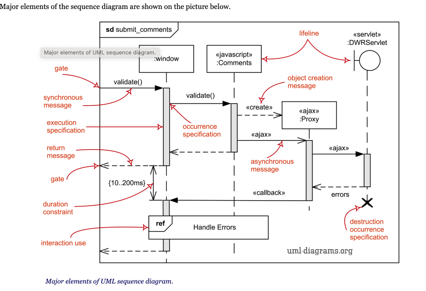

画顺序图主要是以下流程

1. 参与者的创建和删除
2. 同步和非同步的调用

<h3 id="w8_use_case_realization">Use Case Realizations 用例实现</h3>

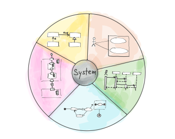

用例是UML系统中比较特殊的一块，因为UML这一整套语言有很多的图表，但是系统只有一个，模型只有一个，用例即是系统的表述，众多的图表也只是用例的辅助表达。（Many diagrams, but only one model）
用例的实现/图形化，也是有选择和策略的，要看你着重哪些方面

- 看中功能性：用例图、状态机、活动图
- 看中结构：组件图、类图
- 验证性：交互图

讲讲用例实现的思路

1. 着重关注系统的一致性（consistency）

   - 一个类图（class diagram）包含多个组件

   - 然后实现每个类(classes)的接口
   - 使用用例图来展现系统

2. 举个例子：图书管理系统

   1. 设计系统组件

   2. 集成组件，实现类图

   3. 根据类图设计生命周期状态机（LSM - life cycle state machine）

      根据LSM构建时序图（可选）

   4. 设计OCL限制，细化逻辑

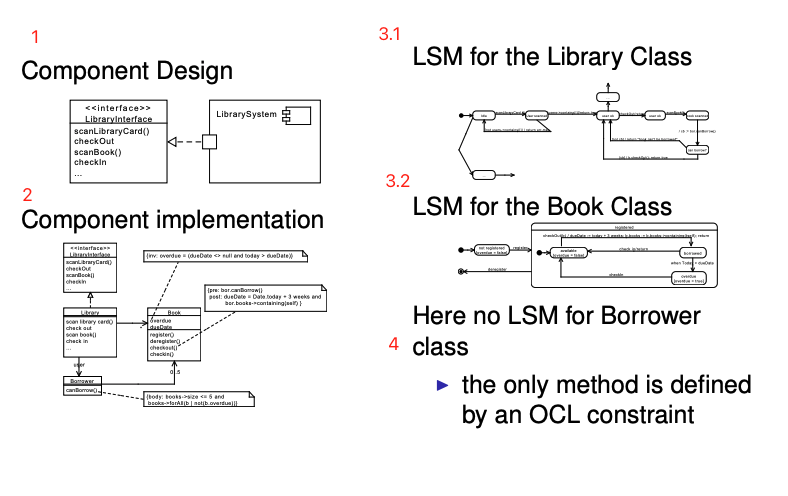

切记，众多图表，但只有一个模型