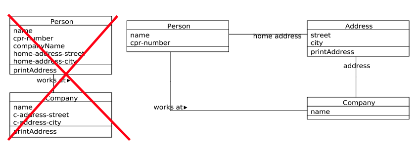
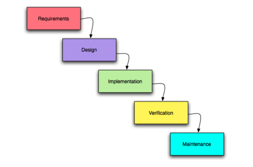
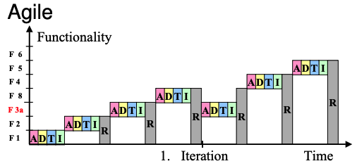
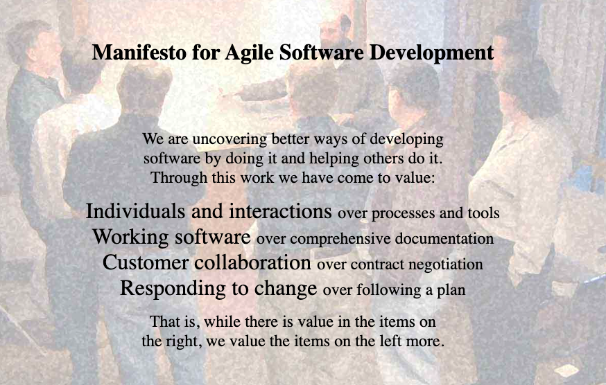
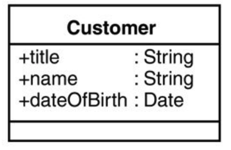
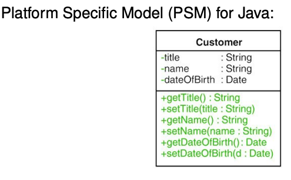
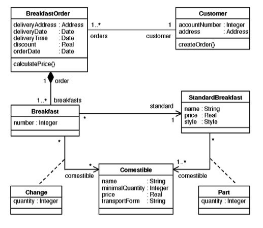

- [Principles for good design 设计原则](#w9_Principles_for_good_design)
  - [DRY principle - DRY原则](#w9_DRY_principle)
  - [KISS principle - KISS原则](#w9_KISS_principle)
  - [Law of Demeter - 最少知识原则](w9_Demeter)

- [Agile Software Development 敏捷软件开发](#w9_Agile_Software_Development)
  - [Agile Modeling - 敏捷建模](#w10_Agile_Modeling)

- [Model-Driven Architecture - 模型驱动架构 (MDA)](#w10_MDA)

<h2 id="w9_Principles_for_good_design">Principles for good design 设计原则</h2>

<h3 id="w9_DRY_principle">1. DRY principle - DRY原则</h3>

Don't repeat yourself! 不要重复自己

1. 拒绝代码冗余
   

   能抽离出来的模块一定要抽离出来，

   - 能常用的方法有
     - 新定义合适的抽象概念
     - 使用委托（Delegation）
     - 继承 Inheritance
     - 合理使用：实例变量/方法(method)变量
   - 阶段性的重构代码
   - 多用一些三方包：eg. javadoc

2. 拒绝文档冗余

3. 拒绝系统冗余

<h3 id="w9_KISS_principle">2. KISS principle - KISS原则</h3>

Keep it short and simple 保持简介 (有时有也可以说：keep it simple, stupid!)

这个原则在工程领域都是通用的，比较典型的就是建筑领域，和软件工程很像，不过软件工程的领域最有名的心法就是这一句：

**高内聚，低耦合（High Cohesion, low coupling）**
**高内聚**指的是将一个类的所有相关功能组织在一起，使其成为一个独立、自包含的单元。一个高内聚的类只关注自己的职责，并且类内部的各个方法和属性之间相互依赖，以实现类的整体功能。

**低耦合**指的是类之间的关联程度尽可能的低。当一个类与其他类之间的依赖性较低时，它们之间的耦合度就较低。这样可以使代码更容易扩展和修改，因为修改一个类不会对其他类产生太大的影响。

个人翻译一下，黑盒内部要尽量梳理完善，外部关系要足够简洁。

感觉和工程师的性格很像，一个个的花1w个小时让自己变得复杂，人际关系却简单直接，把自己活成了NPC......

项目开头优先选择简洁的方案，后续也要不停重构保持简洁性

对于黑内内部来说，其实也有高内聚，低耦合的这个结构。

<h3 id="w9_Demeter">3. Law of Demeter - 最少知识原则</h3>

这个原则也来源于程序员的一个交际习惯：“Only talk to your immediate friends.”

该原则建议在一个模块内，只调用那些直接相关的对象的方法，而不要调用其他对象的方法。这样可以减少模块之间的依赖关系，降低耦合度。

比如调用：

- 本身对象
- 对象的组件
- 本对象创建的子对象
- 方法的参数

这是降低耦合的经典方法论

<h2 id="w9_Agile_Software_Development">Agile Software Development 敏捷软件开发</h2>

软件开发一般流程

- 需求分析
- 系统设计
- 软件构建
- 验证评估

顺着这个思路，瀑布模型这个软件开发模型呼之欲出

一个一个做确实满足按部就班的思路。随着复杂度飙升，这个思路不够用了，产生敏捷开发方法论。

敏捷开发首先引入迭代（Iteration）的概念，迭代本身就是一个小的瀑布流，每一个迭代完成一个小目标

这个理念之上生成了框架Scrum, 看板工具trello。

<h3 id="w10_Agile_Modeling">Agile Modeling - 敏捷建模</h3>

要解释清楚敏捷开发很难，因为它不是一个个规则，而是一种思想，而对思想最好的诠释可以在[敏捷软件开发宣言](http://agilemanifesto.org/iso/zhchs/manifesto.html)中看到, 他是一个由软件开发者们于2001年提出的共识性宣言

我们一直在实践中探寻更好的软件开发方法，
身体力行的同时也帮助他人。由此我们建立了如下价值观：

**个体和互动** 高于 流程和工具
**工作的软件** 高于 详尽的文档
**客户合作** 高于 合同谈判
**响应变化** 高于 遵循计划

也就是说，尽管右项有其价值，
我们更重视左项的价值。

从以上的价值观生成出了一些常见原则

- 有效沟通
- 简洁性、高质量
- 快交付、迭代性
- ...

突然间有了共产党宣言和核心价值观的感觉

价值观 -> 原则 -> 实践

实践可以看这个： http://www.agilemodeling.com/practices.htm

<h2 id="w10_MDA">Model-Driven Architecture - 模型驱动架构 (MDA)</h2>

MDA的核心思想是将软件系统的设计从具体的技术细节中解耦出来，更加关注系统的业务逻辑和功能需求。

在MDA中，开发人员通过创建模型来描述系统的需求和设计，然后通过自动化工具将这些模型转换为具体的实现代码和部署指令。

即：通过转换从模型中派生代码，比如UML -> JAVA

文本参考：MDA website by [OMG](https://www.omg.org/mda/)

好处：

- 高生产率
- 可移植性强
- 高协作性
- 易维护和留档

问题：

- 模型太抽象，学习成本高
- 扩展性不足

**例子1: 属性**

Platform Independent Model (PIM) - PIM 模型

platform Specific Model PSM模型 （在PIM基础上加getter and setter）

**例子2：Associations 链接**：
早饭模型

**PSM** Relational database model 数据关系模型

